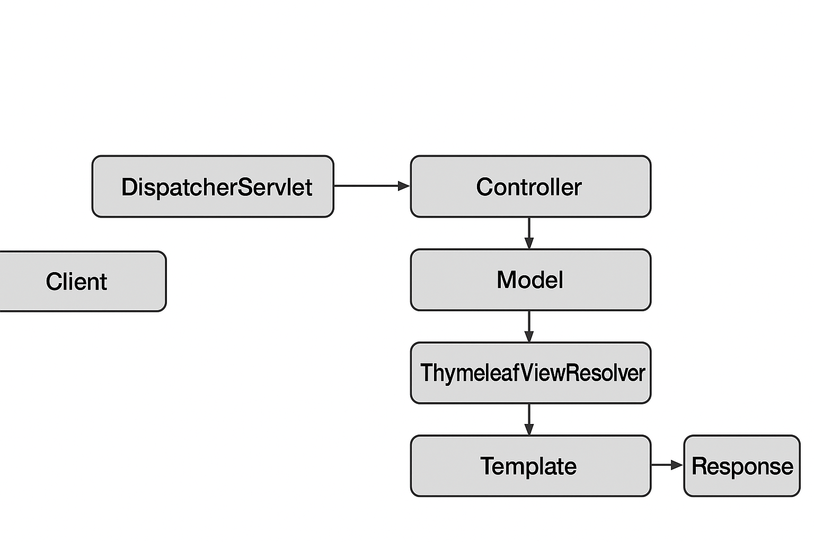

---

# **Lesson Notes: Thymeleaf Templating Engine in Spring MVC**

## **1. Overview**

**Thymeleaf** is a modern **server-side Java templating engine** used to process and generate HTML, XML, JavaScript, CSS, or plain text output. It is fully integrated into **Spring MVC** and is one of the most widely used template engines in the Spring ecosystem.

Thymeleaf enables developers to create dynamic web pages by binding **Java model data** to HTML templates in a **natural, readable syntax**. Its templates can also be opened directly in browsers without a running server, which makes it ideal for prototyping and collaborative UI design.

---

## **2. Integration with Spring Framework**

Thymeleaf can be used both in traditional **Spring MVC** and **Spring Boot** applications.
There are two main approaches to integration:

### **2.1. Manual Configuration (Traditional Spring MVC)**

To integrate Thymeleaf manually, you need to include these Maven dependencies:

```xml
<dependency>
    <groupId>org.thymeleaf</groupId>
    <artifactId>thymeleaf</artifactId>
    <version>3.1.2.RELEASE</version>
</dependency>
<dependency>
    <groupId>org.thymeleaf</groupId>
    <artifactId>thymeleaf-spring5</artifactId>
    <version>3.1.2.RELEASE</version>
</dependency>
```

Then configure the **Template Resolver**, **Template Engine**, and **View Resolver** beans in your Spring configuration class:

```java
@Bean
public ServletContextTemplateResolver templateResolver() {
    ServletContextTemplateResolver resolver = new ServletContextTemplateResolver();
    resolver.setPrefix("/WEB-INF/views/");
    resolver.setSuffix(".html");
    resolver.setTemplateMode("HTML5");
    return resolver;
}

@Bean
public SpringTemplateEngine templateEngine() {
    SpringTemplateEngine engine = new SpringTemplateEngine();
    engine.setTemplateResolver(templateResolver());
    return engine;
}

@Bean
public ThymeleafViewResolver viewResolver() {
    ThymeleafViewResolver viewResolver = new ThymeleafViewResolver();
    viewResolver.setTemplateEngine(templateEngine());
    viewResolver.setOrder(1);
    return viewResolver;
}
```

---

### **2.2. Spring Boot Auto-Configuration**

Spring Boot provides a simplified approach through the **Thymeleaf starter dependency**:

```xml
<dependency>
    <groupId>org.springframework.boot</groupId>
    <artifactId>spring-boot-starter-thymeleaf</artifactId>
</dependency>
```

Once this dependency is added, Boot automatically:

* Configures a `ThymeleafViewResolver` bean,
* Sets up a `SpringTemplateEngine`,
* Looks for HTML templates under:
  `src/main/resources/templates/`

No manual setup is needed — Thymeleaf “just works” out of the box.

---

## **3. The Role of Thymeleaf in the MVC Architecture**

In the **Model–View–Controller (MVC)** pattern:

* **Model**: Holds the data (Java objects or DTOs)
* **View**: Defines the visual representation (HTML using Thymeleaf)
* **Controller**: Connects the model and view

Thymeleaf acts as the **View layer**, responsible for dynamically rendering HTML pages by binding them to model attributes provided by the controller.

---

## **4. Creating a Basic Thymeleaf View**

### **4.1. Controller**

The controller prepares model data and returns the view name:

```java
@Controller
public class ProjectController {

    @Autowired
    private ProjectService projectService;

    @GetMapping("/projects")
    public String getProjects(Model model) {
        List<Project> projects = projectService.findAll();
        model.addAttribute("projects", projects);
        return "projects"; // View name
    }
}
```

* The `Model` object passes data from the backend to the HTML template.
* The return value `"projects"` corresponds to a `projects.html` template.

---

### **4.2. Thymeleaf Template (projects.html)**

Located at: `src/main/resources/templates/projects.html`

```html
<!DOCTYPE html>
<html xmlns:th="http://www.thymeleaf.org">
<head>
    <title>Projects</title>
</head>
<body>
    <h2>Project List</h2>

    <table border="1">
        <thead>
            <tr>
                <th>Id</th>
                <th>Name</th>
                <th>Date Created</th>
            </tr>
        </thead>
        <tbody>
            <tr th:each="project : ${projects}">
                <td th:text="${project.id}"></td>
                <td th:text="${project.name}"></td>
                <td th:text="${project.dateCreated}"></td>
            </tr>
        </tbody>
    </table>
</body>
</html>
```

#### **Explanation**

* `th:each` — Iterates through the list of projects.
* `th:text` — Binds data to the HTML element.
* `${projects}` — References the model attribute added in the controller.

---

## **5. Displaying Model Attributes**

### **5.1. Simple Value Binding**

Controller:

```java
model.addAttribute("serverTime", LocalDateTime.now());
```

Template:

```html
<p>Current Time: <span th:text="${serverTime}"></span></p>
```

### **5.2. Displaying Messages from Properties**

Define `messages.properties`:

```
welcome.message=Welcome to the Project Dashboard!
```

Template:

```html
<h1 th:text="#{welcome.message}"></h1>
```

---

## **6. Conditional Evaluation**

Thymeleaf supports simple logic in templates.

```html
<p th:if="${project.completed}">Status: Completed</p>
<p th:unless="${project.completed}">Status: In Progress</p>
```

---

## **7. Handling Forms and User Input**

```html
<form th:action="@{/saveProject}" th:object="${project}" method="post">
    <input type="text" th:field="*{name}" placeholder="Project Name" />
    <input type="date" th:field="*{dateCreated}" />
    <input type="submit" value="Save" />
</form>
```

Controller:

```java
@PostMapping("/saveProject")
public String saveProject(@ModelAttribute Project project) {
    projectService.save(project);
    return "redirect:/projects";
}
```

---

## **8. Error Handling and Validation**

```html
<p th:if="${#fields.hasErrors('name')}" 
   th:errors="*{name}">Name Error</p>
```

The `#fields` utility checks validation errors bound to model fields.

---

## **9. Thymeleaf Request Flow in Spring MVC**

Below is the conceptual flow of how a Thymeleaf request is processed:

**Client → DispatcherServlet → Controller → Model + View Name → ThymeleafViewResolver → Template Rendering → HTML Response**

---

📘 **Diagram: Thymeleaf Request Flow in Spring MVC**
*(Attached below)*

---

## **10. Advantages of Thymeleaf**

* Natural templating – HTML is directly viewable without a running server.
* Tight Spring MVC integration.
* Powerful expression and conditional language.
* Easy form handling and validation.
* Clear separation between logic and presentation.
* Extensible and modular design.

---

## **11. Conclusion**

Thymeleaf provides a modern, flexible, and developer-friendly way to build server-rendered views in Spring MVC applications.
Its combination of **natural HTML syntax**, **powerful binding expressions**, and **deep Spring integration** make it a go-to tool for web applications that need dynamic, maintainable, and secure server-side rendering.

---
