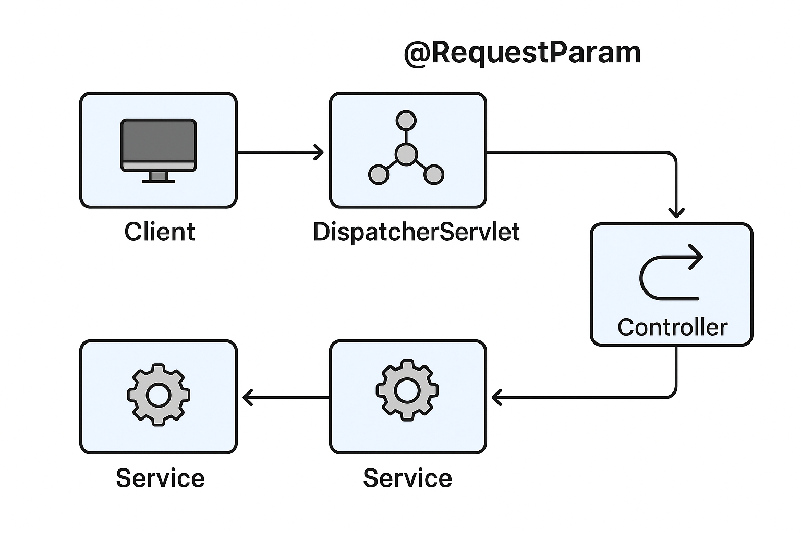

---

## **Lesson: The @RequestParam Annotation**

### **1. Overview**

The `@RequestParam` annotation in **Spring MVC** is used to extract query parameters, form data, or multipart data from the **HTTP request** and bind them to controller method parameters.

It provides a convenient way to access request parameters directly without needing to parse the request object manually.

In simpler terms:

> `@RequestParam` maps a value from the **request URL or form submission** to a variable in your controller method.

---

### **2.1. Uses of the @RequestParam Annotation**

Let’s begin with a simple example.
Suppose we have an endpoint `/projects` that retrieves projects from the database.
Initially, our API might return **all projects** when we visit:

```
http://localhost:8080/projects
```

To make this more useful, we can filter projects by name using a **query parameter**:

```
http://localhost:8080/projects?name=Project 2
```

Now only the project named *Project 2* will be retrieved.

#### **Example – Filtering Projects by Name**

```java
@GetMapping("/projects")
public Collection<ProjectDto> findProjects(@RequestParam("name") String name) {
    Iterable<Project> allProjects = this.projectService.findByName(name);
    return convertToDtoList(allProjects);
}
```

Here, the `@RequestParam("name")` annotation binds the `name` query parameter from the URL to the `name` variable in the method.

---

### **2.2. Adapting Our Endpoint**

If you visit:

```
http://localhost:8080/projects?name=Alpha
```

Spring will automatically map `Alpha` to the `name` variable in the controller method.

This is equivalent to writing:

```java
@RequestParam(name = "name") String name
```

Since the variable name matches the request parameter, we can also simplify it to:

```java
@RequestParam String name
```

The application will then use the `ProjectService` to retrieve matching projects.

---

### **2.3. The `required` Attribute**

By default, all `@RequestParam` parameters are **required**.
If a request doesn’t include the parameter, Spring throws an error such as:

```
Required String parameter 'name' is not present
```

#### **Example – Optional Parameter**

To make a parameter optional:

```java
@GetMapping("/projects")
public Collection<ProjectDto> findProjects(@RequestParam(name = "name", required = false) String name) {
    return projectService.findByName(name);
}
```

If the parameter is missing, the value of `name` will be `null`.

#### **Using Optional for Safer Null Handling**

```java
@GetMapping("/projects")
public Collection<ProjectDto> findProjects(@RequestParam(name = "name") Optional<String> name) {
    return projectService.findByName(name.orElse(""));
}
```

Here, the `Optional` type eliminates the need for null checks.

---

### **2.4. The `defaultValue` Attribute**

If we want to provide a fallback value when a parameter isn’t supplied, we can use `defaultValue`.

```java
@GetMapping("/projects")
public Collection<ProjectDto> findProjects(
        @RequestParam(name = "name", defaultValue = "") String name) {
    return projectService.findByName(name);
}
```

Using `defaultValue` automatically sets `required = false`.

**Example Requests:**

* `/projects` → `name = ""`
* `/projects?name=Beta` → `name = "Beta"`

This ensures that the controller method always receives a valid string value.

---

### **2.5. Mapping Multiple Request Parameters**

You can use multiple `@RequestParam` annotations in the same method:

```java
@GetMapping("/projects/search")
public String searchProjects(@RequestParam String name, @RequestParam String status) {
    return "Searching for projects with name: " + name + " and status: " + status;
}
```

**Example URL:**

```
http://localhost:8080/projects/search?name=Alpha&status=Active
```

Output:

```
Searching for projects with name: Alpha and status: Active
```

---

### **2.6. Mapping All Parameters with a Map**

If you want to dynamically handle an unknown number of parameters, you can use a `Map`:

```java
@PostMapping("/projects/filter")
@ResponseBody
public String filterProjects(@RequestParam Map<String, String> filters) {
    return "Parameters received: " + filters;
}
```

**Example Request:**

```
http://localhost:8080/projects/filter?name=Alpha&type=Internal
```

**Output:**

```
Parameters received: {name=Alpha, type=Internal}
```

---

### **2.7. Handling Multiple Values for a Single Parameter**

When a parameter appears multiple times in a request, Spring can bind it to a list.

```java
@GetMapping("/projects/ids")
@ResponseBody
public String getProjectsByIds(@RequestParam List<Long> id) {
    return "Project IDs are " + id;
}
```

**Example URLs:**

```
http://localhost:8080/projects/ids?id=1&id=2&id=3
```

or

```
http://localhost:8080/projects/ids?id=1,2,3
```

**Output:**

```
Project IDs are [1, 2, 3]
```

---

### **2.8. @RequestParam vs. @PathVariable**

| Feature     | @RequestParam                         | @PathVariable           |
| ----------- | ------------------------------------- | ----------------------- |
| Source      | Query String or Form Data             | URL Path Segment        |
| Example URL | `/projects?name=Alpha`                | `/projects/1`           |
| Declaration | `@RequestParam String name`           | `@PathVariable Long id` |
| Use Case    | Filtering, searching, optional params | Resource identification |

---

### **2.9. Spring MVC Handler Method Parameters (Additional Context)**

Controller methods can accept other request-related objects or annotations alongside `@RequestParam`, including:

| Type                                         | Description                                     |
| -------------------------------------------- | ----------------------------------------------- |
| `HttpServletRequest` / `HttpServletResponse` | Direct access to low-level request and response |
| `HttpSession`                                | Access session data                             |
| `Model`, `ModelMap`, `Map`                   | Used to pass data to the view layer             |
| `@CookieValue`                               | Bind an HTTP cookie value                       |
| `@RequestHeader`                             | Access an HTTP header                           |
| `@RequestPart`                               | Handle multipart requests                       |
| `@ModelAttribute`                            | Bind a form bean                                |
| `@SessionAttribute`                          | Retrieve session-scoped attributes              |

---

### **3. Example Summary**

**Controller Example:**

```java
@RestController
@RequestMapping("/projects")
public class ProjectController {

    @GetMapping
    public Collection<ProjectDto> findProjects(
            @RequestParam(name = "name", required = false, defaultValue = "") String name) {
        return projectService.findByName(name);
    }

    @GetMapping("/filter")
    public String filter(@RequestParam Map<String, String> params) {
        return "Parameters received: " + params;
    }

    @GetMapping("/ids")
    public String getProjectsByIds(@RequestParam List<Long> id) {
        return "Project IDs are " + id;
    }
}
```

---

### **4. Summary**

✅ **Key Takeaways:**

* `@RequestParam` maps query parameters, form data, and multipart data.
* Parameters are required by default but can be made optional.
* Supports default values using the `defaultValue` attribute.
* Can handle multiple parameters and multi-valued parameters.
* Works seamlessly with Java 8’s `Optional` for null-safe handling.
* Often used for filtering, searching, or conditional logic in REST endpoints.

---
`@RequestParam` request–response flow chart
