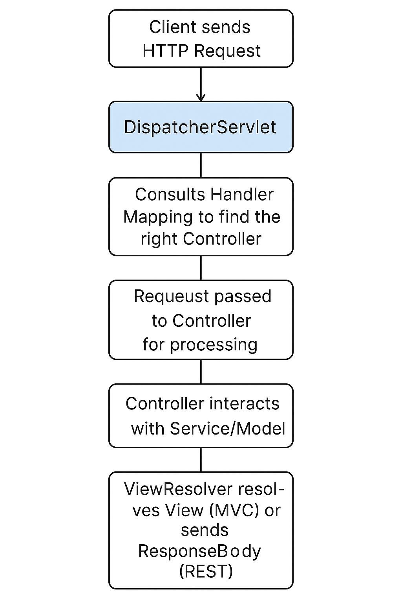
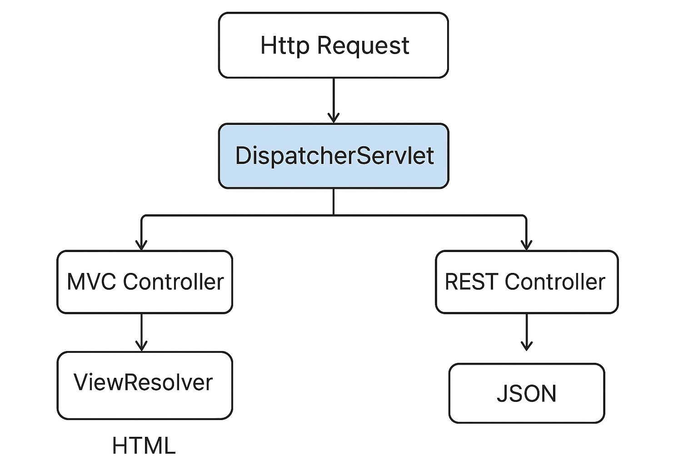

---

# **Lesson Notes: Spring Controllers in Spring Framework**

## **1. Introduction to Spring Controllers**

In the **Spring MVC (Model–View–Controller)** architecture, a **Controller** plays the central role of handling client requests, interacting with the service and model layers, and returning an appropriate response (a view or data).

Spring’s design follows the **Front Controller Pattern**, where the **DispatcherServlet** acts as the front controller. It intercepts all incoming requests, delegates them to appropriate controller classes, and coordinates the overall flow of execution.

### **High-Level Flow in Spring MVC**

1. **Client sends an HTTP request**
2. **DispatcherServlet** intercepts the request
3. It consults **HandlerMapping** to find the right controller
4. The request is passed to the **Controller** for processing
5. The Controller interacts with the **Service/Model**
6. **ViewResolver** resolves a view (for MVC) or sends a **ResponseBody** (for REST)
7. **Response** is returned to the client

---

## **2. Controller Annotations in Spring**

Spring provides two key annotations for defining controllers:

| Annotation        | Type            | Description                                                                                         |
| ----------------- | --------------- | --------------------------------------------------------------------------------------------------- |
| `@Controller`     | MVC Controller  | Used for returning views (HTML, JSP, Thymeleaf). Usually part of server-side rendered applications. |
| `@RestController` | REST Controller | Used for returning raw data (JSON/XML). Combines `@Controller` and `@ResponseBody`.                 |

---

## **3. @Controller Annotation**

### **3.1 Definition**

`@Controller` is a specialization of `@Component` used to mark a class as a web controller capable of handling web requests.

It is typically used in **Spring MVC** applications that return **views** (e.g., HTML pages).

### **3.2 Example: MVC Controller**

```java
import org.springframework.stereotype.Controller;
import org.springframework.web.bind.annotation.GetMapping;
import org.springframework.web.bind.annotation.RequestMapping;
import org.springframework.web.servlet.ModelAndView;

@Controller
@RequestMapping("/test")
public class TestController {

    @GetMapping
    public ModelAndView getTestData() {
        ModelAndView mv = new ModelAndView();
        mv.setViewName("welcome"); // The name of the Thymeleaf or JSP view
        mv.addObject("message", "Welcome to Spring MVC!");
        return mv;
    }
}
```

**Explanation:**

* `@Controller`: Marks the class as a web controller.
* `@RequestMapping("/test")`: Maps the base URL `/test` to this controller.
* `ModelAndView`: Combines the model (data) and view (template name) for rendering.
* When `/test` is accessed, Spring passes data to `welcome.html` via the **ViewResolver**.

### **3.3 View Resolution**

When returning a view name, Spring’s **ViewResolver** locates a template (e.g., `/templates/welcome.html`) and injects the model data for rendering.

---

## **4. @RestController Annotation**

### **4.1 Definition**

`@RestController` is a specialized version of `@Controller` introduced in **Spring 4.0**.
It combines:

```java
@Controller + @ResponseBody
```

This means every method in the class automatically returns data directly to the **HTTP response body** — eliminating the need for `@ResponseBody` on each method.

### **4.2 Example: REST Controller**

```java
import org.springframework.web.bind.annotation.*;

@RestController
@RequestMapping("/books-rest")
public class BookRestController {

    @GetMapping("/{id}")
    public Book getBook(@PathVariable int id) {
        return findBookById(id);
    }

    private Book findBookById(int id) {
        return new Book(id, "Effective Java", "Joshua Bloch");
    }
}

class Book {
    private int id;
    private String title;
    private String author;

    // Constructor, Getters, and Setters
    public Book(int id, String title, String author) {
        this.id = id;
        this.title = title;
        this.author = author;
    }
}
```

**Key Points:**

* No need for `@ResponseBody` — handled automatically.
* Returns JSON by default (if Jackson is on the classpath).
* Ideal for building REST APIs.

---

## **5. @RequestMapping and Shorthand Annotations**

`@RequestMapping` maps web requests to specific controller methods.

It can define:

* **HTTP path** (`value` or `path`)
* **HTTP method** (GET, POST, PUT, DELETE)
* **Headers**
* **Parameters**
* **Consumes / Produces**

### **Example Using @RequestMapping**

```java
@RequestMapping(value = "/projects/{id}", method = RequestMethod.GET)
public ProjectDto findOne(@PathVariable Long id) {
    return convertToDto(projectService.findById(id));
}
```

### **Simplified Shortcuts (Introduced in Spring 4.3+)**

| Shortcut         | Equivalent to                      | Description           |
| ---------------- | ---------------------------------- | --------------------- |
| `@GetMapping`    | `@RequestMapping(method = GET)`    | Retrieves resources   |
| `@PostMapping`   | `@RequestMapping(method = POST)`   | Creates new resources |
| `@PutMapping`    | `@RequestMapping(method = PUT)`    | Updates resources     |
| `@DeleteMapping` | `@RequestMapping(method = DELETE)` | Deletes resources     |

---

## **6. Combining Controller-Level and Method-Level Mappings**

You can define a base mapping at the **class level** and more specific mappings at the **method level**.

```java
@RestController
@RequestMapping("/projects")
public class ProjectController {

    @GetMapping("/{id}")
    public ProjectDto getProjectById(@PathVariable Long id) {
        return convertToDto(projectService.findById(id));
    }

    @PostMapping
    public ProjectDto createProject(@RequestBody ProjectDto projectDto) {
        return convertToDto(projectService.save(convertToEntity(projectDto)));
    }
}
```

The final endpoint paths become:

* `GET /projects/{id}`
* `POST /projects`

Spring **merges** the paths from both annotations automatically.

---

## **7. Narrowing Mappings**

You can narrow endpoint behavior using additional attributes:

| Attribute  | Purpose                                 | Example                               |
| ---------- | --------------------------------------- | ------------------------------------- |
| `produces` | Specifies the MIME type of the response | `produces = "application/json"`       |
| `consumes` | Specifies accepted content type         | `consumes = "application/json"`       |
| `headers`  | Restricts based on HTTP headers         | `headers = "accept=application/json"` |
| `params`   | Restricts based on query parameters     | `params = "version=1"`                |

```java
@GetMapping(value = "/{id}", produces = "application/json", params = "version=1")
public ProjectDto getProjectV1(@PathVariable Long id) {
    return convertToDto(projectService.findById(id));
}
```

---

## **8. MVC vs REST Controller Comparison**

| Aspect                 | @Controller             | @RestController |
| ---------------------- | ----------------------- | --------------- |
| Returns                | Views (HTML, JSP, etc.) | Data (JSON/XML) |
| Requires View Resolver | Yes                     | No              |
| Requires @ResponseBody | Yes (for JSON)          | No (implicit)   |
| Common Use Case        | MVC Web Apps            | REST APIs       |
| Serialization          | Manual                  | Automatic       |

---

## **9. Example: Full REST Controller with CRUD Operations**

```java
@RestController
@RequestMapping("/projects")
public class ProjectController {

    private final ProjectService projectService;

    public ProjectController(ProjectService projectService) {
        this.projectService = projectService;
    }

    @GetMapping("/{id}")
    public ProjectDto getProject(@PathVariable Long id) {
        return projectService.findById(id)
            .map(this::convertToDto)
            .orElseThrow(() -> new ResponseStatusException(HttpStatus.NOT_FOUND));
    }

    @PostMapping
    public ProjectDto createProject(@RequestBody ProjectDto projectDto) {
        return convertToDto(projectService.save(convertToEntity(projectDto)));
    }

    @PutMapping("/{id}")
    public ProjectDto updateProject(@PathVariable Long id, @RequestBody ProjectDto projectDto) {
        return convertToDto(projectService.update(id, convertToEntity(projectDto)));
    }

    @DeleteMapping("/{id}")
    public void deleteProject(@PathVariable Long id) {
        projectService.deleteById(id);
    }

    private ProjectDto convertToDto(Project project) {
        return new ProjectDto(project.getId(), project.getName(), project.getDescription());
    }

    private Project convertToEntity(ProjectDto dto) {
        return new Project(dto.getId(), dto.getName(), dto.getDescription());
    }
}
```

---

## **10. Conclusion**

In this lesson, we explored:

* The role of controllers in Spring MVC architecture.
* The difference between `@Controller` and `@RestController`.
* How to use `@RequestMapping` and shorthand annotations.
* How to refine mappings and combine them at class and method levels.
* How to implement both MVC-style and RESTful controllers in Spring Boot.

The **Spring Controller layer** bridges the client and the backend, ensuring clear separation of concerns, scalable design, and flexible response handling for both web pages and RESTful services.

---
## **How `DispatcherServlet` routes requests to both **MVC** and **REST** controllers**
