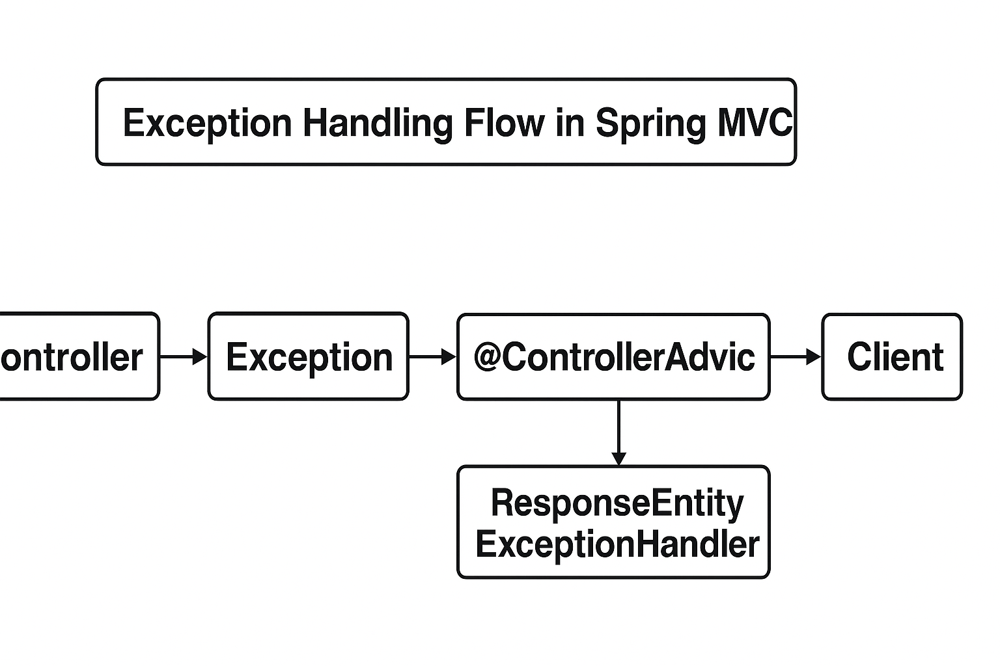

Here’s a comprehensive **academic-style lesson** on **Spring Exception Handling**, integrating your notes, explanations, and working Java code examples — organized in a clear, structured teaching format suitable for use in course material or documentation.

---

# **Lesson Notes: Exception Handling in Spring Boot**

---

## **1. Introduction and Overview**

Exception handling is an essential aspect of building robust, production-grade Spring applications. In REST APIs, proper exception handling ensures that clients receive consistent, meaningful, and standardized responses when errors occur.

Spring provides several mechanisms to manage exceptions effectively, ranging from simple local handling using `@ResponseStatusException` to more comprehensive global handling using `@ControllerAdvice` and `ResponseEntityExceptionHandler`.

This lesson explores:

* How to throw exceptions using `ResponseStatusException`
* How to define a **Global Exception Handler** using `@ControllerAdvice`
* How to use `@ExceptionHandler` for fine-grained exception mapping
* How to leverage **ResponseEntityExceptionHandler** for predefined Spring exceptions
* How to implement custom error responses (`ApiError` model)
* Best practices in centralized exception handling

---

## **2. Throwing a ResponseStatusException**

The simplest way to control the HTTP response status from a controller is by throwing a `ResponseStatusException`.

### **Example: Using ResponseStatusException in Controller**

```java
@GetMapping(value = "/{id}")
public ProjectDto findOne(@PathVariable Long id) {
    Project entity = projectService.findById(id)
      .orElseThrow(() -> new ResponseStatusException(
              HttpStatus.NOT_FOUND, "Project not found"));
    return convertToDto(entity);
}
```

If we send a GET request to a non-existing project, e.g.,
`GET http://localhost:8080/projects/4`

We receive:

```json
{
  "timestamp": "2025-11-02T16:22:09.254+0000",
  "status": 404,
  "error": "Not Found",
  "message": "Project not found",
  "path": "/projects/4"
}
```

✅ **Note:** Since Spring Boot 2.3, the `message` field is hidden by default for security reasons.
To always include it, add this property in `application.properties`:

```properties
server.error.include-message=always
```

---

## **3. Global Exception Handling**

Throwing exceptions in individual controllers can quickly become repetitive. A better approach is to **handle exceptions globally** using a dedicated class annotated with `@ControllerAdvice`.

### **Creating a Global Exception Handler**

```java
@ControllerAdvice
public class GlobalExceptionHandler {

    @ExceptionHandler(EmptyResultDataAccessException.class)
    public ResponseEntity<String> handleDataRetrievalException(EmptyResultDataAccessException ex) {
        return new ResponseEntity<>(
            "Exception retrieving data: " + ex.getMessage(),
            HttpStatus.NOT_FOUND);
    }
}
```

Now, when we delete a non-existing resource:

`DELETE http://localhost:8080/projects/4`

Response:

```json
{
  "status": 404,
  "message": "Exception retrieving data: No class entity with id 4 exists"
}
```

This approach centralizes exception handling logic and removes duplication.

---

## **4. Broader Exception Mapping**

Instead of handling each exception separately, we can catch **a family of related exceptions**.

```java
@ExceptionHandler(DataRetrievalFailureException.class)
public ResponseEntity<String> handleDataRetrievalException(DataRetrievalFailureException ex) {
    return new ResponseEntity<>(
        "Exception retrieving data: " + ex.getMessage(),
        HttpStatus.NOT_FOUND);
}
```

This ensures any subclass of `DataRetrievalFailureException` is handled by the same method.

---

## **5. Extending ResponseEntityExceptionHandler**

Spring provides a built-in class `ResponseEntityExceptionHandler` that maps common framework-level exceptions (like `HttpRequestMethodNotSupportedException`, `MissingServletRequestParameterException`, etc.).

Extending it gives us predefined behavior for many common exceptions.

### **Example: Custom Global Exception Handler**

```java
@ControllerAdvice
public class CustomRestExceptionHandler extends ResponseEntityExceptionHandler {

    @ExceptionHandler({ ConstraintViolationException.class })
    public ResponseEntity<Object> handleConstraintViolation(
      ConstraintViolationException ex, WebRequest request) {

        List<String> errors = ex.getConstraintViolations()
            .stream()
            .map(v -> v.getPropertyPath() + ": " + v.getMessage())
            .toList();

        ApiError apiError = new ApiError(
            HttpStatus.BAD_REQUEST, "Validation Failed", errors);

        return new ResponseEntity<>(apiError, new HttpHeaders(), apiError.getStatus());
    }

    @Override
    protected ResponseEntity<Object> handleHttpRequestMethodNotSupported(
      HttpRequestMethodNotSupportedException ex,
      HttpHeaders headers, HttpStatus status, WebRequest request) {

        String error = ex.getMethod() + " method is not supported. Supported: " + ex.getSupportedHttpMethods();
        ApiError apiError = new ApiError(HttpStatus.METHOD_NOT_ALLOWED, ex.getLocalizedMessage(), error);
        return new ResponseEntity<>(apiError, new HttpHeaders(), apiError.getStatus());
    }
}
```

---

## **6. Defining a Custom Error Response (ApiError)**

To return structured JSON errors, we define a custom class:

```java
public class ApiError {
    private HttpStatus status;
    private String message;
    private List<String> errors;

    public ApiError(HttpStatus status, String message, List<String> errors) {
        this.status = status;
        this.message = message;
        this.errors = errors;
    }

    public ApiError(HttpStatus status, String message, String error) {
        this(status, message, Arrays.asList(error));
    }

    // getters and setters
}
```

Example Response:

```json
{
  "status": "BAD_REQUEST",
  "message": "Validation Failed",
  "errors": ["name must not be blank", "email must be valid"]
}
```

---

## **7. Exception Handling Hierarchy**

| **Approach**                     | **Scope**           | **Advantages**             | **Limitations**                  |
| -------------------------------- | ------------------- | -------------------------- | -------------------------------- |
| `@ResponseStatus`                | Per Exception Class | Simple, declarative        | Tightly coupled, static behavior |
| `ResponseStatusException`        | Per Controller      | Dynamic, lightweight       | Scattered handling logic         |
| `@ExceptionHandler`              | Local or Global     | Flexible, centralized      | Needs configuration              |
| `ResponseEntityExceptionHandler` | Global              | Predefined Spring handling | Requires subclassing             |
| `HandlerExceptionResolver`       | Framework level     | Fully customizable         | Complex, low-level API           |

---

## **8. Modern Approach: ProblemDetail (Spring 6 / Boot 3)**

Spring 6 introduced built-in support for the **Problem Details for HTTP APIs (RFC 9457)** specification.

Example response:

```json
{
    "type": "about:blank",
    "title": "Not Found",
    "status": 404,
    "detail": "Project not found",
    "instance": "/projects/4"
}
```

To enable:

```properties
spring.mvc.problemdetails.enabled=true
```

---

## **9. Best Practices**

- ✅ Use `@ControllerAdvice` for centralized handling.
- ✅ Define custom error objects for consistency (`ApiError`).
- ✅ Extend `ResponseEntityExceptionHandler` for framework-level exceptions.
- ✅ Use `ResponseStatusException` only for simple, one-off errors.
- ✅ Hide sensitive details from error messages in production.

---

## **10. Conclusion**

Spring’s exception handling ecosystem is powerful and flexible. It allows developers to define clear and consistent responses for every possible failure scenario. The combination of `@ControllerAdvice`, `@ExceptionHandler`, and `ResponseEntityExceptionHandler` ensures that your REST APIs communicate errors in a structured, client-friendly, and maintainable way.

---
*Exception Handling Flow in Spring MVC* 

