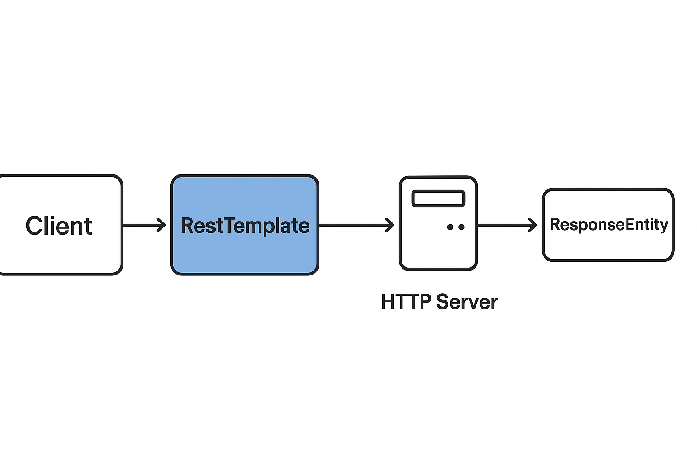

---

# **Lesson Notes: RestTemplate in Spring**

## **1. Introduction**

`RestTemplate` is a synchronous client provided by Spring for consuming RESTful web services.
It provides a higher-level abstraction over the standard HTTP client libraries, allowing developers to easily send HTTP requests and handle responses.

Although `RestTemplate` is now gradually being replaced by **WebClient** (a non-blocking reactive alternative), it remains a widely used and powerful tool for making REST API calls.

---

## **2. Setting Up RestTemplate**

### **2.1. Adding RestTemplate**

Since Spring Boot automatically includes all necessary dependencies when you add the `spring-boot-starter-web` dependency, you can create a `RestTemplate` instance directly.

```java
import org.springframework.web.client.RestTemplate;
import org.springframework.boot.test.context.SpringBootTest;

@SpringBootTest
public class ProjectRestAPILiveTest {

    private static final String BASE_URL = "http://localhost:8080/projects/";
    private RestTemplate restTemplate = new RestTemplate();

    // Tests will go here
}
```

> **Note:** In production, `RestTemplate` is usually declared as a Spring Bean and injected where needed.

---

## **3. Using RestTemplate to Send GET Requests**

### **3.1. Retrieve Data with `getForEntity()`**

The `getForEntity()` method retrieves data from a REST endpoint and returns a `ResponseEntity` that includes:

* The response body
* The HTTP status code
* The HTTP headers

```java
@Test
public void givenProjectExists_whenGet_thenSuccess() {
    ResponseEntity<ProjectDto> response = 
        restTemplate.getForEntity(BASE_URL + "1", ProjectDto.class);

    assertEquals(HttpStatus.OK, response.getStatusCode());
    assertNotNull(response.getBody());
}
```

Here, the `ProjectDto` object is automatically deserialized from JSON into a Java object using Spring’s message converters.

---

### **3.2. Retrieve Object Directly with `getForObject()`**

If you only need the response body, you can use `getForObject()` instead of `getForEntity()`.

```java
ProjectDto project = restTemplate.getForObject(BASE_URL + "1", ProjectDto.class);
System.out.println("Project Name: " + project.getName());
```

---

## **4. Using RestTemplate to Send POST Requests**

### **4.1. Creating a Resource with `postForEntity()`**

The `postForEntity()` method is used to send data to a REST API and receive a response.

```java
@Test
public void givenNewProject_whenCreated_thenSuccess() {
    ProjectDto newProject = new ProjectDto(1L, "First Project", LocalDate.now());
    ResponseEntity<Void> response = 
        restTemplate.postForEntity(BASE_URL, newProject, Void.class);

    assertEquals(HttpStatus.OK, response.getStatusCode());
}
```

Here, the method sends a **POST** request with the project data in the body and checks for a 200 OK response.

---

### **4.2. Using `postForObject()`**

The `postForObject()` method returns the response body directly rather than the full `ResponseEntity`.

```java
ProjectDto newProject = new ProjectDto(2L, "Second Project", LocalDate.now());
ProjectDto createdProject = restTemplate.postForObject(BASE_URL, newProject, ProjectDto.class);

System.out.println("Created Project: " + createdProject.getName());
```

---

### **4.3. Using `postForLocation()`**

This method is useful when the server returns a **Location header** indicating where the newly created resource can be accessed.

```java
URI location = restTemplate.postForLocation(BASE_URL, newProject);
System.out.println("New project created at: " + location);
```

---

## **5. Advantages of RestTemplate**

| **Feature**              | **Description**                                                                               |
| ------------------------ | --------------------------------------------------------------------------------------------- |
| **Simplicity**           | Provides high-level methods for all common HTTP verbs (GET, POST, PUT, DELETE).               |
| **Automatic Conversion** | Converts request/response bodies between JSON and Java objects using `HttpMessageConverters`. |
| **Customizable**         | Can use different HTTP clients like Apache HttpClient or OkHttp.                              |
| **Error Handling**       | Returns detailed `ResponseEntity` objects that include status codes and headers.              |

---

## **6. Example: Complete API Consumption**

Below is a full example showing GET and POST operations in a single test class.

```java
@SpringBootTest
public class ProjectRestAPILiveTest {

    private static final String BASE_URL = "http://localhost:8080/projects/";
    private RestTemplate restTemplate = new RestTemplate();

    @Test
    public void givenProjectExists_whenGet_thenSuccess() {
        ResponseEntity<ProjectDto> response = 
            restTemplate.getForEntity(BASE_URL + "1", ProjectDto.class);
        assertEquals(HttpStatus.OK, response.getStatusCode());
        assertNotNull(response.getBody());
    }

    @Test
    public void givenNewProject_whenCreated_thenSuccess() {
        ProjectDto newProject = new ProjectDto(2L, "Test Project", LocalDate.now());
        ResponseEntity<Void> response = 
            restTemplate.postForEntity(BASE_URL, newProject, Void.class);
        assertEquals(HttpStatus.OK, response.getStatusCode());
    }
}
```

---

✅ **Up next (Page 2 of 2):**

* PUT, DELETE, and exchange() usage
* Configuring headers and authentication
* Handling timeouts and custom HTTP clients
* Comparison between RestTemplate and WebClient

---

## **7. Using Other HTTP Methods**

### **7.1. PUT — Updating a Resource**

The `put()` method sends an HTTP PUT request to update an existing resource. It does not return a response body.

```java
@Test
public void whenUpdateProject_thenSuccess() {
    ProjectDto updatedProject = new ProjectDto(1L, "Updated Project", LocalDate.now());
    restTemplate.put(BASE_URL + "1", updatedProject);
    System.out.println("Project updated successfully!");
}
```

If you need more control (for example, checking headers or status codes), you can use the more flexible `exchange()` method.

---

### **7.2. DELETE — Removing a Resource**

The `delete()` method deletes a resource identified by a URL.

```java
@Test
public void whenDeleteProject_thenSuccess() {
    restTemplate.delete(BASE_URL + "1");
    System.out.println("Project deleted successfully!");
}
```

---

### **7.3. Using `exchange()` for Flexible Operations**

The `exchange()` method is a versatile API for any HTTP operation.
It lets you specify:

* The HTTP method (GET, POST, PUT, DELETE)
* The request body and headers
* The expected response type

```java
HttpHeaders headers = new HttpHeaders();
headers.setContentType(MediaType.APPLICATION_JSON);

ProjectDto project = new ProjectDto(3L, "Exchange API Project", LocalDate.now());
HttpEntity<ProjectDto> request = new HttpEntity<>(project, headers);

ResponseEntity<ProjectDto> response = restTemplate.exchange(
        BASE_URL, HttpMethod.POST, request, ProjectDto.class);

assertEquals(HttpStatus.OK, response.getStatusCode());
System.out.println("Created Project: " + response.getBody().getName());
```

---

## **8. Handling HTTP Headers and Authentication**

Sometimes you need to send authentication details or custom headers.

### **8.1. Adding Headers**

```java
HttpHeaders headers = new HttpHeaders();
headers.setContentType(MediaType.APPLICATION_JSON);
headers.set("Authorization", "Bearer your-token-here");

HttpEntity<String> entity = new HttpEntity<>("body", headers);
ResponseEntity<String> response = restTemplate.exchange(
        "https://api.example.com/data", HttpMethod.GET, entity, String.class);
```

---

### **8.2. Basic Authentication**

#### **Option 1: Manually Add Authorization Header**

```java
HttpHeaders headers = new HttpHeaders();
String auth = "user:password";
byte[] encodedAuth = Base64.getEncoder().encode(auth.getBytes(StandardCharsets.US_ASCII));
String authHeader = "Basic " + new String(encodedAuth);
headers.set("Authorization", authHeader);

HttpEntity<String> entity = new HttpEntity<>(headers);
ResponseEntity<String> response = restTemplate.exchange(
        "http://localhost:8080/api/secure", HttpMethod.GET, entity, String.class);
```

#### **Option 2: Using Spring Interceptor**

```java
restTemplate.getInterceptors().add(
    new BasicAuthorizationInterceptor("user", "password")
);
```

---

## **9. Configuring Timeouts and Custom HTTP Clients**

`RestTemplate` uses a `ClientHttpRequestFactory` internally. You can customize it to configure timeouts or switch HTTP clients.

### **9.1. Example with Apache HttpClient**

```java
public RestTemplate getCustomRestTemplate() {
    int timeout = 5000;

    HttpComponentsClientHttpRequestFactory factory = new HttpComponentsClientHttpRequestFactory();
    factory.setConnectTimeout(timeout);
    factory.setReadTimeout(timeout);

    return new RestTemplate(factory);
}
```

---

### **9.2. Example with OkHttp or Custom Pooling**

```java
OkHttpClient okHttpClient = new OkHttpClient.Builder()
    .connectTimeout(5, TimeUnit.SECONDS)
    .readTimeout(5, TimeUnit.SECONDS)
    .build();

ClientHttpRequestFactory factory = new OkHttp3ClientHttpRequestFactory(okHttpClient);
RestTemplate restTemplate = new RestTemplate(factory);
```

---

## **10. Handling Character Encoding in JSON Requests**

To ensure correct encoding (especially for non-Latin characters like Japanese, Thai, or Arabic), explicitly specify UTF-8:

```java
HttpHeaders headers = new HttpHeaders();
headers.set("Content-Type", "application/json; charset=UTF-8");
HttpEntity<Person> request = new HttpEntity<>(new Person(100, "関連当"), headers);

Person person = restTemplate.postForObject(BASE_URL, request, Person.class);
assertEquals("関連当", person.getName());
```

---

## **11. Common RestTemplate Methods**

| **Method**          | **HTTP Verb** | **Purpose**                                         |
| ------------------- | ------------- | --------------------------------------------------- |
| `getForObject()`    | GET           | Retrieves a resource and returns the body           |
| `getForEntity()`    | GET           | Retrieves a resource and returns a `ResponseEntity` |
| `postForObject()`   | POST          | Creates a new resource and returns the body         |
| `postForEntity()`   | POST          | Creates a new resource and returns `ResponseEntity` |
| `postForLocation()` | POST          | Creates a new resource and returns its URI          |
| `put()`             | PUT           | Updates an existing resource                        |
| `delete()`          | DELETE        | Deletes a resource                                  |
| `exchange()`        | Any           | Flexible API for all HTTP methods                   |
| `headForHeaders()`  | HEAD          | Retrieves headers only                              |
| `optionsForAllow()` | OPTIONS       | Retrieves supported HTTP methods                    |

---

## **12. Example: Full CRUD Operations**

```java
@RestController
@RequestMapping("/projects")
public class ProjectController {

    @GetMapping("/{id}")
    public ProjectDto findOne(@PathVariable Long id) {
        return new ProjectDto(id, "Spring REST Project", LocalDate.now());
    }

    @PostMapping
    public void create(@RequestBody ProjectDto newProject) {
        System.out.println("Created: " + newProject.getName());
    }

    @PutMapping("/{id}")
    public void update(@PathVariable Long id, @RequestBody ProjectDto updatedProject) {
        System.out.println("Updated Project ID " + id);
    }

    @DeleteMapping("/{id}")
    public void delete(@PathVariable Long id) {
        System.out.println("Deleted Project ID " + id);
    }
}
```

Then, the client side using RestTemplate:

```java
RestTemplate restTemplate = new RestTemplate();

// GET
ProjectDto project = restTemplate.getForObject(BASE_URL + "1", ProjectDto.class);

// POST
restTemplate.postForEntity(BASE_URL, new ProjectDto(2L, "New Project", LocalDate.now()), Void.class);

// PUT
restTemplate.put(BASE_URL + "1", new ProjectDto(1L, "Updated Project", LocalDate.now()));

// DELETE
restTemplate.delete(BASE_URL + "1");
```

---

## **13. RestTemplate vs WebClient**

| **Feature**           | **RestTemplate**            | **WebClient**                        |
| --------------------- | --------------------------- | ------------------------------------ |
| **Programming model** | Synchronous (blocking)      | Asynchronous (non-blocking)          |
| **Performance**       | Simpler, but less efficient | High performance, scalable           |
| **Streaming support** | No                          | Yes                                  |
| **Reactive support**  | No                          | Yes                                  |
| **Error handling**    | Via `ResponseErrorHandler`  | Functional, declarative style        |
| **Use case**          | Traditional Spring MVC apps | Reactive and modern Spring Boot apps |

> **Recommendation:** For new projects, prefer **WebClient**.
> For legacy or synchronous systems, **RestTemplate** remains perfectly valid.

---

## **14. Conclusion**

`RestTemplate` simplifies communication between microservices and APIs by handling:

* HTTP connection setup
* Serialization/deserialization of request/response
* Error handling and header management

It supports all HTTP methods and can easily integrate with different HTTP clients, making it a flexible and developer-friendly solution for RESTful communication in Spring applications.

---

## *RestTemplate request flow*

