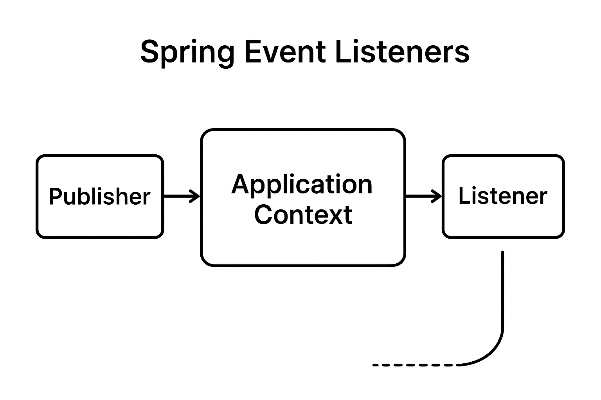

---

# **Lesson Notes: Spring Event Listeners**

---

## **2.1 Overview**

Spring’s **event-driven programming model** enables components to communicate in a **loosely coupled** manner.
It follows the **Observer Design Pattern**, where:

* **Publishers** (subjects) fire events.
* **Listeners** (observers) react to those events.

This design improves modularity by decoupling components that don’t need direct dependencies.

**Key Characteristics:**

* By default, Spring events are **synchronous** — they are sent and processed within the **same thread**.
* You can configure **asynchronous processing**, but it is **not enabled by default**.
* Events in Spring are **in-process only**. They **do not** travel across JVM boundaries.

    * ⚠️ Therefore, this mechanism is **not** a message broker or a distributed event bus (e.g., Kafka, RabbitMQ).

---

## **2.2 The Event and Listener API**

### **Event**

An **event** is simply a **plain Java object (POJO)** representing something that has happened in the system.

It can contain any data you want to share with the listeners.

> Prior to Spring 4.2, event classes had to extend `ApplicationEvent`.
> From Spring 4.2 onward, any POJO can act as an event.

### **Listener**

An **event listener** is a **Spring-managed bean** with a method that responds to a specific event type.

When the event is published, all registered listeners for that event are automatically notified.

### **Publisher**

Events are triggered using the **Event Publishing API**, typically through:

* `ApplicationEventPublisher`
* or directly from the `ApplicationContext`.

Spring handles the task of dispatching events to the appropriate listeners.

---

## **2.3 Creating a Simple Event**

Let’s create a simple event that represents the creation of a new project.

```java
public class ProjectCreatedEvent {

    private Long projectId;

    public ProjectCreatedEvent(Long projectId) {
        this.projectId = projectId;
    }

    public Long getProjectId() {
        return projectId;
    }

    public void setProjectId(Long projectId) {
        this.projectId = projectId;
    }
}
```

This is a **POJO** with a single field, `projectId`, used to identify the created project.

---

## **2.4 Publishing the Event**

We use the `ApplicationEventPublisher` to trigger or fire the event.

**Steps:**

1. Inject `ApplicationEventPublisher` into your component (e.g., controller or service).
2. Publish the event after performing your desired action (like saving an entity).

**Example:**

```java
import org.springframework.beans.factory.annotation.Autowired;
import org.springframework.context.ApplicationEventPublisher;
import org.springframework.stereotype.Controller;
import org.springframework.web.bind.annotation.PostMapping;

@Controller
public class ProjectController {

    @Autowired
    private ApplicationEventPublisher publisher;

    @Autowired
    private ProjectService projectService;

    @PostMapping("/projects")
    public String addProject(ProjectDto projectDto) {
        Project newProject = projectService.save(convertToEntity(projectDto));
        publisher.publishEvent(new ProjectCreatedEvent(newProject.getId()));
        return "redirect:/projects";
    }
}
```

✅ The `publishEvent()` method fires the event and notifies all interested listeners.

---

## **2.5 Creating the Event Listener**

Listeners react to specific event types using the `@EventListener` annotation.

**Example:**

```java
import org.slf4j.Logger;
import org.slf4j.LoggerFactory;
import org.springframework.context.event.EventListener;
import org.springframework.stereotype.Component;

@Component
public class ProjectCreatedEventListener {

    private static final Logger LOG = LoggerFactory.getLogger(ProjectCreatedEventListener.class);

    @EventListener
    public void handleProjectCreatedEvent(ProjectCreatedEvent event) {
        LOG.info("New Project Created with Id {}", event.getProjectId());
    }
}
```

When `ProjectCreatedEvent` is fired, this method runs automatically.

### **Output Example**

```
INFO  com.example.ProjectCreatedEventListener - New Project Created with Id 4
```

---

## **2.6 Asynchronous Event Listeners**

By default, event handling is **synchronous** (executed in the same thread).
To make listeners run **asynchronously**, annotate the listener method with `@Async`.

Example:

```java
import org.springframework.scheduling.annotation.Async;
import org.springframework.context.event.EventListener;
import org.springframework.stereotype.Component;

@Component
public class AsyncProjectCreatedListener {

    @Async
    @EventListener
    public void handleProjectCreatedEvent(ProjectCreatedEvent event) {
        System.out.println("Processing project creation asynchronously: " + event.getProjectId());
    }
}
```

> To use `@Async`, you must enable asynchronous support in your configuration:

```java
import org.springframework.context.annotation.Configuration;
import org.springframework.scheduling.annotation.EnableAsync;

@Configuration
@EnableAsync
public class AsyncConfig { }
```

---

## **2.7 Event Handling in Tests**

Spring provides tools to record and test application events in unit tests using `@RecordApplicationEvents`.

**Example:**

```java
import org.junit.jupiter.api.Test;
import org.springframework.beans.factory.annotation.Autowired;
import org.springframework.test.context.junit.jupiter.SpringJUnitConfig;
import org.springframework.test.context.event.RecordApplicationEvents;
import org.springframework.test.context.event.ApplicationEvents;

@SpringJUnitConfig
@RecordApplicationEvents
class OrderServiceTests {

    @Test
    void testEventPublication(@Autowired OrderService service, ApplicationEvents events) {
        service.submitOrder(new Order("order-1"));
        long count = events.stream(OrderSubmittedEvent.class).count();
        assertThat(count).isEqualTo(1);
    }
}
```

✅ This ensures that events are correctly published during service execution.

---

## **2.8 How Events Work Internally**

Spring’s event system works through the **ApplicationContext**, which:

1. Maintains a registry of all event listeners.
2. Publishes events via `ApplicationEventMulticaster`.
3. Invokes matching listeners for each event type.

---

## **2.9 Advantages of Using Events**

| **Advantage**      | **Explanation**                                                               |
| ------------------ | ----------------------------------------------------------------------------- |
| **Loose Coupling** | Publishers and listeners don’t depend on each other directly.                 |
| **Modularity**     | Each listener can perform independent logic (e.g., logging, notifications).   |
| **Reusability**    | You can reuse or replace listeners without altering core business logic.      |
| **Scalability**    | Multiple listeners can handle the same event concurrently (especially async). |

---

## **2.10 Complete Example: Spring Boot Project Structure**

**1️⃣ Event Class**

```java
public class CustomSpringEvent {
    private final String message;

    public CustomSpringEvent(String message) {
        this.message = message;
    }

    public String getMessage() {
        return message;
    }
}
```

**2️⃣ Publisher**

```java
import org.springframework.context.ApplicationEventPublisher;
import org.springframework.stereotype.Component;

@Component
public class CustomSpringEventPublisher {

    private final ApplicationEventPublisher publisher;

    public CustomSpringEventPublisher(ApplicationEventPublisher publisher) {
        this.publisher = publisher;
    }

    public void publish(String message) {
        System.out.println("Publishing custom event...");
        publisher.publishEvent(new CustomSpringEvent(message));
    }
}
```

**3️⃣ Listener**

```java
import org.springframework.context.event.EventListener;
import org.springframework.stereotype.Component;

@Component
public class CustomSpringEventListener {

    @EventListener
    public void onCustomEvent(CustomSpringEvent event) {
        System.out.println("Received event: " + event.getMessage());
    }
}
```

**4️⃣ Trigger (Runner Class)**

```java
import org.springframework.boot.CommandLineRunner;
import org.springframework.stereotype.Component;

@Component
public class AppRunner implements CommandLineRunner {

    private final CustomSpringEventPublisher publisher;

    public AppRunner(CustomSpringEventPublisher publisher) {
        this.publisher = publisher;
    }

    @Override
    public void run(String... args) {
        publisher.publish("Hello, Spring Event!");
    }
}
```

**Output:**

```
Publishing custom event...
Received event: Hello, Spring Event!
```
**How These Components Work Together**
- Event Creation: The event class, CustomSpringEvent, can be defined to represent the event in the application.
- Event Publishing: The publisher component, CustomSpringEventPublisher, is responsible for creating and publishing this event to the Spring context. The event is typically published in response to some application logic.
- Event Listening: The listener component, CustomSpringEventListener, is registered to listen for the specific event type, CustomSpringEvent. When the event is published, the listener's method is triggered, allowing the application to respond to the event.

**Advantages of Using Event Handling in Spring**
- Loose Coupling: Publishers and listeners do not need to know about each other. They can communicate through events, making the system more modular and easier to maintain.
- Scalability: New listeners can be easily added without modifying the existing publishing logic.
- Flexibility: Different listeners can handle the same event in different ways, allowing for a variety of reactions to a single event.
---

## **2.11 Conclusion**
Spring's event handling mechanism provides a flexible way to manage communication between different components of an application. By using custom events, publishers, and listeners, you can create a robust and loosely-coupled architecture. This approach enhances the maintainability and scalability of your Spring Boot applications.
Spring’s **Event Listener** mechanism offers a simple yet powerful way to:

* Decouple components,
* React to application events,
* And structure your application cleanly.

By understanding how to create, publish, and listen to events, developers can design more **modular, maintainable, and scalable** applications.

---

## Event Listener flow diagram

