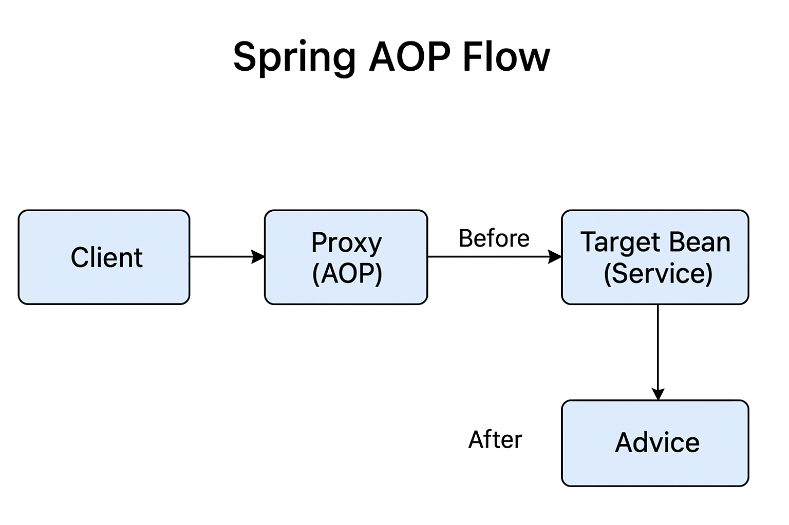

---

## 🧭 **Lesson Title:** Spring AOP (Aspect-Oriented Programming)

---

### **1. Lesson Goals**

In this lesson, we aim to:

* Understand the concept of **Aspect-Oriented Programming (AOP)** in Spring.
* Identify **cross-cutting concerns** and how AOP modularizes them.
* Learn the **key components of AOP**: Aspect, Advice, Pointcut, Join Point, and Weaving.
* Implement **Spring AOP** in a real example with code.
* Appreciate how AOP promotes **cleaner, maintainable, and loosely coupled code**.

---

### **2. Introduction to AOP**

**Aspect-Oriented Programming (AOP)** is a programming paradigm that improves modularity by separating **cross-cutting concerns** — functionalities that are scattered across multiple modules, such as:

* Logging
* Security
* Transaction management
* Exception handling
* Performance monitoring

In traditional OOP, these concerns are **tangled** with business logic, making code harder to read and maintain.
AOP solves this by **adding behavior to existing code without modifying it directly.**

---

### **3. Why Use AOP?**

Manually adding logging or security checks into every service or controller method can lead to **code repetition**, **tight coupling**, and **violations of the Open/Closed Principle**.

* When applications grow large, this becomes inefficient and error-prone.
* AOP enables **separation of concerns** — keeping business logic clean and reusable.
* The **infrastructure logic** (like logging or transaction management) is implemented separately and applied declaratively.

---

### **4. Key Concepts in Spring AOP**

| **Term**       | **Definition**                                                                    | **Example / Description**                       |
| -------------- | --------------------------------------------------------------------------------- | ----------------------------------------------- |
| **Aspect**     | A module that encapsulates a cross-cutting concern.                               | Example: LoggingAspect, SecurityAspect          |
| **Advice**     | The action taken by an aspect at a particular join point (before, after, around). | Example: Logging before a method call           |
| **Join Point** | A point in program execution where an aspect can be applied (e.g., method call).  | Example: Method execution in a service class    |
| **Pointcut**   | An expression that selects join points to apply advice.                           | Example: `execution(* com.app.service.*.*(..))` |
| **Weaving**    | The process of linking aspects with target code.                                  | Done at compile, load, or runtime in Spring     |

---

### **5. Types of Advice in Spring AOP**

| **Advice Type**     | **Description**                                            | **Annotation**    |
| ------------------- | ---------------------------------------------------------- | ----------------- |
| **Before Advice**   | Runs before the method execution.                          | `@Before`         |
| **After Advice**    | Runs after method execution (regardless of success).       | `@After`          |
| **After Returning** | Runs after a method returns a value successfully.          | `@AfterReturning` |
| **After Throwing**  | Runs if the method throws an exception.                    | `@AfterThrowing`  |
| **Around Advice**   | Wraps around method execution (can modify inputs/outputs). | `@Around`         |

---

### **6. Example: Logging Aspect with AOP**

#### **Step 1: Maven Dependencies**

Add Spring AOP starter to your `pom.xml`:

```xml
<dependency>
    <groupId>org.springframework.boot</groupId>
    <artifactId>spring-boot-starter-aop</artifactId>
</dependency>
```

---

#### **Step 2: Create a Service Class**

```java
package com.example.demo.service;

import org.springframework.stereotype.Service;

@Service
public class ProductService {
    public void addProduct(String name) {
        System.out.println("Adding product: " + name);
    }

    public void deleteProduct(String name) {
        System.out.println("Deleting product: " + name);
    }
}
```

---

#### **Step 3: Define an Aspect Class**

```java
package com.example.demo.aspect;

import org.aspectj.lang.JoinPoint;
import org.aspectj.lang.annotation.*;
import org.springframework.stereotype.Component;

@Aspect
@Component
public class LoggingAspect {

    // Define a pointcut for all methods in ProductService
    @Pointcut("execution(* com.example.demo.service.ProductService.*(..))")
    public void productServiceMethods() {}

    @Before("productServiceMethods()")
    public void beforeMethod(JoinPoint joinPoint) {
        System.out.println("[BEFORE] Executing: " + joinPoint.getSignature().getName());
    }

    @AfterReturning("productServiceMethods()")
    public void afterReturning(JoinPoint joinPoint) {
        System.out.println("[AFTER RETURNING] Completed: " + joinPoint.getSignature().getName());
    }

    @AfterThrowing(value = "productServiceMethods()", throwing = "ex")
    public void afterThrowing(JoinPoint joinPoint, Exception ex) {
        System.out.println("[AFTER THROWING] Exception in " + joinPoint.getSignature().getName() + ": " + ex.getMessage());
    }
}
```

---

#### **Step 4: Main Application**

```java
package com.example.demo;

import com.example.demo.service.ProductService;
import org.springframework.beans.factory.annotation.Autowired;
import org.springframework.boot.CommandLineRunner;
import org.springframework.boot.SpringApplication;
import org.springframework.boot.autoconfigure.SpringBootApplication;

@SpringBootApplication
public class AopApplication implements CommandLineRunner {

    @Autowired
    private ProductService productService;

    public static void main(String[] args) {
        SpringApplication.run(AopApplication.class, args);
    }

    @Override
    public void run(String... args) {
        productService.addProduct("Laptop");
        productService.deleteProduct("Mobile");
    }
}
```

**Output:**

```
[BEFORE] Executing: addProduct
Adding product: Laptop
[AFTER RETURNING] Completed: addProduct
[BEFORE] Executing: deleteProduct
Deleting product: Mobile
[AFTER RETURNING] Completed: deleteProduct
```

---

### **7. Advantages of AOP**

* **Separation of Concerns:** Keeps core business logic clean.
* **Reduced Code Duplication:** Common behavior defined once.
* **Improved Maintainability:** Easier debugging and testing.
* **Dynamic Modularity:** Cross-cutting behavior can be modified centrally.

---

### **8. Common Use Cases**

| **Use Case** | **Description**                                   |
| ------------ | ------------------------------------------------- |
| Logging      | Centralized log management for all methods        |
| Security     | Role-based access control before method execution |
| Transactions | Manage commits and rollbacks transparently        |
| Performance  | Track execution time of methods                   |
| Auditing     | Record user actions for compliance                |

---

### **9. Summary**

Spring AOP provides a **powerful way to modularize cross-cutting concerns** like logging, security, and transactions without cluttering the business logic.
It promotes **clean architecture**, **adheres to SOLID principles**, and is **integrated deeply within Spring** — meaning you already benefit from it even if you don’t write aspects explicitly.

---

### **10. Spring AOP Flow**

