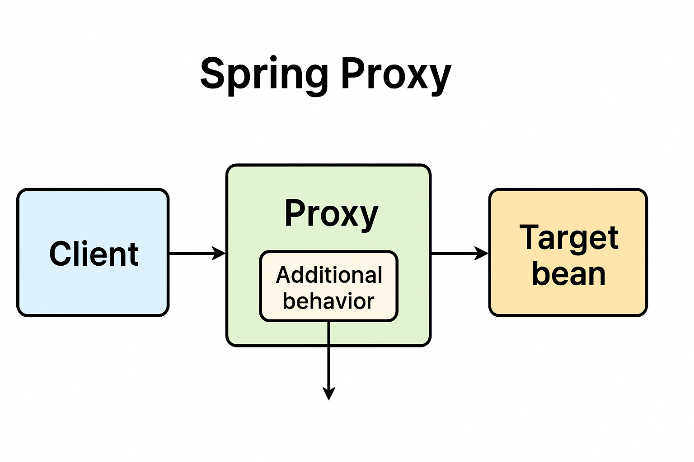

---

## **Spring Proxies**

---

### **3.1 What Is a Proxy Object?**

A **proxy** is a *wrapper object* that stands in for another object—the *real object*—and controls access to it. When the client invokes a method on the proxy, the proxy can execute **additional behavior** (such as logging, security checks, or transactions) *before* or *after* delegating the actual call to the target object.

In the **Spring Framework**, proxies form the backbone of many key features, such as:

* **AOP (Aspect-Oriented Programming)**
* **Transactional management**
* **Security enforcement**
* **Lazy loading**

---

### **3.2 How Spring Uses Proxies**

When Spring detects that a bean needs additional behavior (for example, when a method is annotated with `@Transactional` or `@Secured`), it does not inject the bean instance directly.
Instead, Spring injects a **proxy object** that wraps the target bean.

When a client calls a method on this proxy:

1. The proxy intercepts the call.
2. Executes the additional behavior (e.g., start a transaction).
3. Delegates the actual business logic to the target bean.
4. Optionally performs some logic after the call (e.g., commit or rollback the transaction).

---

### **3.3 Proxies in Action: Example**

Let’s see how proxies work using **Spring’s transaction support**.

#### **Without Transactional Proxy**

```java
public class ProjectServiceImpl implements IProjectService {

    @Override
    public Project save(Project project) {
        if (StringUtils.isEmpty(project.getId())) {
            project.setDateCreated(LocalDate.now());
        }
        return projectRepository.save(project);
    }
}
```

---

#### **Client Code (Integration Test)**

```java
@SpringBootTest
public class ProjectServiceIntegrationTest {
    
   @Autowired
   private IProjectService projectService;
   
   @Test
   public void givenNewProject_whenSaved_thenSuccess() {
       Project newProject = new Project("First Project", LocalDate.now());
       assertNotNull(projectService.save(newProject));
   }
}
```

At this stage, when you inspect the injected bean in the debugger:

```
projectService = ProjectServiceImpl
```

Spring injected the real class because it did **not** require any proxying.

---

#### **With Transactional Proxy**

Now, make the `save` method transactional:

```java
public class ProjectServiceImpl implements IProjectService {

    @Override
    @Transactional
    public Project save(Project project) {
        if (StringUtils.isEmpty(project.getId())) {
            project.setDateCreated(LocalDate.now());
        }
        return projectRepository.save(project);
    }
}
```

Re-run the test and inspect the `projectService` again:

```
projectService = com.sun.proxy.$Proxy69
```

Spring now injects a **proxy** object instead of the actual implementation.
This proxy manages the transaction lifecycle before and after the `save()` method executes.

---

### **3.4 Spring Proxying Mechanism**

Spring can generate proxies using two main mechanisms:

#### **A. JDK Dynamic Proxies**

* Built into the JDK (`java.lang.reflect.Proxy`).
* Create proxy implementations for **interfaces**.
* By default, Spring uses JDK proxies if the target class implements at least one interface.

**Example:**
In the above case, since `ProjectServiceImpl` implements `IProjectService`, Spring used a **JDK proxy**.

**Limitations:**

* Only interface methods are proxied.
* **Self-invocation** (a method calling another method on the same class via `this`) is **not intercepted**.

**Simple Illustration:**

```java
public interface Pojo {
    void foo();
    void bar();
}

public class SimplePojo implements Pojo {
    public void foo() {
        this.bar();  // Not intercepted
    }
    public void bar() { /* some logic */ }
}
```

If `SimplePojo` is proxied, only external calls (e.g., from another class) are intercepted, not internal calls using `this.bar()`.

---

#### **B. CGLIB Proxies**

If the target class does **not** implement any interface, Spring uses **CGLIB (Code Generation Library)** to create a proxy.

* CGLIB dynamically generates a subclass of the target class.
* The subclass overrides methods and delegates calls to the original class.
* Used widely in Spring Boot since `spring.aop.proxy-target-class=true` by default.

**Limitations:**

* Cannot proxy `final` classes or methods (cannot override them).
* Private methods are not advised.
* Requires class bytecode modification at runtime.

---

### **3.5 Spring Boot Proxy Configuration**

By default, **Spring Boot uses CGLIB proxies**, controlled by the property:

```properties
spring.aop.proxy-target-class=true
```

To switch to JDK dynamic proxies, set:

```properties
spring.aop.proxy-target-class=false
```

---

### **3.6 Understanding AOP Proxies**

Spring AOP is **proxy-based**, meaning all method calls are routed through a proxy object.
This is important because **self-invocation** bypasses the proxy and therefore skips any advice (like transactions or logging).

---

#### **Example: Using ProxyFactory**

```java
public class Main {
    public static void main(String[] args) {
        ProxyFactory factory = new ProxyFactory(new SimplePojo());
        factory.addInterface(Pojo.class);
        factory.addAdvice(new RetryAdvice());
        
        Pojo pojo = (Pojo) factory.getProxy();
        pojo.foo();  // Method call on proxy
    }
}
```

Here, the `ProxyFactory` generates a proxy object that can execute advice (`RetryAdvice`) before and after method calls.

---

#### **Example: Avoiding Self-Invocation Issue**

**Option 1:** Refactor code to avoid calling methods internally via `this`.
**Option 2:** Inject a self-reference (proxy of the same bean).
**Option 3:** Use `AopContext.currentProxy()` (discouraged):

```java
public class SimplePojo implements Pojo {

    public void foo() {
        // Invokes proxy instead of 'this'
        ((Pojo) AopContext.currentProxy()).bar();
    }

    public void bar() { /* logic */ }
}
```

To enable this, configure:

```java
ProxyFactory factory = new ProxyFactory(new SimplePojo());
factory.setExposeProxy(true);
```

---

### **3.7 Programmatic Creation of @AspectJ Proxies**

You can also create proxies programmatically using `AspectJProxyFactory`.

```java
AspectJProxyFactory factory = new AspectJProxyFactory(targetObject);
factory.addAspect(SecurityManager.class);
factory.addAspect(UsageTracker.class);
MyInterface proxy = factory.getProxy();
```

This allows creating a proxy that applies one or more **@AspectJ** aspects to a target object dynamically.

---

### **3.8 JDK Dynamic Proxy Example (Standalone)**

Java provides native support for creating dynamic proxies.

#### **Step 1: Create Invocation Handler**

```java
public class DynamicInvocationHandler implements InvocationHandler {

    @Override
    public Object invoke(Object proxy, Method method, Object[] args)
      throws Throwable {
        System.out.println("Invoked method: " + method.getName());
        return 42;
    }
}
```

#### **Step 2: Create Proxy Instance**

```java
Map proxyInstance = (Map) Proxy.newProxyInstance(
  DynamicProxyTest.class.getClassLoader(),
  new Class[] { Map.class },
  new DynamicInvocationHandler()
);

proxyInstance.put("hello", "world");
```

Output:

```
Invoked method: put
```

---

### **3.9 CGLIB Proxy Example (Standalone)**

```java
public class PersonService {
    public String sayHello(String name) {
        return "Hello " + name;
    }

    public Integer lengthOfName(String name) {
        return name.length();
    }
}
```

#### **Using Enhancer**

```java
Enhancer enhancer = new Enhancer();
enhancer.setSuperclass(PersonService.class);
enhancer.setCallback((MethodInterceptor) (obj, method, args, proxy) -> {
    if (method.getReturnType() == String.class) {
        return "Hello Tom!";
    } else {
        return proxy.invokeSuper(obj, args);
    }
});

PersonService proxy = (PersonService) enhancer.create();
System.out.println(proxy.sayHello(null)); // Output: Hello Tom!
System.out.println(proxy.lengthOfName("Mary")); // Output: 4
```

---

### **3.10 Summary**

| Proxy Type            | Mechanism        | Works On        | Library Used        | Limitations                            |
| --------------------- | ---------------- | --------------- | ------------------- | -------------------------------------- |
| **JDK Dynamic Proxy** | Reflection-based | Interfaces only | Built-in JDK        | No self-invocation, interface required |
| **CGLIB Proxy**       | Subclass-based   | Classes         | cglib (spring-core) | Final/private methods not proxied      |

---

### **3.11 Key Takeaways**

* A **proxy** is an intermediary object that adds extra behavior before/after delegating calls.
* Spring uses proxies for AOP, transactions, and security.
* **JDK proxies** are used when the target implements interfaces.
* **CGLIB proxies** are used for concrete classes.
* Self-invocation bypasses proxy behavior — avoid or refactor when possible.
* In Spring Boot, `spring.aop.proxy-target-class=true` means **CGLIB proxies** are the default.

---

**method calls flow through Spring’s proxy**

