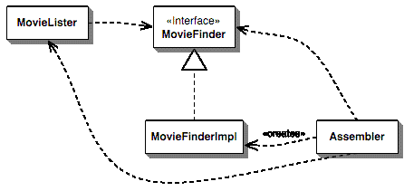
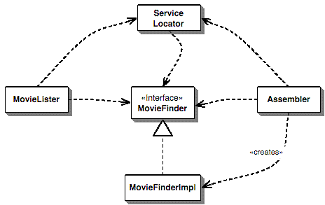

# 🧩 **Lesson Notes: Inversion of Control and Dependency Injection**

---

## **1. Introduction**

In modern Java development, applications are often composed of many interdependent components — database connectors, services, repositories, and controllers. Managing how these pieces connect is crucial for clean, maintainable, and testable code.

This is where **Inversion of Control (IoC)** and **Dependency Injection (DI)** come in.

These principles are the foundation of **lightweight containers** such as **Spring** and **PicoContainer**, which assemble application components and manage their dependencies automatically.

---

## **2. Inversion of Control (IoC)**

### 🧠 **Definition**

**Inversion of Control** is a design principle where the control of object creation and dependency management is “inverted” from the application code to an external framework or container.

In simpler terms:

> Instead of your code controlling dependencies, the framework controls how objects are created and connected.

Traditionally, objects create their own dependencies like this:


```java
class MovieLister {
    private MovieFinder finder;

    public MovieLister() {
        finder = new ColonMovieFinder("movies1.txt");
    }

    public List<Movie> moviesDirectedBy(String director) {
        List<Movie> allMovies = finder.findAll();
        return allMovies.stream()
                .filter(m -> m.getDirector().equals(director))
                .toList();
    }
}
```

Here, the `MovieLister` **controls the creation** of its dependency (`MovieFinder`).
That means if we later want to use a different `MovieFinder` implementation — say one that queries a database — we’ll have to **modify this class**, breaking flexibility and reusability.

---

### 🧩 **How IoC Changes This**

With IoC, an external container (like **Spring**) creates and injects the `MovieFinder` into `MovieLister`.
Now, the **control of dependency creation is inverted** — the container, not `MovieLister`, manages it.

---
The advantages of this architecture are:
````
1.decoupling the execution of a task from its implementation
2.making it easier to switch between different implementations
3.greater modularity of a program
4.greater ease in testing a program by isolating a component or mocking its dependencies, and allowing components to communicate through contracts
````
---
We can achieve Inversion of Control through various mechanisms such as: 
````
1.Strategy design pattern, 
2.Service Locator pattern,
3.Factory pattern, and
4.Dependency Injection (DI).
````
---
## **3. Dependency Injection (DI)**

### 🧠 **Definition**

**Dependency Injection** is a specific design pattern that implements Inversion of Control.
It “injects” required dependencies into a class instead of letting the class create them.

> Instead of a class saying “I need to build this,” it says “I need this — please give it to me.”

---

### ⚙️ **Types of Dependency Injection**

There are three main forms of DI:

| **Type**                  | **How Dependencies Are Provided**                                   |
| ------------------------- | ------------------------------------------------------------------- |
| **Constructor Injection** | Dependencies are passed via the class constructor.                  |
| **Setter Injection**      | Dependencies are set through public setter methods.                 |
| **Interface Injection**   | The class implements an interface that defines an injection method. |

---

## **4. Constructor Injection (Example: PicoContainer)**

### 🧩 **Concept**

The dependency is provided through the class constructor.
This approach makes dependencies **immutable** and ensures the class is always in a valid state when created.

### 💻 **Code Example**

```java
// Dependency interface
public interface MovieFinder {
    List<Movie> findAll();
}

// Dependency implementation
public class ColonMovieFinder implements MovieFinder {
    private String filename;

    public ColonMovieFinder(String filename) {
        this.filename = filename;
    }

    public List<Movie> findAll() {
        // Implementation that reads from a colon-delimited file
        return List.of(new Movie("Once Upon a Time in the West", "Sergio Leone"));
    }
}

// Dependent class using constructor injection
public class MovieLister {
    private MovieFinder finder;

    // Dependency injected via constructor
    public MovieLister(MovieFinder finder) {
        this.finder = finder;
    }

    public List<Movie> moviesDirectedBy(String director) {
        return finder.findAll().stream()
                .filter(m -> m.getDirector().equals(director))
                .toList();
    }
}
```

The configuration container (like PicoContainer) would create and “wire” these together:

```java
MutablePicoContainer pico = new DefaultPicoContainer();
Parameter[] finderParams = { new ConstantParameter("movies1.txt") };

pico.registerComponentImplementation(MovieFinder.class, ColonMovieFinder.class, finderParams);
pico.registerComponentImplementation(MovieLister.class);

MovieLister lister = (MovieLister) pico.getComponentInstance(MovieLister.class);
```

**Advantages**

* Strong immutability and clarity
* Easy to see dependencies in constructor
* Ensures complete initialization

---

## **5. Setter Injection (Example: Spring Framework)**

### 🧩 **Concept**

The container injects dependencies **after** object creation using setter methods.
It’s flexible and allows changes after instantiation.

### 💻 **Code Example**

```java
public class MovieLister {
    private MovieFinder finder;

    // Dependency injected through setter
    public void setFinder(MovieFinder finder) {
        this.finder = finder;
    }

    public List<Movie> moviesDirectedBy(String director) {
        return finder.findAll().stream()
                .filter(m -> m.getDirector().equals(director))
                .toList();
    }
}

public class ColonMovieFinder implements MovieFinder {
    private String filename;

    public void setFilename(String filename) {
        this.filename = filename;
    }

    public List<Movie> findAll() {
        // Simulate reading from file
        return List.of(new Movie("Once Upon a Time in the West", "Sergio Leone"));
    }
}
```

**XML Configuration (Spring Example)**

```xml
<beans>
    <bean id="movieFinder" class="ColonMovieFinder">
        <property name="filename" value="movies1.txt"/>
    </bean>

    <bean id="movieLister" class="MovieLister">
        <property name="finder" ref="movieFinder"/>
    </bean>
</beans>
```

**Java Test**

```java
ApplicationContext ctx = new FileSystemXmlApplicationContext("spring.xml");
MovieLister lister = (MovieLister) ctx.getBean("movieLister");
List<Movie> movies = lister.moviesDirectedBy("Sergio Leone");
```

**Advantages**

* More flexible configuration
* Ideal when dependencies can change at runtime
* Often simpler for frameworks using XML or annotations

---

## **6. Interface Injection**

### 🧩 **Concept**

The class implements an interface that defines an injection method.
The container then calls the method to supply the dependency.

### 💻 **Code Example**

```java
public interface MovieFinder {
    List<Movie> findAll();
}

// Injection interface
public interface FinderInjection {
    void injectFinder(MovieFinder finder);
}

public class MovieLister implements FinderInjection {
    private MovieFinder finder;

    @Override
    public void injectFinder(MovieFinder finder) {
        this.finder = finder;
    }

    public List<Movie> moviesDirectedBy(String director) {
        return finder.findAll().stream()
                .filter(m -> m.getDirector().equals(director))
                .toList();
    }
}
```

Here, the **container** must call `injectFinder()` to inject the dependency.
This approach is more explicit but less common because it’s more invasive — classes must implement extra interfaces.

---

## **7. Service Locator Pattern (Alternative to DI)**

### 🧩 **Concept**

Instead of having dependencies injected, the class **requests them** from a central registry (the Service Locator).

### 💻 **Code Example**

```java
public class ServiceLocator {
    private static MovieFinder movieFinder = new ColonMovieFinder("movies1.txt");

    public static MovieFinder getMovieFinder() {
        return movieFinder;
    }
}

public class MovieLister {
    private MovieFinder finder = ServiceLocator.getMovieFinder();

    public List<Movie> moviesDirectedBy(String director) {
        return finder.findAll().stream()
                .filter(m -> m.getDirector().equals(director))
                .toList();
    }
}
```

**Pros**

* Simple and explicit
* Works well for small or internal applications

**Cons**

* Harder to test (hidden dependencies)
* Class depends on the ServiceLocator itself, reducing flexibility

---

## **8. Comparing IoC, DI, and Service Locator**

| **Aspect**                   | **Dependency Injection**            | **Service Locator**               |
| ---------------------------- | ----------------------------------- | --------------------------------- |
| **Who provides dependency?** | Container or framework              | Class asks for it                 |
| **Dependency visibility**    | Clear in constructor or setters     | Hidden in code                    |
| **Ease of testing**          | Easier (dependencies can be mocked) | Harder unless locator is flexible |
| **Coupling**                 | Loosely coupled                     | Tightly coupled to locator        |
| **Complexity**               | Requires IoC container              | Simpler for small systems         |

---

## **9. Best Practices**

1. Prefer **constructor injection** for mandatory dependencies.
2. Use **setter injection** for optional dependencies.
3. Avoid **interface injection** unless required by a framework.
4. Always separate **configuration** (how dependencies are created) from **usage** (how they’re used).
5. Keep containers or configuration files **outside** business logic.
6. When designing reusable components for others, **Dependency Injection** is more portable than Service Locator.

---

## **10. Summary**

* **Inversion of Control (IoC)** transfers control of object creation from the program to the framework.
* **Dependency Injection (DI)** is a key IoC technique that provides dependencies externally via constructors, setters, or interfaces.
* **Service Locator** is an alternative pattern but adds coupling to the locator itself.
* Frameworks like **Spring**, **PicoContainer**, and **Guice** automate DI, making applications more modular, testable, and maintainable.

---
