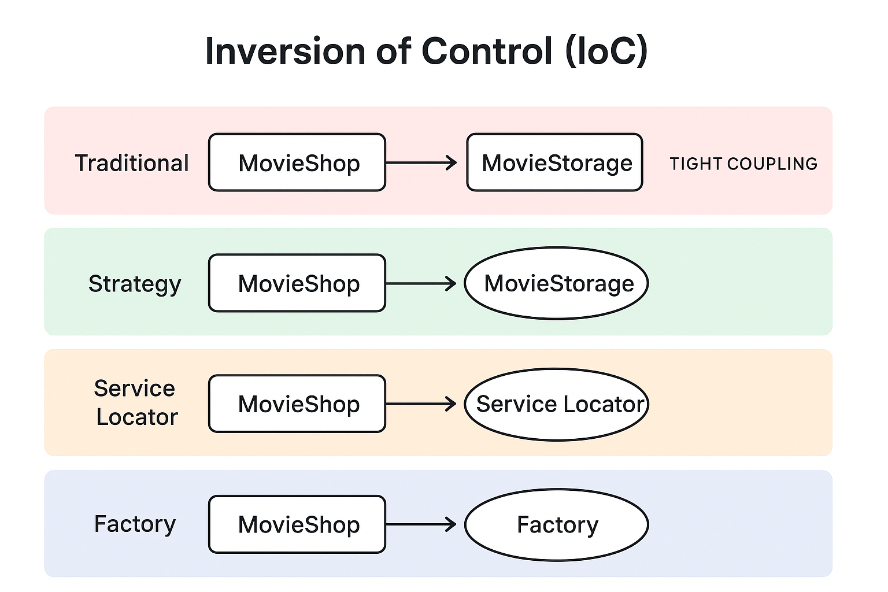

Perfect example 👌—your `MovieShop` class is currently **tightly coupled** because:

* All logic (add, find, display, future edits) lives in **one class**.
* If you add new features like `editMovie()` or `deleteMovie()`, you must **modify the same class**, breaking the *Open/Closed Principle*.
* There’s no separation of concerns — so testing or swapping behavior (e.g., using a database instead of a list) becomes difficult.

We’ll now gradually refactor your `MovieShop` into an **IoC (Inversion of Control)** architecture using four classic patterns:

1. **Strategy Pattern**
2. **Service Locator Pattern**
3. **Factory Pattern**
4. **Dependency Injection (DI)**

---

## 🎬 Original (Tightly Coupled)

```java
import java.util.ArrayList;
import java.util.List;

public class MovieShop {
    static List<String> movieList = new ArrayList<>();

    public static void main(String[] args) {
        addMovie("Harry Potter");
        addMovie("Cobra Squad");

        for (int i = 0; i < movieList.size(); i++) {
            System.out.println(i + 1 + ". " + movieList.get(i));
        }

        findMovie("Harry Potter");
        findMovie("Unexisting movie");
    }

    public static void addMovie(String movieName) {
        if (movieList.contains(movieName)) {
            System.err.println(movieName + " is already added");
        } else {
            movieList.add(movieName);
        }
    }

    public static void findMovie(String movie) {
        if (movieList.contains(movie)) {
            System.out.println("\n" + movie + " is available");
        } else {
            System.err.println("Movie not found");
        }
    }
}
```

### ❌ Problems

* Directly manages movie storage.
* Hard to extend (e.g., adding `editMovie()` or switching to a database).
* Not testable or reusable.

---

## ✅ 1. Strategy Pattern — Plug-and-Play Movie Storage

👉 We define an **interface** for movie operations and **inject** the implementation (list, database, etc.) dynamically.

```java
import java.util.ArrayList;
import java.util.List;

// Strategy interface
interface MovieStorage {
    void addMovie(String movieName);
    void findMovie(String movieName);
    void editMovie(String oldName, String newName);
    List<String> getAllMovies();
}

// Concrete strategy: List-based storage
class ListMovieStorage implements MovieStorage {
    private final List<String> movies = new ArrayList<>();

    public void addMovie(String movieName) {
        if (movies.contains(movieName)) {
            System.err.println(movieName + " is already added");
        } else {
            movies.add(movieName);
        }
    }

    public void findMovie(String movieName) {
        if (movies.contains(movieName)) {
            System.out.println(movieName + " is available");
        } else {
            System.err.println("Movie not found");
        }
    }

    public void editMovie(String oldName, String newName) {
        if (movies.contains(oldName)) {
            movies.set(movies.indexOf(oldName), newName);
            System.out.println("Movie renamed to " + newName);
        } else {
            System.err.println("Movie not found");
        }
    }

    public List<String> getAllMovies() {
        return movies;
    }
}

// Context class
public class MovieShop {
    private final MovieStorage storage;

    public MovieShop(MovieStorage storage) {
        this.storage = storage;  // injected strategy
    }

    public void demo() {
        storage.addMovie("Harry Potter");
        storage.addMovie("Cobra Squad");
        storage.editMovie("Cobra Squad", "Cobra Strike");
        storage.findMovie("Harry Potter");

        System.out.println("\nAll movies:");
        int i = 1;
        for (String m : storage.getAllMovies()) {
            System.out.println(i++ + ". " + m);
        }
    }

    public static void main(String[] args) {
        MovieStorage storage = new ListMovieStorage();
        MovieShop shop = new MovieShop(storage); // inject the strategy
        shop.demo();
    }
}
```

🧠 **IoC Principle:** `MovieShop` depends on the abstraction (`MovieStorage`), not the implementation.
Switching to a database? Just provide another `MovieStorage` implementation.

---

## ✅ 2. Service Locator Pattern — Centralized Lookup

👉 Instead of injecting dependencies, the class **asks** a Service Locator for them.

```java
import java.util.HashMap;
import java.util.Map;

class ServiceLocator {
    private static final Map<String, Object> services = new HashMap<>();

    static {
        services.put("movieStorage", new ListMovieStorage());
    }

    public static Object getService(String key) {
        return services.get(key);
    }
}

public class MovieShop {
    private final MovieStorage storage;

    public MovieShop() {
        this.storage = (MovieStorage) ServiceLocator.getService("movieStorage");
    }

    public void demo() {
        storage.addMovie("Avengers");
        storage.editMovie("Avengers", "Avengers: Endgame");
        storage.findMovie("Avengers: Endgame");
    }

    public static void main(String[] args) {
        new MovieShop().demo();
    }
}
```

🧠 **IoC Principle:** The `MovieShop` no longer creates dependencies — it *looks them up* from the **Service Locator**, which controls all service lifecycles.

---

## ✅ 3. Factory Pattern — Delegating Object Creation

👉 We move creation logic into a **factory**.

```java
class MovieStorageFactory {
    public static MovieStorage createStorage(String type) {
        return switch (type) {
            case "list" -> new ListMovieStorage();
            case "db" -> new DatabaseMovieStorage(); // hypothetical future class
            default -> throw new IllegalArgumentException("Unknown type: " + type);
        };
    }
}

public class MovieShop {
    private final MovieStorage storage;

    public MovieShop() {
        this.storage = MovieStorageFactory.createStorage("list");
    }

    public void demo() {
        storage.addMovie("Titanic");
        storage.editMovie("Titanic", "Titanic (1997)");
        storage.findMovie("Titanic (1997)");
    }

    public static void main(String[] args) {
        new MovieShop().demo();
    }
}
```

🧠 **IoC Principle:** `MovieShop` delegates dependency creation to a **factory**, keeping control out of its hands.

---

## ✅ 4. Dependency Injection (DI) — The Most Decoupled Form

👉 Dependencies are provided from the **outside** (via constructor or framework like Spring).

```java
public class MovieShop {
    private final MovieStorage storage;

    // Constructor Injection
    public MovieShop(MovieStorage storage) {
        this.storage = storage;
    }

    public void demo() {
        storage.addMovie("Matrix");
        storage.addMovie("Interstellar");
        storage.editMovie("Matrix", "Matrix Reloaded");
        storage.findMovie("Interstellar");
    }

    public static void main(String[] args) {
        // Inject dependency manually (Spring or Guice would do this automatically)
        MovieStorage storage = new ListMovieStorage();
        MovieShop shop = new MovieShop(storage);
        shop.demo();
    }
}
```

🧠 **IoC Principle:**
The `MovieShop` class no longer knows where the dependency comes from —
the control is *inverted* to an external injector.

---

## ⚖️ Summary Table

| Approach             | Who Creates Dependency | Control Direction | Coupling Level |
| -------------------- | ---------------------- | ----------------- | -------------- |
| Traditional          | `MovieShop` itself     | Inward            | High           |
| Strategy             | Client / Context       | Outward           | Medium-Low     |
| Service Locator      | Central Registry       | Shared            | Medium         |
| Factory              | Factory class          | Outward           | Low            |
| Dependency Injection | External Container     | Fully Inverted    | Lowest         |

---
 **Diagram** showing how the “control” moves outward (from `MovieShop` → Service → Container) across these four approaches.
---

