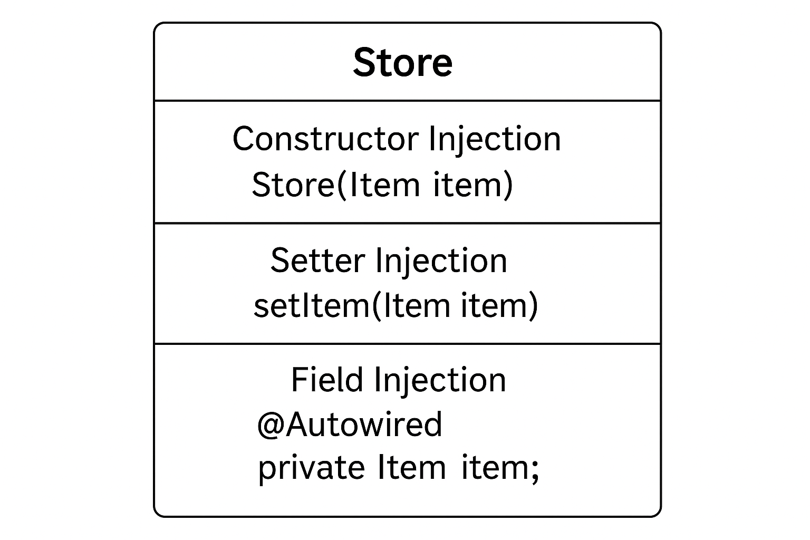

# 🧩 Lesson Notes: Dependency Injection (DI)

### 1. Overview

**Dependency Injection (DI)** is a design pattern that implements the **Inversion of Control (IoC)** principle.
Instead of a class creating its own dependencies, **external code (like a Spring container)** provides those dependencies.

This makes code more **flexible, testable, and loosely coupled**.

**Without DI (tight coupling):**

```java
public class Store {
    private Item item = new ItemImpl1(); // tightly coupled
}
```

If you later want a different `Item` implementation, you must modify the `Store` class.

**With DI (loose coupling):**

```java
public class Store {
    private Item item;
    public Store(Item item) { // dependency passed in
        this.item = item;
    }
}
```

Now `Store` no longer depends on *how* the `Item` is created — only *that* it exists.

---

## 2. Types of Dependency Injection

There are three primary types of DI:

| Type                      | How Dependency is Injected                     | Example                         |
| ------------------------- | ---------------------------------------------- | ------------------------------- |
| **Constructor Injection** | Through class constructor                      | `new Store(item)`               |
| **Setter Injection**      | Through setter methods                         | `store.setItem(item)`           |
| **Field Injection**       | Injected directly into fields using reflection | `@Autowired private Item item;` |

Let’s break each one down.

---

## 3. Constructor-Based Dependency Injection

In **constructor injection**, dependencies are passed as arguments in the constructor.

This ensures all required dependencies are provided when the object is created — making the class *immutable* and easy to test.

### 💡 Example

```java
public interface Item {
    void display();
}

public class ItemImpl1 implements Item {
    public void display() {
        System.out.println("Item: ItemImpl1");
    }
}

public class Store {
    private final Item item;

    // Constructor-based injection
    public Store(Item item) {
        this.item = item;
    }

    public void showItem() {
        item.display();
    }
}
```

### 🧱 Configuration with Spring Annotations

```java
@Configuration
public class AppConfig {

    @Bean
    public Item item1() {
        return new ItemImpl1();
    }

    @Bean
    public Store store() {
        return new Store(item1());
    }
}
```

### 🧩 XML Alternative

```xml
<bean id="item1" class="org.example.ItemImpl1" />
<bean id="store" class="org.example.Store">
    <constructor-arg ref="item1"/>
</bean>
```

---

## 4. Setter-Based Dependency Injection

Setter injection uses **setters** (or mutators) to provide dependencies after the object is created.

This method allows optional dependencies and more flexibility.

### 💡 Example

```java
public class Store {
    private Item item;

    public void setItem(Item item) { // Setter Injection
        this.item = item;
    }

    public void showItem() {
        item.display();
    }
}
```

### 🧱 Configuration with Spring Annotations

```java
@Configuration
public class AppConfig {

    @Bean
    public Item item1() {
        return new ItemImpl1();
    }

    @Bean
    public Store store() {
        Store store = new Store();
        store.setItem(item1());
        return store;
    }
}
```

### 🧩 XML Alternative

```xml
<bean id="store" class="org.example.Store">
    <property name="item" ref="item1" />
</bean>
```

📘 *Best Practice:*
Use **constructor injection** for *mandatory dependencies* and **setter injection** for *optional ones*.

---

## 5. Field-Based Dependency Injection

With **field injection**, the dependency is injected directly into the field using the `@Autowired` annotation.

### 💡 Example

```java
@Component
public class Store {

    @Autowired
    private Item item;  // Field Injection

    public void showItem() {
        item.display();
    }
}
```

Here, Spring automatically assigns a matching `Item` bean by **type**.

### ⚠️ Drawbacks

* Uses reflection (slower, harder to test)
* Hides dependencies (they’re not visible in the constructor)

---

## 6. Autowiring Dependencies

**Autowiring** lets Spring automatically find and inject beans without explicit configuration.

Four autowiring modes in XML:

| Mode          | Description                            |
| ------------- | -------------------------------------- |
| `no`          | No autowiring (manual wiring)          |
| `byName`      | Matches property name to bean ID       |
| `byType`      | Matches property type to bean type     |
| `constructor` | Matches constructor parameters by type |

### 🧩 Example (Autowiring by Type)

```java
public class Store {
    @Autowired
    private Item item;
}
```

If multiple `Item` beans exist, specify which one:

```java
public class Store {
    @Autowired
    @Qualifier("item1")
    private Item item;
}
```

### 🧱 XML Configuration

```xml
<bean id="item1" class="org.example.ItemImpl1" />
<bean id="store" class="org.example.Store" autowire="byName" />
```

---

## 7. Lazy Initialization

By default, Spring initializes all **singleton beans** at startup.
To delay bean creation until it’s actually needed, use **lazy-init**.

### 🧩 XML Example

```xml
<bean id="item1" class="org.example.ItemImpl1" lazy-init="true" />
```

This improves startup performance but delays error detection until the bean is used.

---

## 8. Summary

| Injection Type  | When to Use           | Pros             | Cons                                |
| --------------- | --------------------- | ---------------- | ----------------------------------- |
| **Constructor** | Required dependencies | Immutable, clear | Harder with many params             |
| **Setter**      | Optional dependencies | Flexible         | Object may be incomplete            |
| **Field**       | Quick prototyping     | Simplifies code  | Hides dependencies, reflection cost |

---

## 🧠 Key Takeaway

**Dependency Injection = flexibility + testability.**
It separates **object creation** (handled by Spring) from **object usage** (handled by your code).

---
A **diagram** showing the three injection types (constructor, setter, and field) visually inside a `Store` class.
---
