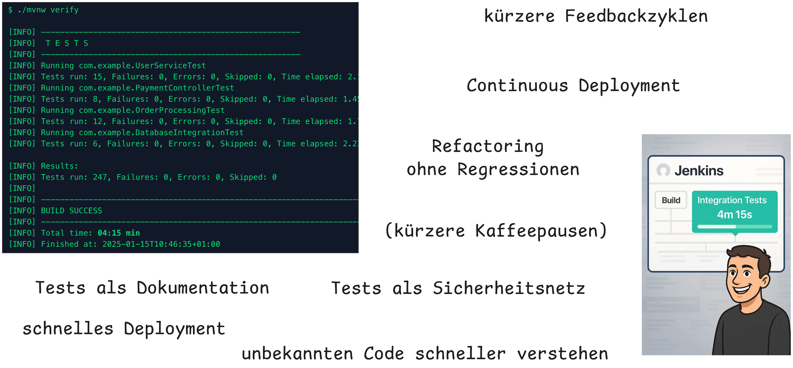
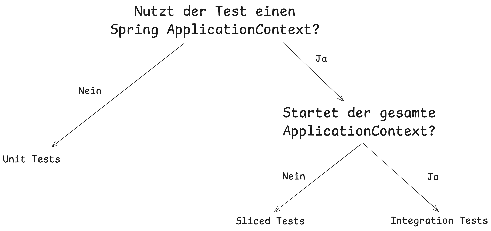
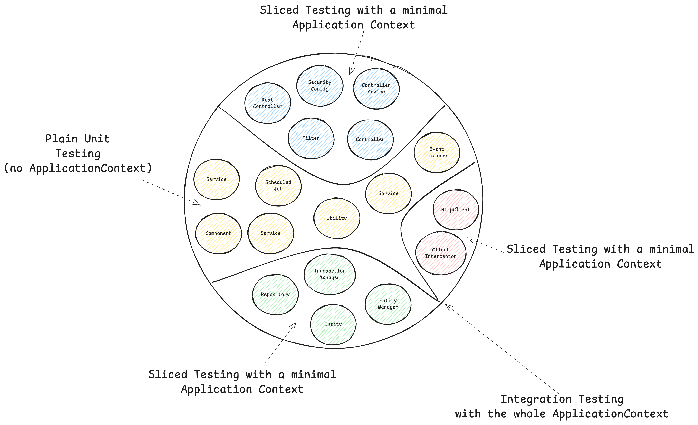
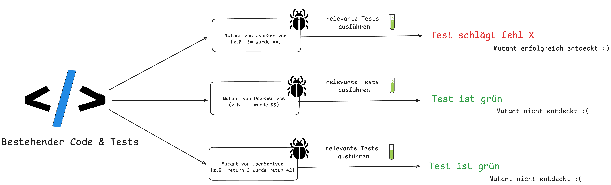
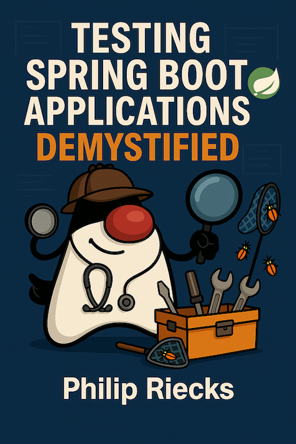

<!-- header: "" -->
<!-- footer: ""-->

---
<!--

Notes:

- Despite having AI, who still wirtes test by hand
- and who enjoys it? -> I do and hope I can change that for some of you today

-->
<!-- _class: title -->


# Stop Fighting Your Spring Boot Tests

## Patterns für zuverlässige & schnelle Builds

_Firma & Datum_

Philip Riecks - [PragmaTech GmbH](https://pragmatech.digital/) - [@rieckpil](https://x.com/rieckpil)

---


## Interaktive Teilnahme


Gehe auf [menti.com](https://www.menti.com/) und verwende den Code **5490 0636**, um **anonym** Antworten zu den Quizfragen einzureichen und während des Vortrags Fragen zu stellen.

Starte mit den ersten beiden Fragen:
- Schreibst du deine Tests trotz LLMs und Code Agents noch von Hand?
- Macht dir das Schreiben von automatisierten Tests Spaß?

---

<!-- paginate: false -->

<!-- header: '' -->
<!-- footer: '' -->
<!--


-->

<!-- header: 'Firma & Datum - Fragen & FAQ @ menti.com Code: <strong>5490 0636</strong>' -->
<!-- footer: '' -->
## Spring Boot Testing - The Bad & Ugly


---

<!--
- Automatisiertes Testen macht es uns nicht leicht
- Langsame & flaky tests
- Spring Boot komplexität, auto-configuration, neues Framework
- Die Versuchung alles mit AI zu lösen


-->

## Spring Boot Testing - The Good



<!--
- Es geht aber auch anders

-->

---


## Mein Nordstern

Stell dir vor, du siehst diesen Pull Request an einem Freitagnachmittag:


Wie zuversichtlich bist du, dieses Spring Boot Upgrade zu mergen und in Produktion zu deployen, sobald die Pipeline grün ist?

Gute Tests finden nicht nur Bugs – Tests (plus Automatisierung) geben dir das Vertrauen, ohne Zögern zu deployen.

---

## Ziele für die nächsten 45 Minuten


- Das Fundament für erfolgreiches Testen von Spring Boot Anwendungen legen
- Einführung in Spring Boots hervorragende Test-Unterstützung
- Spring Boot Testing Best Practices und häufige Pitfalls
- Hands-On Tipps zur Optimierung von Build-Zeiten


---


## Über Philip

- Selbstständiger Entwickler aus Herzogenaurach 🍻
- Blogging & Content-Erstellung mit Fokus auf das Testen von Java und speziell Spring Boot Anwendungen 🍃
- Gründer der PragmaTech GmbH - Entwickler befähigen, Software häufiger und mit mehr Vertrauen zu deployen 🚤

---


## Agenda


- Einführung
- Testen mit Spring Boot
  - Part 1: Die Spring Boot Test Pyramide
  - Part 2: Geschwindigkeit & Stabilität für deine Spring Boot Test Suite
  - Part 3: Warum & wann Spring Boot Tests Probleme machen
- Zusammenfassung & Ausblick
- FAQ

---

<!--

Notes:
- Not because a definition of done says "all tests must pass"
- Not to reach a coverage goal


-->


# Part 1: Die Spring Boot Test Pyramide

---


## Testing - Pyramid, Honeycomb, Diamond, Trophy?

- Die klassische Testpyramide ist ein guter Ausgangspunkt, aber kein Dogma
- Nicht 1:1 auf jedes Projekt übertragbar
- Viele alternative Modelle: Testing Trophy, Testing Honeycomb, Testing Diamond, etc.
- Die richtige Teststrategie hängt stark vom Projektkontext ab
- Schwer messbar, aber entscheidend: das subjektive Selbstvertrauen bei der Entwicklung & Deployment

---

## Spring Boot Testarten



---


## Unit Testing mit Spring Boot

---

### Unit Testing 101

- Spring Boot Starter Test ("Testing Schweizertaschenmesser"): Bringt notwendige Test-Bibliotheken mit (JUnit, Mockito, AssertJ, etc.)
- Abhängigkeiten von außen bereitstellen (Dependency Injection)
- Kleine Klassen/Methode mit Single Responsibility entwickeln
- Nur die öffentliche API der Klasse/Methode testen
- Verhalten prüfen, nicht Implementierungsdetails
- TDD kann helfen, (bessere) Klassen zu entwerfen

---

### Unit Testing Beispiel

```java
@ExtendWith(MockitoExtension.class)
class CustomerServiceTest {

  @Mock
  private CustomerRepository customerRepository;

  @InjectMocks
  private CustomerService customerService;

  @Test
  void shouldCreateNewCustomerWhenNameDoesNotExist() {

    when(customerRepository.findByCustomerName("duke"))
      .thenReturn(empty());

    when(customerRepository.save(any(CustomerEntity.class)))
      .thenAnswer(invocation -> {
        CustomerEntity storedCustomer = invocation.getArgument(0);
        storedCustomer.setId("42");
        return storedCustomer;
      });

    String customerId = customerService.createNewCustomer("duke");

    assertThat(customerId).isEqualTo("42");
  }
}
```

---


## Sliced Testing mit Spring Boot


---


---


---


---


---

### Spring Boot Test Slice Beispiel: `@WebMvcTest`


```java
@WebMvcTest(CustomerController.class)
@Import(SecurityConfig.class)
class CustomerControllerTest {

  @Autowired
  private MockMvc mockMvc;

  @MockitoBean
  private CustomerService customerService;

  @Test
  @WithMockUser
  void shouldReturnLocationOfNewlyCreatedCustomer() throws Exception {
    // ...
  }
}
```

---


## Integration Testing mit Spring Boot

---


### Integration Testing Herausforderungen

- Externe Infrastruktur mit Testcontainers bereitstellen
- Servlet Container (z.B. Tomcat) starten mit: `@SpringBootTest(webEnvironment = WebEnvironment.RANDOM_PORT)`
- WireMock/MockServer für das Stubben externer HTTP-Services in Betracht ziehen
- Controller-Endpunkte testen via: `MockMvc`, `WebTestClient`, `TestRestTemplate`

---

### Testcontainers 101

Infrastrukturkomponenten (Datenbanken, Message Broker, etc.) in Docker-Containern für unsere Tests zu betreiben wird mit [Testcontainers](https://testcontainers.com/) kinderleicht:

```java
@Container
@ServiceConnection
static PostgreSQLContainer<?> postgres = new PostgreSQLContainer<>("postgres:16-alpine")
  .withDatabaseName("testdb")
  .withUsername("test")
  .withPassword("test")
  .withInitScript("init-postgres.sql");
```

Das gibt uns eine kurzlebige PostgreSQL-Datenbank für unsere Tests:

```shell {3}
$ docker ps
CONTAINER ID   IMAGE                        COMMAND                  CREATED          STATUS         PORTS                                           NAMES
a958ee2887c6   postgres:16-alpine           "docker-entrypoint.s…"   10 seconds ago   Up 9 seconds   0.0.0.0:32776->5432/tcp, [::]:32776->5432/tcp   affectionate_cannon
ad0f804068dc   testcontainers/ryuk:0.12.0   "/bin/ryuk"              10 seconds ago   Up 9 seconds   0.0.0.0:32775->8080/tcp, [::]:32775->8080/tcp   testcontainers-ryuk-1f9f76a6-46d4-4e19-85c1-e8364da12804
```

---

### Integration Test Beispiel

```java {1-2,13}
@AutoConfigureWebTestClient // Spring Boot 4.0
@SpringBootTest(webEnvironment = SpringBootTest.WebEnvironment.RANDOM_PORT)
class ApplicationServletContainerIT {

  @LocalServerPort
  private int port; // <-- we're running on a real port

  @Test
  void contextLoads(@Autowired WebTestClient webTestClient) {
    webTestClient
      .get()
      .uri("/api/customers")
      .header("Authorization", "Basic " + Base64.getEncoder().encodeToString("user:dummy".getBytes()))
      .exchange()
      .expectStatus()
      .isOk();
  }
}
```


---

### Zusammenfassung Part 1



---


# Part 2: Geschwindigkeit & Stabilität für deine Spring Boot Test Suite

---

## Geschwindigkeitstipp #1 - Spring Context Caching

- **Das Problem:** Integrationstests benötigen einen gestarteten & initialisierten Spring `ApplicationContext`, dessen Start Zeit kostet
- **Die Lösung:** Spring Test `TestContext` Caching – speichert einen bereits gestarteten Spring `ApplicationContext` zur Wiederverwendung
- Dieses Feature ist Teil von Spring Test (in jedem Spring Boot Projekt via `spring-boot-starter-test` enthalten)

Beispiel für Geschwindigkeitsverbesserung:


---

### Wie der Cache funktioniert: Schritt 0


---

### Wie der Cache funktioniert: Schritt 1


---

### Wie der Cache funktioniert: Schritt 2


---


### Wie der Cache Key aufgebaut wird

```java
// DefaultContextCache.java
private final Map<MergedContextConfiguration, ApplicationContext> contextMap =
  Collections.synchronizedMap(new LruCache(32, 0.75f));
```

Folgendes fließt in den Cache Key (`MergedContextConfiguration`) ein:

- activeProfiles (`@ActiveProfiles`)
- contextInitializersClasses (`@ContextConfiguration`)
- propertySourceLocations (`@TestPropertySource`)
- propertySourceProperties (`@TestPropertySource`)
- contextCustomizer (`@MockitoBean`, `@MockBean`, `@DynamicPropertySource`, ...)
- etc.

---
### Context Restarts erkennen - Visuell


---

### Context Restarts erkennen - Logs


---

### Context Restarts erkennen - Tooling


Ein [Open-Source Spring Test Utility](https://github.com/PragmaTech-GmbH/spring-test-profiler), das Visualisierung und Einblicke in die Spring Test Ausführung bietet, mit Fokus auf Spring Context Caching Statistiken.

**Ziel**: Optimierungspotenziale in deiner Spring Test Suite identifizieren, um Builds zu beschleunigen und schneller sowie mit mehr Vertrauen in Produktion zu deployen.

---

### Der Endgegner

Entwickler neigen dazu, bei Integrationstestproblemen AI/StackOverflow zu konsultieren und kopieren oft Ratschläge aus dem Internet, ohne die Auswirkungen zu kennen:

```java
@SpringBootTest
@DirtiesContext
// this instructs Spring to remove the context from the cache
// and rebuild a new context on every request
public abstract class AbstractIntegrationTest {

}
```

Das Setup oben deaktiviert das Context-Caching-Feature und verlangsamt die Builds erheblich!

---

### Ausblick Spring Framework 7: Pausing von Contexts

Siehe Release Notes von [Spring Framework 7.0.0 M7](https://spring.io/blog/2025/07/17/spring-framework-7-0-0-M7-available-now).

> Pausing of Test Application Contexts
>
> The Spring TestContext framework is caching application context instances within test suites for faster runs. As of Spring Framework 7.0, we now pause test application contexts when
> they're not used.
>
> This means an application context stored in the context cache will be stopped when it is no longer actively in use and automatically restarted the next time the
> context is retrieved from the cache.
>
> Specifically, the latter will restart all auto-startup beans in the application context, effectively restoring the lifecycle state.

---

## Geschwindigkeitstipp #2 - Test Parallelisierung

Anforderungen:
- Kein shared State
- Keine Abhängigkeit zwischen Tests und ihrer Ausführungsreihenfolge
- Keine Mutation von globalem State

Zwei Wege, um das zu erreichen:
- Neue JVM mit Surefire/Failsafe forken und parallel laufen lassen -> mehr Ressourcen, aber isolierte Ausführung
- JUnit Jupiters Parallelisierungsmodus nutzen und in derselben JVM mit mehreren Threads laufen lassen
---


---

<!--

Notes:
- Useful to get started
- Boilerplate and skeleton help
- LLM very usueful for boilerplate setup, test data, test migration (e.g. Kotlin -> Java)
- ChatBots might not produce compilable/working test code, agents are better
-->

## Geschwindigkeitstipp #3 - AI & Tools

- [Diffblue Cover](https://www.diffblue.com/): AI-Agent für Unit Testing von komplexem (Spring Boot) Java-Code im großen Maßstab
- Mein bevorzugter CLI Code Agent: Claude Code
- TDD mit einem LLM
- (Nicht AI, aber trotzdem nützlich) OpenRewrite für [automatische Code-Migrationen](https://docs.openrewrite.org/recipes/java/testing) (z.B. JUnit 4 -> JUnit 5 -> JUnit 6)
- Anforderungen klar definieren in z.B. `claude.md` oder Cursor-Rule-Dateien, um eine einheitliche Teststruktur zu etablieren

---

## Geschwindigkeitstipp #4 - Testcontainers Container wiederverwenden

- Wenn möglich Container-Reuse in Testcontainers aktivieren: `.withReuse(true)`
- Singleton-Container pro Testlauf eignen sich besser als `@Testcontainers` (Container pro Testklasse)
- Containerstart beschleunigen durch z.B. vordefinierten Datenbank-Snapshots

```java
private static PostgreSQLContainer<?> postgresModule = new PostgreSQLContainer<>("myteampostgres:42")
  .withDatabaseName("testdb")
  .withUsername("testuser")
  .withPassword("testpass");

static {
  postgresModule.start();
}
```

---


# Part 3: Warum & wann Spring Boot Tests Probleme machen

---

## Pitfall 1: `@SpringBootTest` "Besessenheit"

- Der Name könnte suggerieren, es sei eine Universallösung, aber das ist es nicht
- Es hat seinen Preis: der (gesamte) Application Context wird gestartet
- Nützlich für Integrationstests, die die ganze Anwendung verifizieren, aber nicht zum Testen einzelner Services in Isolation
- Mit Unit Tests starten, prüfen ob Sliced Tests anwendbar sind und erst dann `@SpringBootTest` nutzen

---

## `@SpringBootTest` "Besessenheit" Visuell


---

## Pitfall 2: `@MockitoBean` vs. `@MockBean` vs. `@Mock`

- `@MockBean` ist eine Spring Boot spezifische Annotation, die eine Bean im Application Context durch ein Mockito Mock ersetzt
- `@MockBean` ist zugunsten der neuen `@MockitoBean` Annotation deprecated
- `@Mock` ist eine Mockito Annotation, nur für Unit Tests

- Golden Mockito Rules:
  - Do not mock types you don't own
  - Don't mock value objects
  - Don't mock everything
  - Show some love with your tests

---


## Pitfall 3: Code Coverage Illusion

- Hohe Code Coverage kann ein **falsches Gefühl von Sicherheit** vermitteln
- Mutation Testing mit [PIT](https://pitest.org/quickstart/)
- Über Line Coverage hinaus: Traditionelle Tools wie JaCoCo zeigen, welcher Code während der Tests ausgeführt wird, aber PIT verifiziert, ob unsere Tests tatsächlich erkennen, wenn Code sich falsch verhält, indem "**Mutationen**" in unseren Quellcode eingeführt werden.
- Qualitätsgarantie: PIT **modifiziert unseren Code** automatisch (ändert Bedingungen, Rückgabewerte, etc.), um sicherzustellen, dass unsere Tests fehlschlagen, wenn sie sollten, und **deckt blind Spots** in scheinbar umfassenden Test Suites auf.
---



---

## Testing Pitfall 4: JUnit 4 vs. JUnit 5 (vs. JUnit 6)


- Man kann beide Versionen im selben Projekt mischen, aber nicht in derselben Testklasse
- Beim Durchsuchen des Internets (aka. StackOverflow/Blogs/LLMs) nach Lösungen findet man möglicherweise Test-Setups, die noch für JUnit 4 sind
- Schnell das falsche `@Test` importiert und schon verschwendet man eine Stunde, weil der Spring Context nicht wie erwartet funktioniert

---

<center>

| JUnit 4              | JUnit 5                         |
|----------------------|---------------------------------|
| @Test from org.junit | @Test von org.junit.jupiter.api |
| @RunWith             | @ExtendWith/@RegisterExtension  |
| @ClassRule/@Rule     | -                               |
| @Before              | @BeforeEach                     |
| @Ignore              | @Disabled                       |
| @Category            | @Tag                            |

</center>

---

## Zusammenfassung & Ausblick

- Spring und Spring Boot bieten viele hervorragende Testing-Features
- Java bietet ein ausgereiftes & umfangreiches Testing-Ökosystem
- Das **Context-Caching-Feature** für schnelle Builds berücksichtigen
- **Sliced Testing** hilft, isolierte Tests mit minimalem Kontext zu schreiben
- Build-Zeiten durch Test Parallelisierung & den richtigen Einsatz von Testcontainers reduzieren
- Viele neue Testing-Features sind Teil neuer Releases

---

## Weitere Spring Boot Testing Angebote


- Online Kurs: [Testing Spring Boot Applications Masterclass](https://rieckpil.de/testing-spring-boot-applications-masterclass/) (on-demand, 12 Stunden, 130+ Module)
- eBook: [30 Testing Tools and Libraries Every Java Developer Must Know](https://leanpub.com/java-testing-toolbox)
- eBook: [Stratospheric - From Zero to Production with AWS](https://leanpub.com/stratospheric)
- Spring Boot [testing workshops](https://pragmatech.digital/workshops/) (vor Ort/remote/hybrid)
- [Consulting Angebote](https://pragmatech.digital/consulting/), z.B. das Test Maturity Assessment für Projekte/Teams

---

## Ergänzendes Spring Boot Testing eBook



- Hol dir das ergänzende Spring Boot Testing eBook **kostenlos** (statt $9)
- 120+ Seiten mit praktischen Hands-on-Tipps, um Code mit Vertrauen zu deployen
- Hol dir das eBook, indem du dich über den QR-Code auf der nächsten & letzten Folie für unseren [Newsletter](https://rieckpil.de/book) anmeldest

---

<!-- paginate: false -->

## Viel Erfolg beim Testen!

Hol dir dein kostenloses Spring Boot Testing eBook:


Melde dich jederzeit via:
- [LinkedIn](https://www.linkedin.com/in/rieckpil) (Philip Riecks)
- [X](https://x.com/rieckpil) (@rieckpil)
- [Mail](mailto:philip@pragmatech.digital) (philip@pragmatech.digital)
