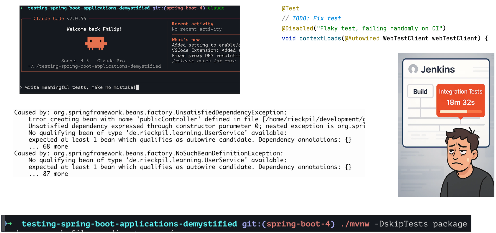
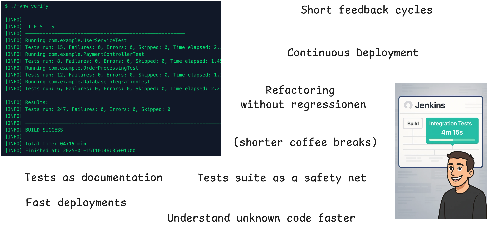
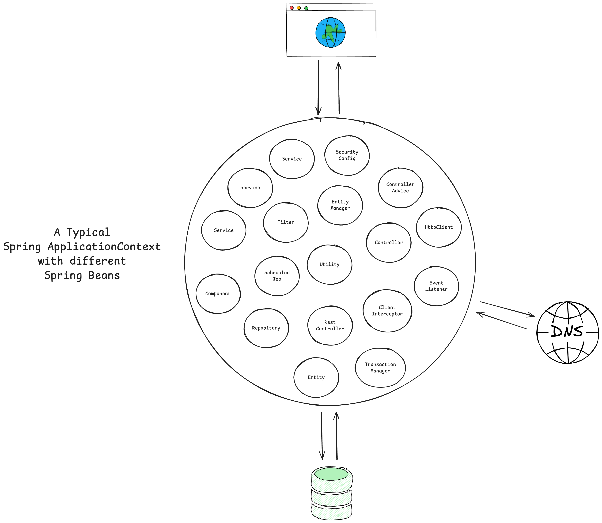
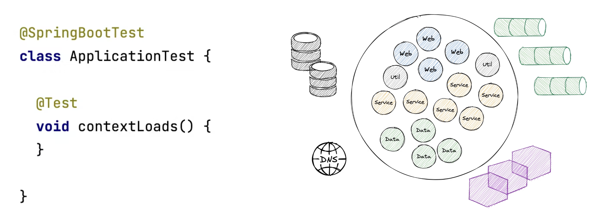
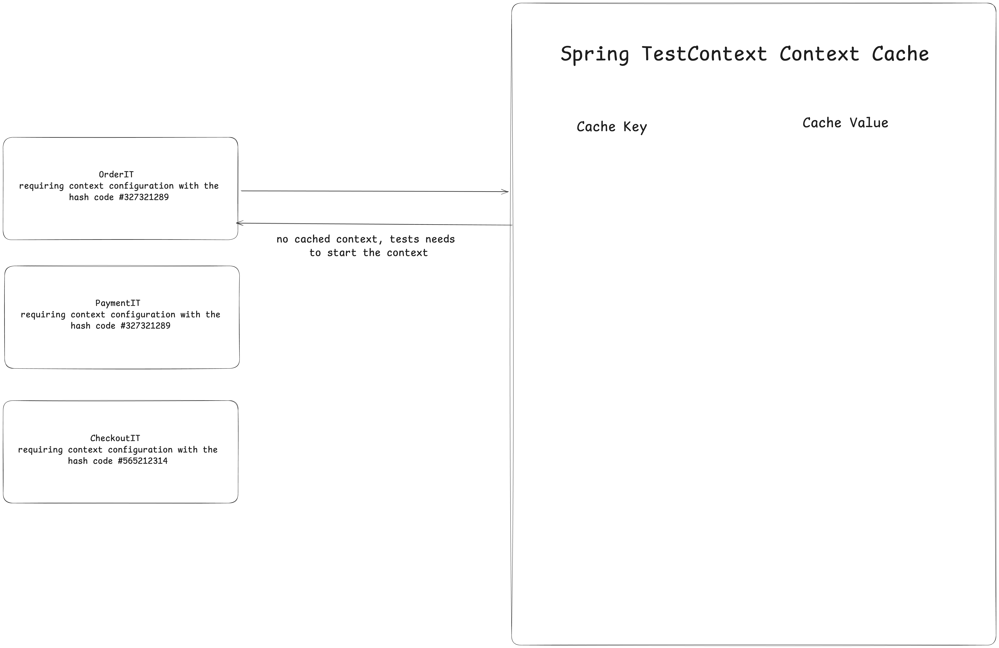
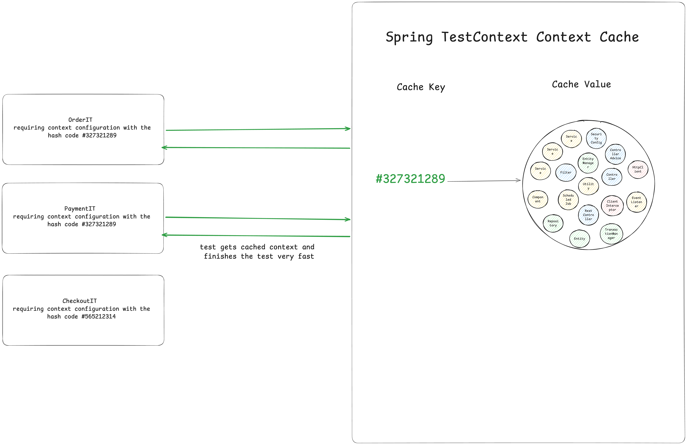
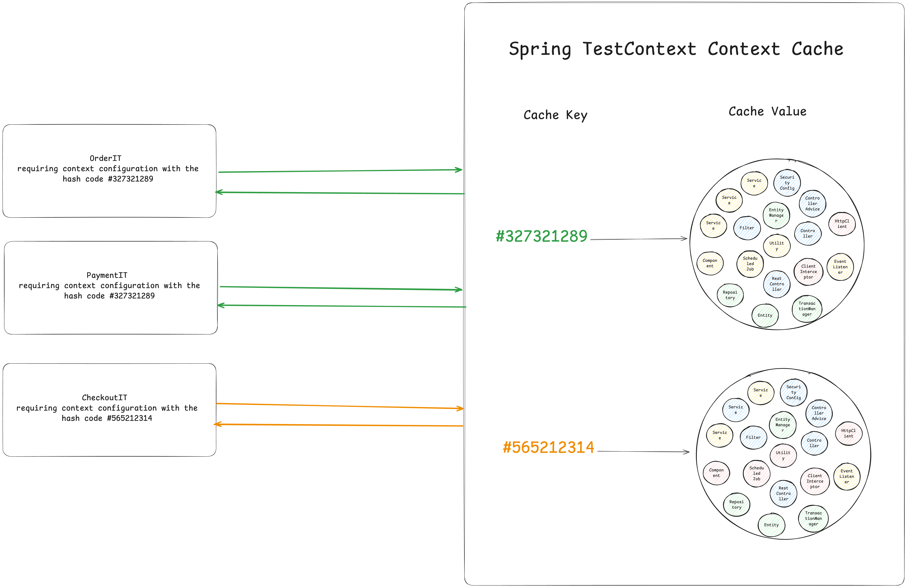
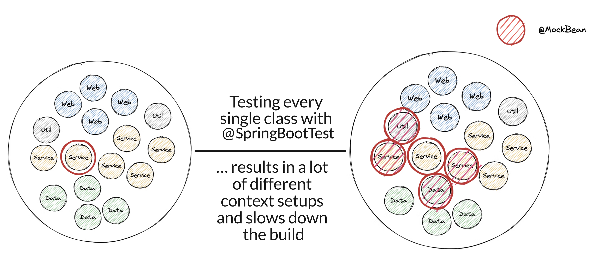

<!-- header: "" -->
<!-- footer: ""-->

---


# Stop Fighting Your Spring Boot Tests

## Optimizing your test suite for speed, stability, and developer happiness

_Infinum Webinar 15.01.2026_

Philip Riecks - [PragmaTech GmbH](https://pragmatech.digital/) - [@rieckpil](https://x.com/rieckpil)

---


## Participate During the Talk

Go to [menti.com](https://www.menti.com/) and use the code **2322 7818** to **anonymously** submit answers for the quizzes and add your questions during the talk.

Start with the first two questions:
- Despite having LLMs and Code Agents, do you still write your tests by hand?
- Do You Enjoy Writing Automated Tests?

---

<!-- header: 'Infinum Webinar 15.01.2026 - Questions @ menti.com Code: <strong>2322 7818</strong>' -->


# Why Test Software?

---


[//]: # (<!-- footer: '![w:32 h:32]&#40;assets/logo.webp&#41;' -->)
## Spring Boot Testing - The Bad & Ugly




---


## Spring Boot Testing - The Good




---


## My Overall Northstar

Imagine seeing this pull request on a Friday afternoon:


How confident are you to merge this major Spring Boot upgrade and deploy it to production once the pipeline turns green?

Good tests don't just catch bugs - they give you the confidence to say "yes" without hesitation.

---

## Goals for The Next 45 Minutes


- Laying the foundation for successfully testing Spring Boot applications
- Introduction to Spring Boot's excellent testing support
- Spring Boot testing best practices and common pitfalls
- Hands-on tips for optimizing build times

---


## About Philip

- Self-employed developer from Germany (close to Nuremberg) 🍻
- Blogging & content creation with a focus on testing Java and specifically Spring Boot applications 🍃
- Founder of PragmaTech GmbH - Enabling Developers to Frequently Deliver Software with More Confidence 🚤

---


## Agenda


- Introduction
- Testing with Spring Boot
  - Part 1: The Spring Boot Test "Pyramid"
  - Part 2: Speed & Stability for your Spring Boot Test Suite
  - Part 3: Why & When Spring Boot Tests Fight Back
- Wrap-up & Next Steps
- FAQ

---


# Part 1: The Spring Boot Test "Pyramid"

---


## Testing - Pyramid, Honeycomb, Diamond, Trophy?

- The classic test pyramid is a good starting point, but not a dogma
- It cannot be applied 1-to-1 to every project
- Many alternative models: Testing Trophy, Testing Honeycomb, Testing Diamond, etc.
- The right testing strategy depends heavily on the project context
- Hard to measure, but crucial: subjective confidence during development & deployment

---

## Spring Boot Test Types


---


## Unit Testing with Spring Boot

---

### Unit Testing with Spring Boot 101

- The Spring Boot Starter Test ("The Testing Swiss Army Knife") includes necessary test libraries (JUnit, Mockito, AssertJ, etc.)
- When designing classes:
  - Provide dependencies from the outside (Dependency Injection)
  - Develop small classes/methods with a single responsibility
  - Test only the public API of the class/method
  - Verify behavior, not implementation details
- TDD can help design (better testable) classes

---

### Basic Spring Boot Unit Test Example

```java
@ExtendWith(MockitoExtension.class)
class CustomerServiceTest {

  @Mock
  private CustomerRepository customerRepository;

  @InjectMocks
  private CustomerService customerService;

  @Test
  void shouldCreateNewCustomerWhenNameDoesNotExist() {

    when(customerRepository.findByCustomerName("duke"))
      .thenReturn(empty());

    when(customerRepository.save(any(CustomerEntity.class)))
      .thenAnswer(invocation -> {
        CustomerEntity storedCustomer = invocation.getArgument(0);
        storedCustomer.setId("42");
        return storedCustomer;
      });

    String customerId = customerService.createNewCustomer("duke");

    assertThat(customerId).isEqualTo("42");
  }
}
```

---

## Things We Can't Cover with a Unit Test

- **Request Mapping**: Does HTTP GET `/api/customers/{id}` actually resolve to our desired method?
- **Validation**: Will incomplete request bodys result in a 400 bad request or return an accidental 201?
- **Serialization**: Are we JSON objects serialized and deserialized correctly?
- **Headers**: Are we setting `Content-Type` or custom headers correctly?
- **Security**: Are we Spring Security configuration and other authorization checks enforced?


---


## Sliced Testing with Spring Boot

Verify specific layers of your Spring Boot application with a minimal `ApplicationContext`.

---



---


---


---


---

### Spring Boot Test Slice Beispiel: `@WebMvcTest`


```java
@WebMvcTest(CustomerController.class)
@Import(SecurityConfig.class)
class CustomerControllerTest {

  @Autowired
  private MockMvc mockMvc;

  @MockitoBean
  private CustomerService customerService;

  @Test
  @WithMockUser
  void shouldReturnLocationOfNewlyCreatedCustomer() throws Exception {
    // ...
  }
}
```

---

## Sliced Testing Spring Boot Applications 101

- **Core Concept**: Test a specific "slice" or layer of your application by loading a minimal, relevant part of the Spring `ApplicationContext`.

- **Confidence Gained**: Helps validate parts of your application where pure unit testing is insufficient, like the web, messaging, or data layer.

- **Prominent Examples:** Web layer (`@WebMvcTest`) and database layer (`@DataJpaTest`)

- **Pitfalls**: Requires careful configuration to ensure only the necessary slice of the context is loaded.

- **Tools**: JUnit, Mockito, Spring Test, Spring Boot, Testcontainers

---

## Common Test Slices

- `@WebMvcTest`/`@WebFluxTest` - Controller layer
- `@DataJpaTest`/`@JdbcTest` - Persistence layer
- `@JsonTest` - JSON serialization/deserialization
- `@RestClientTest` - RestTemplate testing
- etc.

---


---

## Integration Testing

Writing tests against the whole `ApplicationContext`.


---

<!--

Notes:

- Ask who is using Testcontainers?

-->



---

## Challenges when Starting the Entire `ApplicationContext`

- **Problem #1**: How to ensure surrounding infrastructure (e.g. database, queues, etc.) is present?
- **Problem #2**: How to handle HTTP communication from our application to remote services?
- **Problem #3**: How to keep our build time at a reasonable duration?

---

## Integration Testing with Spring Boot  101

- **Core Concept**: Start the entire Spring application context, often on a random local port, and test the application through its external interfaces (e.g., REST API).

- **Confidence Gained**: Validates the integration of all internal components working together as a complete application.

- **Best Practices**: Use `@SpringBootTest` to run the app on a local port.

- **Pitfalls**: Slower to run than unit or sliced tests. Managing the lifecycle of dependent services can be complex.

- **Tools**: JUnit, Mockito, Spring Test, Spring Boot, Testcontainers, WireMock (for mocking external HTTP services), Selenium (for browser-based UI testing)

---


## Provide External Infrastructure with Testcontainers (Problem #1)

Running infrastructure components (databases, message brokers, etc.) in Docker containers for our tests becomes a breeze with [Testcontainers](https://testcontainers.com/):

```java
@Container // <-- Testcontainers manages the lifecycle of the container
@ServiceConnection // <-- automatically configures Spring Boot datasource properties
static PostgreSQLContainer<?> postgres = new PostgreSQLContainer<>("postgres:16-alpine")
  .withDatabaseName("testdb")
  .withUsername("test")
  .withPassword("test")
  .withInitScript("init-postgres.sql");
```

This gives us an ephemeral PostgreSQL database for our tests:

```shell {3}
$ docker ps
CONTAINER ID   IMAGE                        COMMAND                  CREATED          STATUS         PORTS                                           NAMES
a958ee2887c6   postgres:16-alpine           "docker-entrypoint.s…"   10 seconds ago   Up 9 seconds   0.0.0.0:32776->5432/tcp, [::]:32776->5432/tcp   affectionate_cannon
ad0f804068dc   testcontainers/ryuk:0.12.0   "/bin/ryuk"              10 seconds ago   Up 9 seconds   0.0.0.0:32775->8080/tcp, [::]:32775->8080/tcp   testcontainers-ryuk-1f9f76a6-46d4-4e19-85c1-e8364da12804
```

---

### Full Integration Test Example

```java {1-2,13}
@AutoConfigureWebTestClient // Spring Boot 4.0
@SpringBootTest(webEnvironment = SpringBootTest.WebEnvironment.RANDOM_PORT)
class ApplicationServletContainerIT {

  @LocalServerPort
  private int port; // <-- we're running on a real port

  @Test
  void contextLoads(@Autowired WebTestClient webTestClient) {
    webTestClient
      .get()
      .uri("/api/customers")
      .header("Authorization", "Basic " + Base64.getEncoder().encodeToString("user:dummy".getBytes()))
      .exchange()
      .expectStatus()
      .isOk();
  }
}
```

---


# Part 2: Speed & Stability for your Spring Boot Test Suite


---
<!--

- Go to `DefaultContextCache` to show the cache

-->

## Speed Hack #1 - Spring Context Caching

- **The** **problem**: Integration tests require a started & initialized Spring `ApplicationContext`, which takes time to start
- **The** **solution**: Spring Test `TestContext` caching, caches an already started Spring `ApplicationContext` for later reuse
- This feature is part of Spring Test (part of every Spring Boot project via `spring-boot-starter-test`)

Speed improvement example:


---

### How Caching Works: Step 0



---

### How Caching Works: Step 1



---

### How Caching Works: Step 2



---

## How the Cache Key is Built

```java
// DefaultContextCache.java
private final Map<MergedContextConfiguration, ApplicationContext> contextMap =
  Collections.synchronizedMap(new LruCache(32, 0.75f));
```

This goes into the cache key (`MergedContextConfiguration`):

- activeProfiles (`@ActiveProfiles`)
- contextInitializersClasses (`@ContextConfiguration`)
- propertySourceLocations (`@TestPropertySource`)
- propertySourceProperties (`@TestPropertySource`)
- contextCustomizer (`@MockitoBean`, `@MockBean`, `@DynamicPropertySource`, ...)
- etc.

---
## Identify Context Restarts - Visually


---

## Identify Context Restarts - with Logs


---

## Identify Context Restarts - with Tools


An [open-source Spring Test utility](https://github.com/PragmaTech-GmbH/spring-test-profiler) that provides visualization and insights for Spring Test execution, with a focus on Spring context caching statistics.

**Overall goal**: Identify optimization opportunities in your Spring Test suite to speed up your builds and ship to production faster and with more confidence.

---


## The Final Boss

Developers tend to consult AI/StackOverflow for integration test issues and often copy advice from the internet without knowing the implications:

```java
@SpringBootTest
@DirtiesContext
// this instructs Spring to remove the context from the cache
// and rebuild a new context on every request
public abstract class AbstractIntegrationTest {

}
```

The setup above will **disable** the context caching feature and slow down the builds significantly!


---


## New in Spring Framework 7: Pausing of Test Contexts

See the release notes of [Spring Framework 7.0.0 M7](https://spring.io/blog/2025/07/17/spring-framework-7-0-0-M7-available-now).

> Pausing of Test Application Contexts
>
> The Spring TestContext framework is caching application context instances within test suites for faster runs. As of Spring Framework 7.0, we now pause test application contexts when
> they're not used.
>
> This means an application context stored in the context cache will be stopped when it is no longer actively in use and automatically restarted the next time the
> context is retrieved from the cache.
>
> Specifically, the latter will restart all auto-startup beans in the application context, effectively restoring the lifecycle state.


---

## Make the Most of the Caching Feature


- Avoid `@DirtiesContext` when possible, especially central places
- Understand how the cache key is built
- Monitor and investigate the context restarts
- Align the number of unique context configurations for your test suite

---

### Speed Hack #2: Test Parallelization

**Goal**: Reduce build time and get faster feedback

Requirements:
- No shared state
- No dependency between tests and their execution order
- No mutation of global state

Two ways to achieve this:
- Fork a new JVM with Maven/Gradle and let it run in parallel -> more resources but isolated execution
- Use JUnit Jupiter's parallelization mode and let it run in the same JVM with multiple threads

---


---

<!--

Notes:
- Useful to get started
- Boilerplate and skeleton help
- LLM very usueful for boilerplate setup, test data, test migration (e.g. Kotlin -> Java)
- ChatBots might not produce compilable/working test code, agents are better
-->

### Speed Hack #3 - Get Help from AI

- [Diffblue Cover](https://www.diffblue.com/): AI Agent for unit testing complex (Spring Boot) Java code at scale
- My go-to CLI code agent: Claude Code
- TDD with an LLM?
- (Not AI but still useful) OpenRewrite for [automatic code migrations](https://docs.openrewrite.org/recipes/java/testing) (e.g. JUnit 4 -> JUnit 5 -> JUnit 6)
- Clearly define your requirements in e.g. `claude.md` or Cursor rule files to adopt a common test structure

---


## Speed Hack #4 - Reuse Testcontainers Container

- Enable container reuse in Testcontainers if possible: `.withReuse(true)`
- Singleton containers per test run are better suited than `@Testcontainers` (container per test class)
- Speed up container startup, e.g., by using predefined database snapshots

```java
private static PostgreSQLContainer<?> postgresModule = new PostgreSQLContainer<>("myteampostgres:42")
  .withDatabaseName("testdb")
  .withUsername("testuser")
  .withPassword("testpass");

static {
  postgresModule.start();
}
```

---

# Part 3: Why & When Spring Boot Tests Fight Back


---

## Pitfall 1: `@SpringBootTest` Obsession

- The name could apply it's a one size fits all solution, but it isn't
- It comes with costs: starting the (entire) application context
- Useful for integration tests that verify the whole application but not for testing a single service in isolation
- Start with unit tests, see if sliced tests are applicable and only then use `@SpringBootTest`

---

## @SpringBootTest Obsession Visualized



---

## Pitfall 2: @MockitoBean vs. @MockBean vs. @Mock

- `@MockBean` is a Spring Boot specific annotation that replaces a bean in the application context with a Mockito mock
- `@MockBean` is deprecated in favor of the new `@MockitoBean` annotation
- `@Mock` is a Mockito annotation, only for unit tests

- Golden Mockito Rules:
  - Do not mock types you don't own
  - Don't mock value objects
  - Don't mock everything
  - Show some love with your tests

---

## Pitfall 3: Code Coverage Illusion

- Having high code coverage might give you a **false sense of security**
- Mutation Testing with [PIT](https://pitest.org/quickstart/)
- Beyond Line Coverage: Traditional tools like JaCoCo show which code runs during tests, but PIT verifies if our tests actually detect when code behaves incorrectly by introducing "**mutations**" to our source code.
- Quality Guarantee: PIT automatically **modifies our code** (changing conditionals, return values, etc.) to ensure our tests fail when they should, **revealing blind spots** in seemingly comprehensive test suites.

---


---

## Pitfall 4: JUnit 4 vs. JUnit 5 vs. JUnit 6


- You can mix all three versions in the same project but not in the same test class
- Browsing through the internet (aka. StackOverflow/blogs/LLMs) for solutions, you might find test setups that are still for JUnit 4
- Easily import the wrong `@Test` and you end up wasting one hour because the Spring context does not work as expected

---

<center>

| JUnit 4              | JUnit 5                            |
|----------------------|------------------------------------|
| @Test from org.junit | @Test from org.junit.jupiter.api   |
| @RunWith             | @ExtendWith/@RegisterExtension     |
| @ClassRule/@Rule     | -                                  |
| @Before              | @BeforeEach                        |
| @Ignore              | @Disabled                          |
| @Category            | @Tag                               |

</center>

---

<!--

Notes:

- Rich ecosystem: LocalStack, Contract testing (Pact), GreenMail, Selenide, Performance Testing

-->

## Wrap-Up: Key Takeaways

- Spring Boot applications come with batteries-included for testing
- Spring and Spring Boot provides many excellent testing features
- Java provides a mature & rich testing ecosystem
- Consider the context caching feature for fast builds
- Sliced testing can help write isolated tests with a minimal context
- Still many new testing-related features are part of new releases: pausing a `TestContext`, `@ServiceConnection`, Testcontainers support, Docker Compose support, more AssertJ integrations, etc.

---


## What's Next?

Testing is a team sport, make sure your whole team levels up together!

- Further Spring Boot testing resources (courses, eBooks, articles) at [rieckpil.de](https://rieckpil.de/)
- Spring Boot [testing workshops](https://pragmatech.digital/workshops/) (in-house/remote/hybrid)
- [Consulting offerings](https://pragmatech.digital/consulting/), e.g. the Test Maturity Assessment for projects/teams

---

## My Entire Spring Boot Testing Knowledge Combined

... in one on-demand online course.

Learn how to test and verify a real-world self-contained system with the [Testing Spring Boot Applications Masterclass](https://rieckpil.de/testing-spring-boot-applications-masterclass/)


---

## Covering Unit, Sliced, Integration and E2E Tests

... with 130 course lessons and 12h+ of content


---
## Don't Leave Empty-Handed


- Get the complementary **Testing Spring Boot Applications Demystified** for free (instead of $9)
- 120+ Pages with practical hands-on advice to ship code with confidence
- Get the eBook by joining our [newsletter](https://rieckpil.de/free-spring-boot-testing-book/)


---

<!-- paginate: false -->

## Joyful Testing!

The slides & code  will be shared after the webinar.


Reach out any time via:
- [LinkedIn](https://www.linkedin.com/in/rieckpil) (Philip Riecks)
- [X](https://x.com/rieckpil) (@rieckpil)
- [Mail](mailto:philip@pragmatech.digital) (philip@pragmatech.digital)
