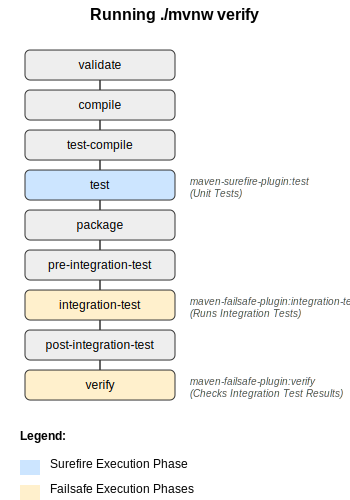
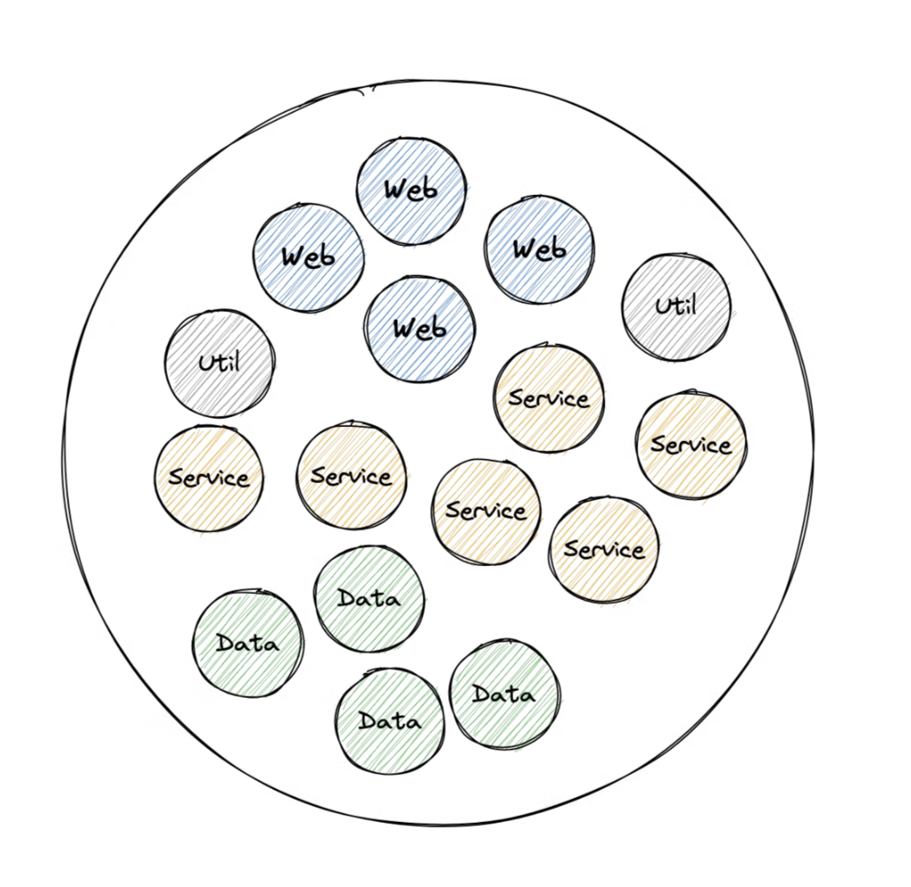
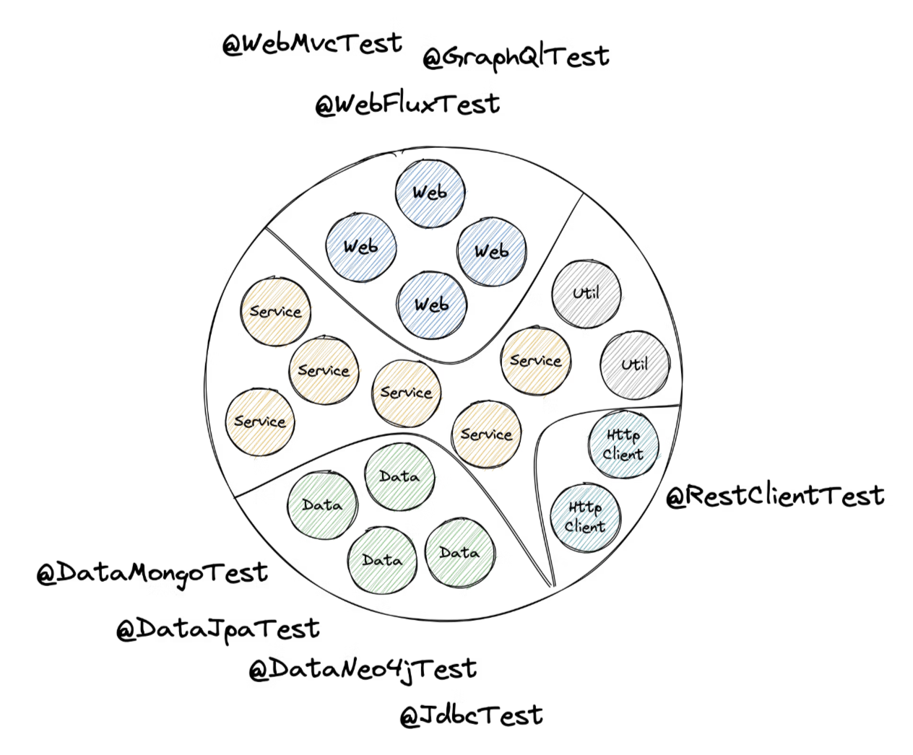
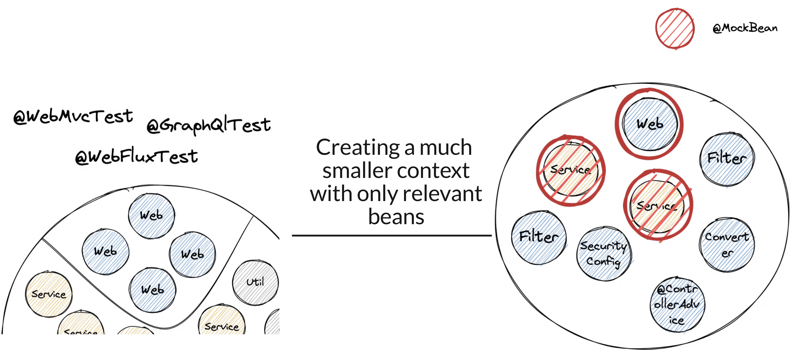
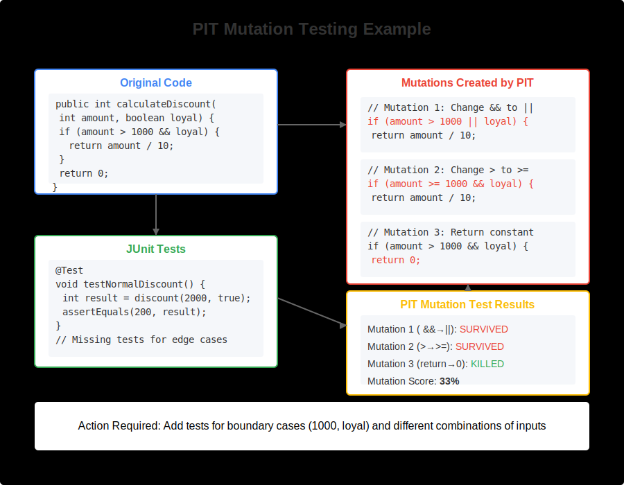

<!-- header: "" -->
<!-- footer: ""-->

---
<!--

Notes:

- Despite having AI, who still wirtes test by hand
- and who enjoys it? -> I do and hope I can change that for some of you today

-->
<!-- _class: title -->


# Testing Spring Boot Applications Demystified

## A Hero's Journey Through the Spring Boot Testing Labyrinth

_Webinar 20.01.2026_

Philip Riecks - [PragmaTech GmbH](https://pragmatech.digital/) - [@rieckpil](https://x.com/rieckpil)

---


## Participate During the Talk


Go to [menti.com](https://www.menti.com/) and use the code **7720 7354** to **anonymously** submit answers for the quizzes and add your questions during the talk.

Start with the first two questions:
- Despite having LLMs and Code Agents, do you still write your tests by hand?
- Do You Enjoy Writing Automated Tests?

---


## Act 1: The Grand Entrance

"Raise your hand if you've ever stared at a failing test with no idea why"
"Keep it raised if you've copied test configuration from Stack Overflow hoping it works"
Testing Spring Boot feels like entering a labyrinth blindfolded

The paradox of choice: @SpringBootTest, @WebMvcTest, @DataJpaTest, @MockBean, @Mock, Testcontainers, WireMock...
Conflicting advice online: "Always use integration tests" vs "Unit tests only"
The slow feedback death spiral: tests take 10 minutes, developers stop running them

Why Developers Get Lost


The Cost of Being Lost


- Neglected afterthought
-
---


### My Overall Northstar for Automated Testing

Imagine seeing this pull request on a Friday afternoon:


How confident are you to merge this major Spring Boot upgrade and deploy it to production once the pipeline turns green?

Good tests don't just catch bugs - they give you **fast feedback** and **confident deployments**.

---

## The Hero's Journey

<!--
- Act 1: The Entrance
- Act 2: The Map
- Act 3: The Three Bosses
  - Quest 1: The Unit Testing Guardian
  - Quest 2: The Slice Testing Hydra
  - Quest 3: The Integration Testing Dragon
- Act 4: The Three Quest Items
  - Quest Item 1: The Caching Amulet
  - Quest Item 2: The Lightning Shield
  - Quest Item 3: The Scroll of Truth
- Act 5: The Exit
-->

<!-- footer: '' -->


---

### Goals For This Talk


- **Provide a clear mental map** for choosing between unit, slice, and integration tests so developers stop guessing which tool to use
- **Equip attendees with practical techniques** to speed up test suites and validate test quality
- **Build confidence to refactor fearlessly** by creating tests that catch real bugs, not just achieve coverage metrics


---


### About Philip

- Self-employed developer from Herzogenaurach, Germany (Bavaria) 🍻
- Blogging & content creation with a focus on testing Java and specifically Spring Boot applications 🍃
- Founder of PragmaTech GmbH - Enabling Developers to Frequently Deliver Software with More Confidence 🚤
- Enjoys writing tests 🧪

---


---

<!--

Notes:
- Not because a definition of done says "all tests must pass"
- Not to reach a coverage goal


-->

# Quest 1

## The Unit Testing Guardian

### The Swift Gatekeeper - Blocks Those Who Overcomplicate


---


# Quest 2

## The Slice Testing Hydra

### Multiple Heads, Each Guarding a Layer


---


# Quest 3

## The Integration Testing Dragon

### Guards the Full Treasure - but Demands Patience


---


# Quest Item 1

## The Caching Amulet

### Helps You Reuse What You Already Built


---


# Quest Item 2

## The Lightning Shield

### Many Cores, One Goal


---

# Quest Item 3

## The Scroll of Truth

### Coverage Lies, Mutants Don't


---


# Spring Boot Testing 101

---

## Maven Build Lifecycle



- **Maven Surefire Plugin** for unit tests: default postfix  `*Test` (e.g. `CustomerTest`)
- **Maven Failsafe Plugin** for integration tests: default postfix `*IT` (e.g. `CheckoutIT`)
- Reason for splitting: fail fast, configure different **parallelization** options, better **organisation**

---


### Gradle Build Lifecycle

- Unit tests are run during the `test` task
- To separate integration tests, we need a custom Gradle task, as this structure is **not part** of default Gradle lifecycle
- We [need to configure](https://docs.gradle.org/current/userguide/java_testing.html#sec:configuring_java_integration_tests) the `integrationTest` task manually in our `build.gradle`:

```groovy
// Sample configuration from the Gradle docs
tasks.register('integrationTest', Test) {
  description = 'Runs integration tests.'
  group = 'verification'

  // ...
  shouldRunAfter test

  useJUnitPlatform()
}
```


---

## Spring Boot Starter Test

<!--

Notes:

- Show the `spring-boot-starter-test` dependency and Maven dependency tree
- Show manual overriden


-->


- aka. "Testing Swiss Army Knife"


```xml
<dependency>
  <groupId>org.springframework.boot</groupId>
  <artifactId>spring-boot-starter-test</artifactId>
  <scope>test</scope>
</dependency>
```

- Batteries-included for testing by transitively including popular testing libraries
  - JUnit
  - Mockito
  - Assertion libraries: AssertJ, Hamcrest, XMLUnit, JSONAssert, Awaitility
---
<!--
Notes:
- Go to IDE to show the start
- Navigate to the parent pom to see the management
- Show the sample test to have seen the libraries at least once

Tips:
- Favor JUnit 5 over JUnit 4
- Pick one assertion library or at least not mix it within the same test class
-->

```shell {4-6,12,14,15-16,23,27,32}
./mvnw dependency:tree
[INFO] ...
[INFO] +- org.springframework.boot:spring-boot-starter-test:jar:3.5.6:test
[INFO] |  +- org.springframework.boot:spring-boot-test:jar:3.5.6:test
[INFO] |  +- org.springframework.boot:spring-boot-test-autoconfigure:jar:3.5.6:test
[INFO] |  +- com.jayway.jsonpath:json-path:jar:2.9.0:test
[INFO] |  +- jakarta.xml.bind:jakarta.xml.bind-api:jar:4.0.2:test
[INFO] |  |  \- jakarta.activation:jakarta.activation-api:jar:2.1.4:test
[INFO] |  +- net.minidev:json-smart:jar:2.5.2:test
[INFO] |  |  \- net.minidev:accessors-smart:jar:2.5.2:test
[INFO] |  |     \- org.ow2.asm:asm:jar:9.7.1:test
[INFO] |  +- org.assertj:assertj-core:jar:3.27.4:test
[INFO] |  |  \- net.bytebuddy:byte-buddy:jar:1.17.7:test
[INFO] |  +- org.awaitility:awaitility:jar:4.3.0:test
[INFO] |  +- org.hamcrest:hamcrest:jar:3.0:test
[INFO] |  +- org.junit.jupiter:junit-jupiter:jar:5.12.2:test
[INFO] |  |  +- org.junit.jupiter:junit-jupiter-api:jar:5.12.2:test
[INFO] |  |  |  +- org.junit.platform:junit-platform-commons:jar:1.12.2:test
[INFO] |  |  |  \- org.apiguardian:apiguardian-api:jar:1.1.2:test
[INFO] |  |  +- org.junit.jupiter:junit-jupiter-params:jar:5.12.2:test
[INFO] |  |  \- org.junit.jupiter:junit-jupiter-engine:jar:5.12.2:test
[INFO] |  |     \- org.junit.platform:junit-platform-engine:jar:1.12.2:test
[INFO] |  +- org.mockito:mockito-core:jar:5.16.0:test
[INFO] |  |  +- net.bytebuddy:byte-buddy-agent:jar:1.17.7:test
[INFO] |  |  \- org.objenesis:objenesis:jar:3.3:test
[INFO] |  +- org.mockito:mockito-junit-jupiter:jar:5.16.0:test
[INFO] |  +- org.skyscreamer:jsonassert:jar:1.5.3:test
[INFO] |  |  \- com.vaadin.external.google:android-json:jar:0.0.20131108.vaadin1:test
[INFO] |  +- org.springframework:spring-core:jar:6.2.11:compile
[INFO] |  |  \- org.springframework:spring-jcl:jar:6.2.11:compile
[INFO] |  +- org.springframework:spring-test:jar:6.2.11:test
[INFO] |  \- org.xmlunit:xmlunit-core:jar:2.10.4:test
```

---


## What's Inside the Testing Swiss Army Knife?

- **JUnit** (currently 5, later 6): Java's de-facto standard testing framework and foundation.
- **Mockito**: Creating mock objects to simulate dependencies and verify interactions.
- **AssertJ**: Provides fluent, chainable, and readable assertions.
- **Hamcrest**: Offers flexible matchers for creating custom assertions.
- **JSONAssert**: Compares JSON strings with flexible matching options.
- **JsonPath**: Extracts and queries data from JSON similar to XPath.
- **XMLUnit**: Compares and validates XML documents.
- **Awaitility**: Handles asynchronous testing with fluent conditions.

---

## Unit Testing Spring Boot Applications 101

- **Core Concept**: Test individual components (classes, methods) in complete isolation from their dependencies.

- **Confidence Gained**: Provides logarithmic verifications, ensuring that the smallest parts of your code work as expected under various conditions.

- **Best Practices**: Focus on a single unit of work.

- **Pitfalls**: Requires a well-thought-out class design. Poor design can lead to testing overly complex "god classes," making tests difficult to write and maintain.

- **Tools**: JUnit (or Spock, TestNG, etc.), Mockito and assertion libraries like AssertJ or Hamcrest.

---

## Unit Testing Has Limits

Consider this sample REST controller, what could we verify with a unit test?

```java
@RestController
@RequestMapping("/api/customers")
public class CustomerController {

  private final CustomerService customerService;

  public CustomerController(CustomerService customerService) {
    this.customerService = customerService;
  }

  @PostMapping
  public ResponseEntity<Void> createNewCustomer(@Validated CustomerCreationRequest payload, UriComponentsBuilder uriBuilder) {

    String customerId = customerService.createNewCustomer(payload.firstName());

    UriComponents uriComponents = uriBuilder
      .path("/api/customers/{id}")
      .buildAndExpand(customerId);

    return ResponseEntity.created(uriComponents.toUri()).build();
  }
}
```

---

```java {15-18}
@ExtendWith(MockitoExtension.class)
class CustomerControllerUnitTests {

  @Mock
  private CustomerService customerService;

  @InjectMocks
  private CustomerController customerController;

  @Test
  void shouldCreateCustomerWhenPayloadRequestIsValid() {
    when(customerService.createNewCustomer(anyString()))
      .thenReturn("42");

    ResponseEntity<Void> result = customerController.createNewCustomer(
      new CustomerCreationRequest("Java", "Duke", "duke@jug.ch"),
      UriComponentsBuilder.newInstance()
    );

    assertThat(result.getStatusCode().value())
      .isEqualTo(201);
    assertThat(result.getHeaders().getLocation().toString())
      .isEqualTo("/api/customers/42");
  }
}
```

---

## Things We Can't Cover with a Unit Test

- **Request Mapping**: Does HTTP GET `/api/customers/{id}` actually resolve to our desired method?
- **Validation**: Will incomplete request bodys result in a 400 bad request or return an accidental 201?
- **Serialization**: Are we JSON objects serialized and deserialized correctly?
- **Headers**: Are we setting `Content-Type` or custom headers correctly?
- **Security**: Are we Spring Security configuration and other authorization checks enforced?

---

# Sliced Testing

A better alternative from some parts of our application compared to unit testing.

<!--

Notes:

- Show the exclude filter in @WebMvcTest

-->


---

## A Typical Spring `ApplicationContext`

Our application context consists of many different components (Spring beans):




---

## We Can Slice It!

Spring Boot allows to load only specific parts (slices) of the application context:



---
## Slicing in Action

Spring Boot's test slice component scanning will only include relevant beans in the sliced context. We need to provide or mock beans that are not part of the slice:



---

## Sliced Testing Spring Boot Applications 101

- **Core Concept**: Test a specific "slice" or layer of your application by loading a minimal, relevant part of the Spring `ApplicationContext`.

- **Confidence Gained**: Helps validate parts of your application where pure unit testing is insufficient, like the web, messaging, or data layer.

- **Prominent Examples:** Web layer (`@WebMvcTest`) and database layer (`@DataJpaTest`)

- **Pitfalls**: Requires careful configuration to ensure only the necessary slice of the context is loaded.

- **Tools**: JUnit, Mockito, Spring Test, Spring Boot, Testcontainers

---

## Slicing Example: `@WebMvcTest`

- Testing the web layer in isolation and only load the beans we need
- `MockMvc`: Mocked servlet environment with HTTP semantics
- See `WebMvcTypeExcludeFilter` for included Spring beans

```java
@WebMvcTest(CustomerController.class)
class CustomerControllerTest {

  @Autowired
  private MockMvc mockMvc;

  @MockitoBean
  private CustomerService customerService;

}
```

---

## Common Test Slices

- `@WebMvcTest`/`@WebFluxTest` - Controller layer
- `@DataJpaTest`/`@JdbcTest` - Persistence layer
- `@JsonTest` - JSON serialization/deserialization
- `@RestClientTest` - RestTemplate testing
- etc.

---


---

# Integration Testing

Writing tests against the whole `ApplicationContext`.


---

<!--

Notes:

- Ask who is using Testcontainers?

-->


---

## Integration Testing Spring Boot Applications 101

- **Core Concept**: Start the entire Spring application context, often on a random local port, and test the application through its external interfaces (e.g., REST API).

- **Confidence Gained**: Validates the integration of all internal components working together as a complete application.

- **Best Practices**: Use `@SpringBootTest` to run the app on a local port.

- **Pitfalls**: Slower to run than unit or sliced tests. Managing the lifecycle of dependent services can be complex.

- **Tools**: JUnit, Mockito, Spring Test, Spring Boot, Testcontainers, WireMock (for mocking external HTTP services), Selenium (for browser-based UI testing)

---

## Starting the Entire `ApplicationContext`

- **Problem #1**: How to ensure surrounding infrastructure (e.g. database, queues, etc.) is present?
- **Problem #2**: How to handle HTTP communication from our application to remote services?
- **Problem #3**: How to keep our build time at a reasonable duration?

---

## Provide External Infrastructure with Testcontainers (Problem #1)

Running infrastructure components (databases, message brokers, etc.) in Docker containers for our tests becomes a breeze with [Testcontainers](https://testcontainers.com/):

```java
@Container
@ServiceConnection
static PostgreSQLContainer<?> postgres = new PostgreSQLContainer<>("postgres:16-alpine")
  .withDatabaseName("testdb")
  .withUsername("test")
  .withPassword("test")
  .withInitScript("init-postgres.sql");
```

This gives us an ephemeral PostgreSQL database for our tests:

```shell {3}
$ docker ps
CONTAINER ID   IMAGE                        COMMAND                  CREATED          STATUS         PORTS                                           NAMES
a958ee2887c6   postgres:16-alpine           "docker-entrypoint.s…"   10 seconds ago   Up 9 seconds   0.0.0.0:32776->5432/tcp, [::]:32776->5432/tcp   affectionate_cannon
ad0f804068dc   testcontainers/ryuk:0.12.0   "/bin/ryuk"              10 seconds ago   Up 9 seconds   0.0.0.0:32775->8080/tcp, [::]:32775->8080/tcp   testcontainers-ryuk-1f9f76a6-46d4-4e19-85c1-e8364da12804
```

---

## Stub External HTTP Services with WireMock (Problem #2)

Consider [WireMock](http://wiremock.org/) to stub external HTTP services during tests.


---

## Using WireMock for Integration Tests

- Run as in-memory service or Docker container to simulate connected HTTP services
- Override HTTP clients to connect to the WireMock server during tests

```java
TestPropertyValues.of(
  "clients.open-library.base-url=http://localhost:"+ wireMockServer.port())
  .applyTo(applicationContext);
```

```java
wireMockServer.stubFor(
  get(urlPathEqualTo("/api/books/" + isbn))
    .willReturn(aResponse()
      .withHeader(HttpHeaders.CONTENT_TYPE, MediaType.APPLICATION_JSON_VALUE)
      .withBodyFile("book-response-success.json"))
);
```

---

## Starting the Entire Spring Context - Version 1


- We access the application over HTTP like a user, the test and context run in separate threads (no `@Transactional` rollback), requires HTTP authentication

```java {1}
@SpringBootTest(webEnvironment = SpringBootTest.WebEnvironment.RANDOM_PORT)
class ApplicationServletContainerIT {

  @LocalServerPort
  private int port; // <-- we're running on a real port

  @Test
  void contextLoads(@Autowired WebTestClient webTestClient) {
    webTestClient
      .get()
      .uri("/api/customers")
      .header("Authorization", "Basic " + Base64.getEncoder().encodeToString("user:dummy".getBytes()))
      .exchange()
      .expectStatus()
      .isOk();
  }
}
```

---

## Starting the Entire Spring Context - Version 2

- The test and the context run in the same thread, hence we can rollback with `@Transactional` and simply override the security context with `@WithMockUser`


```java {1,3}
@SpringBootTest
// which is @SpringBootTest(webEnvironment = SpringBootTest.WebEnvironment.MOCK)
@AutoConfigureMockMvc
class ApplicationMockWebIT {

  // @LocalServerPort
  // private int port; <-- this would fail the test, there is no local port occupied

  @Test
  @WithMockUser
  void givenCustomersThenReturnListForAuthenticatedUser(@Autowired MockMvc mockMvc) throws Exception {
    mockMvc
      .perform(get("/api/customers")
        .header(ACCEPT, APPLICATION_JSON))
      .andExpect(status().is(200))
      .andExpect(content().contentType(APPLICATION_JSON))
      .andExpect(jsonPath("$.size()", is(1)));
  }
}
```


---
<!--

- Go to `DefaultContextCache` to show the cache

-->

## The Need for Speed - Reducing Build Times (Problem #3)

- **The** **problem**: Integration tests require a started & initialized Spring `ApplicationContext`, which takes time to start
- **The** **solution**: Spring Test `TestContext` caching, caches an already started Spring `ApplicationContext` for later reuse
- This feature is part of Spring Test (part of every Spring Boot project via `spring-boot-starter-test`)

Speed improvement example:


---

## Caching is King

How the caching mechanism works:


---

## How the Cache Key is Built

```java
// DefaultContextCache.java
private final Map<MergedContextConfiguration, ApplicationContext> contextMap =
  Collections.synchronizedMap(new LruCache(32, 0.75f));
```

This goes into the cache key (`MergedContextConfiguration`):

- activeProfiles (`@ActiveProfiles`)
- contextInitializersClasses (`@ContextConfiguration`)
- propertySourceLocations (`@TestPropertySource`)
- propertySourceProperties (`@TestPropertySource`)
- contextCustomizer (`@MockitoBean`, `@MockBean`, `@DynamicPropertySource`, ...)
- etc.

---
## Identify Context Restarts - Visually


---

## Identify Context Restarts - with Logs


---

## Identify Context Restarts - with Tools


An [open-source Spring Test utility](https://github.com/PragmaTech-GmbH/spring-test-profiler) that provides visualization and insights for Spring Test execution, with a focus on Spring context caching statistics.

**Overall goal**: Identify optimization opportunities in your Spring Test suite to speed up your builds and ship to production faster and with more confidence.

---


## The Final Boss

Developers tend to consult AI/StackOverflow for integration test issues and often copy advice from the internet without knowing the implications:

```java
@SpringBootTest
@DirtiesContext
// this instructs Spring to remove the context from the cache
// and rebuild a new context on every request
public abstract class AbstractIntegrationTest {

}
```

The setup above will **disable** the context caching feature and slow down the builds significantly!


---

## Spot the Issues for Context Caching


---


## Outlook to Spring Framework 7: Pausing of Test Contexts

See the release notes of [Spring Framework 7.0.0 M7](https://spring.io/blog/2025/07/17/spring-framework-7-0-0-M7-available-now).

> Pausing of Test Application Contexts
>
> The Spring TestContext framework is caching application context instances within test suites for faster runs. As of Spring Framework 7.0, we now pause test application contexts when
> they're not used.
>
> This means an application context stored in the context cache will be stopped when it is no longer actively in use and automatically restarted the next time the
> context is retrieved from the cache.
>
> Specifically, the latter will restart all auto-startup beans in the application context, effectively restoring the lifecycle state.


---

## Make the Most of the Caching Feature


- Avoid `@DirtiesContext` when possible, especially central places
- Understand how the cache key is built
- Monitor and investigate the context restarts
- Align the number of unique context configurations for your test suite

---

## E2E Testing - the Holy Grail of Confidence


- For applications involving a UI consider tools like Selenium, Selenide, Cypress, Playwright, etc.
- Detect issues that only appear in production-like environments, also for downstream systems
- Start with a QA/DEV environment
- Consider Canary Testing and run your E2E tests regularly with a cron-like setup
- Challenges: authentication, test data management, environment stability, flakiness

---

# Spring Boot Testing Best Practices


---

### Best Practice 1: Test Parallelization

**Goal**: Reduce build time and get faster feedback

Requirements:
- No shared state
- No dependency between tests and their execution order
- No mutation of global state

Two ways to achieve this:
- Fork a new JVM with Surefire/Failsafe and let it run in parallel -> more resources but isolated execution
- Use JUnit Jupiter's parallelization mode and let it run in the same JVM with multiple threads

---


---

<!--

Notes:
- Useful to get started
- Boilerplate and skeleton help
- LLM very usueful for boilerplate setup, test data, test migration (e.g. Kotlin -> Java)
- ChatBots might not produce compilable/working test code, agents are better
-->

### Best Practice 2: Get Help from AI

- [Diffblue Cover](https://www.diffblue.com/): AI Agent for unit testing complex (Spring Boot) Java code at scale
- My go-to CLI code agent: Claude Code
- TDD with an LLM?
- (Not AI but still useful) OpenRewrite for [automatic code migrations](https://docs.openrewrite.org/recipes/java/testing) (e.g. JUnit 4 -> JUnit 5)
- Clearly define your requirements in e.g. `claude.md` or Cursor rule files to adopt a common test structure

---

### Best Practice 3: Try Mutation Testing

- Having high code coverage might give you a **false sense of security**
- Mutation Testing with [PIT](https://pitest.org/quickstart/)
- Beyond Line Coverage: Traditional tools like JaCoCo show which code runs during tests, but PIT verifies if our tests actually detect when code behaves incorrectly by introducing "**mutations**" to our source code.
- Quality Guarantee: PIT automatically **modifies our code** (changing conditionals, return values, etc.) to ensure our tests fail when they should, **revealing blind spots** in seemingly comprehensive test suites.

---



---

# Common Spring Boot Testing Pitfalls to Avoid


---

## Testing Pitfall 1: `@SpringBootTest` Obsession

- The name could apply it's a one size fits all solution, but it isn't
- It comes with costs: starting the (entire) application context
- Useful for integration tests that verify the whole application but not for testing a single service in isolation
- Start with unit tests, see if sliced tests are applicable and only then use `@SpringBootTest`

---

## @SpringBootTest Obsession Visualized


---

## Testing Pitfall 2: @MockitoBean vs. @MockBean vs. @Mock

- `@MockBean` is a Spring Boot specific annotation that replaces a bean in the application context with a Mockito mock
- `@MockBean` is deprecated in favor of the new `@MockitoBean` annotation
- `@Mock` is a Mockito annotation, only for unit tests

- Golden Mockito Rules:
  - Do not mock types you don't own
  - Don't mock value objects
  - Don't mock everything
  - Show some love with your tests

---

## Testing Pitfall 3: JUnit 4 vs. JUnit 5


- You can mix both versions in the same project but not in the same test class
- Browsing through the internet (aka. StackOverflow/blogs/LLMs) for solutions, you might find test setups that are still for JUnit 4
- Easily import the wrong `@Test` and you end up wasting one hour because the Spring context does not work as expected

---

<center>

| JUnit 4              | JUnit 5                            |
|----------------------|------------------------------------|
| @Test from org.junit | @Test from org.junit.jupiter.api   |
| @RunWith             | @ExtendWith/@RegisterExtension     |
| @ClassRule/@Rule     | -                                  |
| @Before              | @BeforeEach                        |
| @Ignore              | @Disabled                          |
| @Category            | @Tag                               |

</center>

---

<!--

Notes:

- Rich ecosystem: LocalStack, Contract testing (Pact), GreenMail, Selenide, Performance Testing

-->

## Act 5: The Triumphant Exit


- Spring Boot applications come with batteries-included for testing
- Spring and Spring Boot provides many excellent testing features
- Java provides a mature & rich testing ecosystem
- Consider the context caching feature for fast builds
- Sliced testing can help write isolated tests with a minimal context
- Still many new testing-related features are part of new releases: pausing a `TestContext`, `@ServiceConnection`, Testcontainers support, Docker Compose support, more AssertJ integrations, etc.

---

## What's Next? Additional Testing Resources


- Online Course: [Testing Spring Boot Applications Masterclass](https://rieckpil.de/testing-spring-boot-applications-masterclass/) (on-demand, 12 hours, 130+ modules)
- eBook: [30 Testing Tools and Libraries Every Java Developer Must Know](https://leanpub.com/java-testing-toolbox)
- eBook: [Stratospheric - From Zero to Production with AWS](https://leanpub.com/stratospheric)
- Spring Boot [testing workshops](https://pragmatech.digital/workshops/) (in-house/remote/hybrid)
- [Consulting offerings](https://pragmatech.digital/consulting/), e.g. the Test Maturity Assessment for projects/teams

---

## Don't Leave Empty-Handed


- Get the complementary **Spring Boot Testing eBook** for free (instead of $9)
- 120+ Pages with practical hands-on advice to ship code with confidence
- Get the eBook by joining our [newsletter](https://rieckpil.de/book) via the **QR code** on the next & final slide


---

<!-- paginate: false -->


## Joyful Testing!

Get your free Spring Boot Testing eBook copy:


Reach out any time via:
- [LinkedIn](https://www.linkedin.com/in/rieckpil) (Philip Riecks)
- [X](https://x.com/rieckpil) (@rieckpil)
- [Mail](mailto:philip@pragmatech.digital) (philip@pragmatech.digital)
