<!-- header: "" -->
<!-- footer: ""-->

---
<!--

Notes:

-->
<!-- _class: title -->


# Testing Spring Boot Applications Demystified

## A Hero's Journey Through the Spring Boot Testing Labyrinth

Webinar 19.03.2026

Philip Riecks - [PragmaTech GmbH](https://pragmatech.digital/) - [@rieckpil](https://x.com/rieckpil)

---


## Participate During the Talk

Go to [menti.com](https://www.menti.com/) and use the code **4893 2535** to **anonymously** submit answers for the quizzes and add your questions during the talk.

[//]: # (![h:200 center]&#40;../assets/mentimeter-jug-oslo-2026.png&#41;)

Start with the first two questions:
- Despite having LLMs and Code Agents, do you still write your tests by hand?
- Do You Enjoy Writing Automated Tests?

At the end of the Menti, you can add your questions for the Q&A session.

---


<!-- header: 'Webinar 19.03.2026 - Questions @ menti.com Code: <strong>4893 2535</strong>' -->


# Why Test Software?

---


## Automated Testing in the AI Era

- AI generates the code; you own the consequences.
- Co-pilots don’t carry pagers. You do.
- The faster the code is generated, the faster you need to prove it’s correct.
- AI is the accelerator; your test suite is the brakes. You can't drive fast without both.
- Mass-produced code without (the correct) mass-produced tests is just technical debt at scale.

---

[//]: # (<!-- footer: '![w:32 h:32]&#40;assets/logo.webp&#41;' -->)
## Spring Boot Testing - The Bad & Ugly


---


## Spring Boot Testing - The Good


---


<!-- footer: '' -->


### My Overall Northstar for Automated Testing

Imagine seeing this pull request on a Friday afternoon:


How confident are you to merge this major Spring Boot upgrade and deploy it to production once the pipeline turns green?

Good tests don't just catch bugs - they give you **fast feedback** and **confident deployments**.

---

## The Hero's Journey aka. Our Agenda

<!--
- Act 1: The Entrance
- Act 2: The Map
- Act 3: The Three Bosses
  - Quest 1: The Unit Testing Guardian
  - Quest 2: The Slice Testing Hydra
  - Quest 3: The Integration Testing Dragon
- Act 4: The Three Quest Items
  - Quest Item 1: The Caching Amulet
  - Quest Item 2: The Lightning Shield
  - Quest Item 3: The Scroll of Truth
- Act 5: The Exit
-->


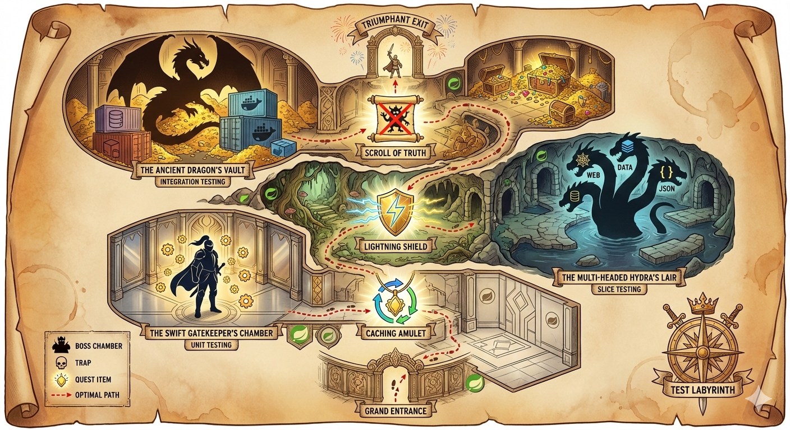

---

### Goals For This Talk

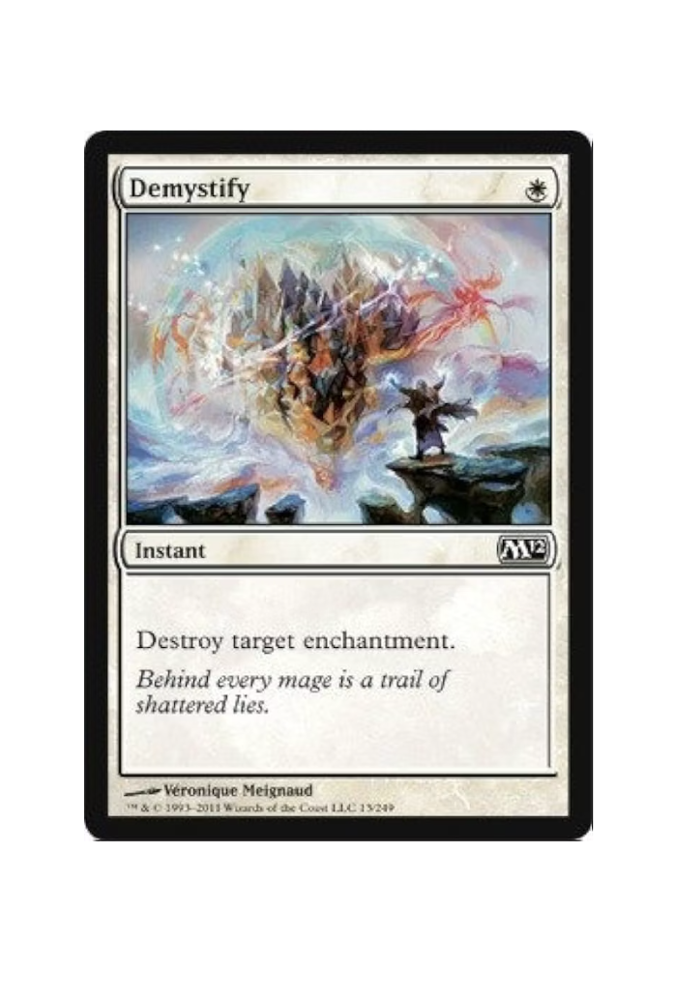


- **Provide a clear mental map** for choosing between unit, slice, and integration tests so developers stop guessing which tool to use
- **Equip attendees with practical techniques** to speed up test suites and validate test quality
- **Build confidence to refactor fearlessly** by creating tests that catch real bugs, not just achieve coverage metrics


---


### About Philip

- Self-employed developer from Herzogenaurach, Germany (Bavaria) 🍻
- Blogging & content creation with a focus on testing Java and specifically Spring Boot applications 🍃
- Founder of PragmaTech GmbH - Enabling Developers to Frequently Deliver Software with More Confidence 🚤
- Enjoys writing tests (sometimes even more than production code) 🧪

---


## Act 1: The Grand Entrance


Testing Spring Boot applications can feel like entering a labyrinth blindfolded:

- Copying test configuration from AI/StackOverflow hoping it works
- The paradox of choice: `@SpringBootTest`, `@WebMvcTest`, `@DataJpaTest`, `@MockBean`, etc.
- Fear of refactoring because tests break for the wrong reasons
- Tests written to satisfy coverage metrics, not increase productivity, confidence or catch bugs
---


<!--

Notes:
- Not because a definition of done says "all tests must pass"
- Not to reach a coverage goal


-->

# Quest 1

## The Unit Testing Guardian

### The Swift Gatekeeper - Blocks Those Who Overcomplicate


---


## Our Foundation: Spring Boot Starter Test

<!--

Notes:

- Show the `spring-boot-starter-test` dependency and Maven dependency tree
- Show manual overriden


-->


- The "Testing Swiss Army Knife"


```xml
<dependency>
  <groupId>org.springframework.boot</groupId>
  <artifactId>spring-boot-starter-test</artifactId>
  <scope>test</scope>
</dependency>
```

- Batteries-included for testing by transitively including popular testing libraries
- Out-of-the-box dependency management to ensure compatibility

---
<!--
Notes:
- Go to IDE to show the start
- Navigate to the parent pom to see the management
- Show the sample test to have seen the libraries at least once

Tips:
- Favor JUnit 5 over JUnit 4
- Pick one assertion library or at least not mix it within the same test class
-->

```shell {4-6,13,15-16,17,25,29}
./mvnw dependency:tree
[INFO] ...
[INFO] +- org.springframework.boot:spring-boot-starter-test:jar:4.0.2:test
[INFO] |  +- org.springframework.boot:spring-boot-test:jar:4.0.2:test
[INFO] |  +- org.springframework.boot:spring-boot-test-autoconfigure:jar:4.0.2:test
[INFO] |  +- com.jayway.jsonpath:json-path:jar:2.10.0:test
[INFO] |  |  \- org.slf4j:slf4j-api:jar:2.0.17:compile
[INFO] |  +- jakarta.xml.bind:jakarta.xml.bind-api:jar:4.0.4:test
[INFO] |  |  \- jakarta.activation:jakarta.activation-api:jar:2.1.4:test
[INFO] |  +- net.minidev:json-smart:jar:2.6.0:test
[INFO] |  |  \- net.minidev:accessors-smart:jar:2.6.0:test
[INFO] |  |     \- org.ow2.asm:asm:jar:9.7.1:test
[INFO] |  +- org.assertj:assertj-core:jar:3.27.6:test
[INFO] |  |  \- net.bytebuddy:byte-buddy:jar:1.17.8:test
[INFO] |  +- org.awaitility:awaitility:jar:4.3.0:test
[INFO] |  +- org.hamcrest:hamcrest:jar:3.0:test
[INFO] |  +- org.junit.jupiter:junit-jupiter:jar:6.0.2:test
[INFO] |  |  +- org.junit.jupiter:junit-jupiter-api:jar:6.0.2:test
[INFO] |  |  |  +- org.opentest4j:opentest4j:jar:1.3.0:test
[INFO] |  |  |  +- org.junit.platform:junit-platform-commons:jar:6.0.2:test
[INFO] |  |  |  \- org.apiguardian:apiguardian-api:jar:1.1.2:test
[INFO] |  |  +- org.junit.jupiter:junit-jupiter-params:jar:6.0.2:test
[INFO] |  |  \- org.junit.jupiter:junit-jupiter-engine:jar:6.0.2:test
[INFO] |  |     \- org.junit.platform:junit-platform-engine:jar:6.0.2:test
[INFO] |  +- org.mockito:mockito-core:jar:5.5.0:test
[INFO] |  |  +- net.bytebuddy:byte-buddy-agent:jar:1.17.8:test
[INFO] |  |  \- org.objenesis:objenesis:jar:3.3:test
[INFO] |  +- org.mockito:mockito-junit-jupiter:jar:5.5.0:test
[INFO] |  +- org.skyscreamer:jsonassert:jar:1.5.3:test
[INFO] |  |  \- com.vaadin.external.google:android-json:jar:0.0.20131108.vaadin1:test
[INFO] |  +- org.springframework:spring-core:jar:7.0.3:compile
[INFO] |  |  +- commons-logging:commons-logging:jar:1.3.5:compile
[INFO] |  |  \- org.jspecify:jspecify:jar:1.0.0:compile
[INFO] |  +- org.springframework:spring-test:jar:7.0.3:test
[INFO] |  \- org.xmlunit:xmlunit-core:jar:2.10.4:test
```

---


## What's Inside the Testing Swiss Army Knife?

- **JUnit** (currently 5, later 6): Java's de-facto standard testing framework and foundation.
- **Mockito**: Creating mock objects to simulate dependencies and verify interactions.
- **AssertJ**: Provides fluent, chainable, and readable assertions.
- **Hamcrest**: Offers flexible matchers for creating custom assertions.
- **JSONAssert**: Compares JSON strings with flexible matching options.
- **JsonPath**: Extracts and queries data from JSON similar to XPath.
- **XMLUnit**: Compares and validates XML documents.
- **Awaitility**: Handles asynchronous testing with fluent conditions.

---

## Unit Testing Spring Boot Applications 101

- **Core Concept**: Test individual components (classes, methods) in complete isolation from their dependencies.

- **Confidence Gained**: Provides logarithmic verifications, ensuring that the smallest parts of your code work as expected under various conditions.

- **Best Practices**: Focus on a single unit of work.

- **Pitfalls**: Requires a well-thought-out class design. Poor design can lead to testing overly complex "god classes," making tests difficult to write and maintain.

- **Tools**: JUnit (or Spock, TestNG, etc.), Mockito and assertion libraries like AssertJ or Hamcrest.

---

## Unit Testing has Limits

Consider this sample REST controller, what could we verify with a unit test?

```java
@RestController
@RequestMapping("/api/customers")
public class CustomerController {

  private final CustomerService customerService;

  public CustomerController(CustomerService customerService) {
    this.customerService = customerService;
  }

  @PostMapping
  public ResponseEntity<Void> createNewCustomer(@Validated CustomerCreationRequest payload, UriComponentsBuilder uriBuilder) {

    String customerId = customerService.createNewCustomer(payload.firstName());

    UriComponents uriComponents = uriBuilder
      .path("/api/customers/{id}")
      .buildAndExpand(customerId);

    return ResponseEntity.created(uriComponents.toUri()).build();
  }
}
```

---

```java {15-18}
@ExtendWith(MockitoExtension.class)
class CustomerControllerUnitTests {

  @Mock
  private CustomerService customerService;

  @InjectMocks
  private CustomerController customerController;

  @Test
  void shouldCreateCustomerWhenPayloadRequestIsValid() {
    when(customerService.createNewCustomer(anyString()))
      .thenReturn("42");

    ResponseEntity<Void> result = customerController.createNewCustomer(
      new CustomerCreationRequest("Java", "Duke", "duke@spring.io"),
      UriComponentsBuilder.newInstance()
    );

    assertThat(result.getStatusCode().value())
      .isEqualTo(201);
    assertThat(result.getHeaders().getLocation().toString())
      .isEqualTo("/api/customers/42");
  }
}
```

---

## Things We Can't Cover With a Unit Test

- **Request Mapping**: Does HTTP GET `/api/customers/{id}` actually resolve to our desired method?
- **Validation**: Will incomplete request bodys result in a 400 bad request or return an accidental 201?
- **Serialization**: Are we JSON objects serialized and deserialized correctly?
- **Headers**: Are we setting `Content-Type` or custom headers correctly?
- **Security**: Are we Spring Security configuration and other authorization checks enforced?

---


# Quest 2

## The Slice Testing Hydra

### Multiple Heads, Each Guarding a Layer

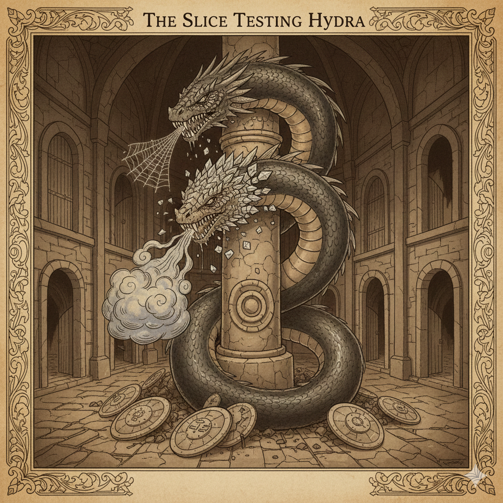

---


---

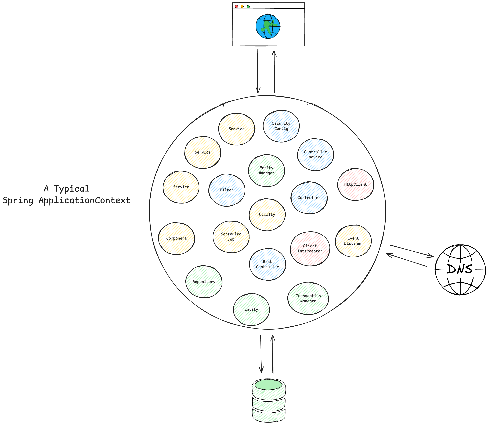

---


---


---

### Spring Boot Test Slice Example: `@WebMvcTest`


```java {1,12,6}
@WebMvcTest(CustomerController.class)
@Import(SecurityConfig.class)
class CustomerControllerTest {

  @Autowired
  private MockMvc mockMvc;

  @MockitoBean
  private CustomerService customerService;

  @Test
  @WithMockUser
  void shouldReturnLocationOfNewlyCreatedCustomer() throws Exception {
    // ...
  }
}
```

---

## Common Test Slices

- `@WebMvcTest`/`@WebFluxTest` - Controller layer
- `@DataJpaTest`/`@JdbcTest` - Persistence layer
- `@JsonTest` - JSON serialization/deserialization
- `@RestClientTest` - RestTemplate testing
- etc.

---

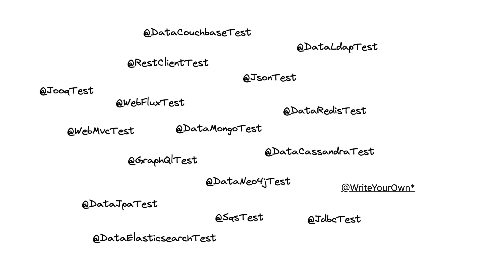

---

## Sliced Testing Spring Boot Applications 101

- **Core Concept**: Test a specific "slice" or layer of your application by loading a minimal, relevant part of the Spring `ApplicationContext`.

- **Confidence Gained**: Helps validate parts of your application where pure unit testing is insufficient, like the web, messaging, or data layer.

- **Prominent Examples:** Web layer (`@WebMvcTest`) and database layer (`@DataJpaTest`)

- **Pitfalls**: Requires careful configuration to ensure only the necessary slice of the context is loaded.

- **Tools**: JUnit, Mockito, Spring Test, Spring Boot, Testcontainers

---


# Quest 3

## The Integration Testing Dragon

### Guards the Full Treasure - but Demands Patience


---

<!--

Notes:

- Ask who is using Testcontainers?

-->


---

## Starting the Entire `ApplicationContext`

- **Problem #1**: How to ensure surrounding infrastructure (e.g. database, queues, etc.) is present?
- **Problem #2**: How to handle HTTP communication from our application to remote services?
- **Problem #3**: How to keep our build time at a reasonable duration?

---

## Provide External Infrastructure with Testcontainers (Problem #1)

Running infrastructure components (databases, message brokers, etc.) in Docker containers for our tests becomes a breeze with [Testcontainers](https://testcontainers.com/):

```java
@Container
@ServiceConnection
static PostgreSQLContainer<?> postgres = new PostgreSQLContainer<>("postgres:16-alpine")
  .withDatabaseName("testdb")
  .withUsername("test")
  .withPassword("test")
  .withInitScript("init-postgres.sql");
```

This gives us an ephemeral PostgreSQL database for our tests:

```shell {3}
$ docker ps
CONTAINER ID   IMAGE                        COMMAND                  CREATED          STATUS         PORTS                                           NAMES
a958ee2887c6   postgres:16-alpine           "docker-entrypoint.s…"   10 seconds ago   Up 9 seconds   0.0.0.0:32776->5432/tcp, [::]:32776->5432/tcp   affectionate_cannon
ad0f804068dc   testcontainers/ryuk:0.12.0   "/bin/ryuk"              10 seconds ago   Up 9 seconds   0.0.0.0:32775->8080/tcp, [::]:32775->8080/tcp   testcontainers-ryuk-1f9f76a6-46d4-4e19-85c1-e8364da12804
```

---

## Stub External HTTP Services with WireMock (Problem #2)

Consider [WireMock](http://wiremock.org/) to stub external HTTP services during tests.

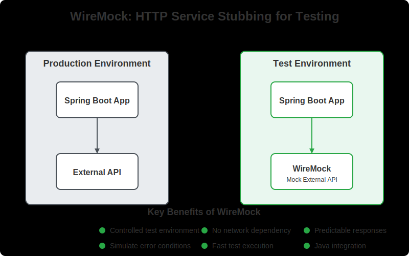

---

## Using WireMock for Integration Tests

- Run as in-memory service or Docker container to simulate connected HTTP services
- Override HTTP clients to connect to the WireMock server during tests

```java
TestPropertyValues.of(
  "clients.open-library.base-url=http://localhost:"+ wireMockServer.port())
  .applyTo(applicationContext);
```

```java
wireMockServer.stubFor(
  get(urlPathEqualTo("/api/books/" + isbn))
    .willReturn(aResponse()
      .withHeader(HttpHeaders.CONTENT_TYPE, MediaType.APPLICATION_JSON_VALUE)
      .withBodyFile("book-response-success.json"))
);
```

---

## Starting the Entire Spring Context - Version 1


- We access the application over HTTP like a user, the test and context run in separate threads (no `@Transactional` rollback), requires HTTP authentication

```java {1}
@SpringBootTest(webEnvironment = SpringBootTest.WebEnvironment.RANDOM_PORT)
class ApplicationServletContainerIT {

  @LocalServerPort
  private int port; // <-- we're running on a real port

  @Test
  void contextLoads(@Autowired WebTestClient webTestClient) {
    webTestClient
      .get()
      .uri("/api/customers")
      .header("Authorization", "Basic " + Base64.getEncoder().encodeToString("user:dummy".getBytes()))
      .exchange()
      .expectStatus()
      .isOk();
  }
}
```

---

## Starting the Entire Spring Context - Version 2

- The test and the context run in the same thread, hence we can rollback with `@Transactional` and simply override the security context with `@WithMockUser`


```java {1,3}
@SpringBootTest
// which is @SpringBootTest(webEnvironment = SpringBootTest.WebEnvironment.MOCK)
@AutoConfigureMockMvc
class ApplicationMockWebIT {

  // @LocalServerPort
  // private int port; <-- this would fail the test, there is no local port occupied

  @Test
  @WithMockUser
  void givenCustomersThenReturnListForAuthenticatedUser(@Autowired MockMvc mockMvc) throws Exception {
    mockMvc
      .perform(get("/api/customers")
        .header(ACCEPT, APPLICATION_JSON))
      .andExpect(status().is(200))
      .andExpect(content().contentType(APPLICATION_JSON))
      .andExpect(jsonPath("$.size()", is(1)));
  }
}
```

---

## Integration Testing Spring Boot Applications 101

- **Core Concept**: Start the entire Spring application context, often on a random local port, and test the application through its external interfaces (e.g., REST API).

- **Confidence Gained**: Validates the integration of all internal components working together as a complete application.

- **Best Practices**: Use `@SpringBootTest` to run the app on a local port.

- **Pitfalls**: Slower to run than unit or sliced tests. Managing the lifecycle of dependent services can be complex.

- **Tools**: JUnit, Mockito, Spring Test, Spring Boot, Testcontainers, WireMock (for mocking external HTTP services), Selenium (for browser-based UI testing)

---


# Quest Item 1

## The Caching Amulet

### Helps You Reuse What You Already Built


---

## Integration Testing - The Need for Speed

- **The Problem:** Integration tests require a started & initialized Spring `ApplicationContext`, which slows down the build
- **The Solution:** Spring Test `TestContext` Caching – stores an already started Spring `ApplicationContext` for reuse
- This feature is part of Spring Test (included in every Spring Boot project via `spring-boot-starter-test`)

Example of speed improvement:


---

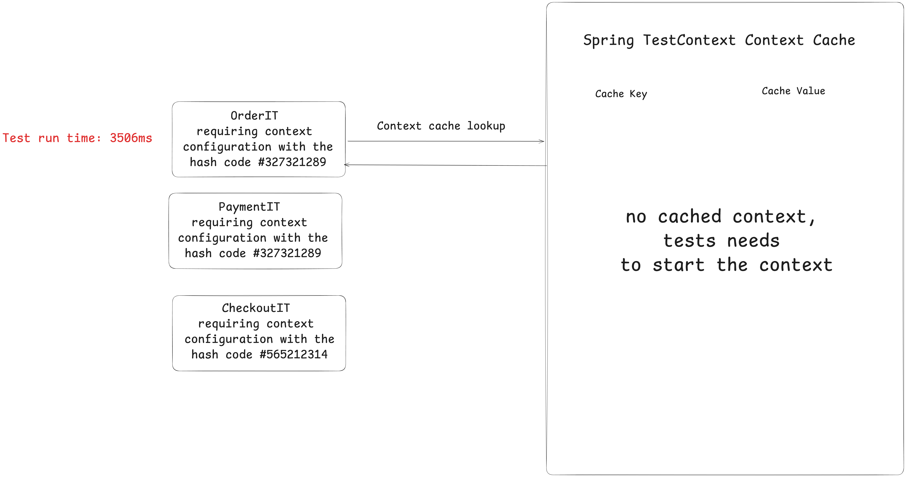

---


---


---

### How the Cache Key is Built

```java
// DefaultContextCache.java
private final Map<MergedContextConfiguration, ApplicationContext> contextMap =
  Collections.synchronizedMap(new LruCache(32, 0.75f));
```

The following information is part of the Cache Key (`MergedContextConfiguration`):

- activeProfiles (`@ActiveProfiles`)
- contextInitializersClasses (`@ContextConfiguration`)
- propertySourceLocations (`@TestPropertySource`)
- propertySourceProperties (`@TestPropertySource`)
- contextCustomizer (`@MockitoBean`, `@MockBean`, `@DynamicPropertySource`, ...)
- etc.

---
###  Detect Context Restarts - Visually

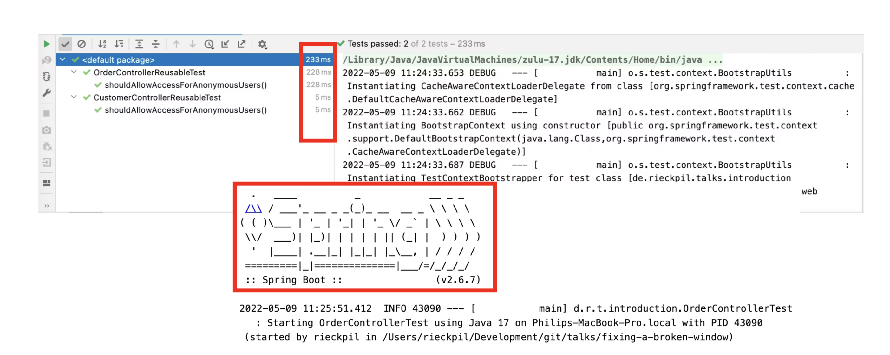


---

### Detect Context Restarts - with Logs


---

### Detect Context Restarts - with Tooling


An [open-source Spring Test utility](https://github.com/PragmaTech-GmbH/spring-test-profiler) that provides visualization and insights for Spring Test execution, with a focus on Spring context caching statistics.

**Overall goal**: Identify optimization opportunities in your Spring Test suite to speed up your builds and ship to production faster and with more confidence.

---

### The Final Boss

Developers tend to consult AI/StackOverflow for integration test issues and often copy advice from the internet without knowing the implications:

```java
@SpringBootTest
@DirtiesContext
// this instructs Spring to remove the context from the cache
// and rebuild a new context on every request
public abstract class AbstractIntegrationTest {

}
```

The setup above will **disable** the context caching feature and slow down the builds significantly!

---

### New in Spring Framework 7: Pausing Contexts

See Release Notes von [Spring Framework 7](https://spring.io/blog/2025/07/17/spring-framework-7-0-0-M7-available-now).

> Pausing of Test Application Contexts
>
> The Spring TestContext framework is caching application context instances within test suites for faster runs. As of Spring Framework 7.0, we now pause test application contexts when
> they're not used.
>
> This means an application context stored in the context cache will be stopped when it is no longer actively in use and automatically restarted the next time the
> context is retrieved from the cache.
>
> Specifically, the latter will restart all auto-startup beans in the application context, effectively restoring the lifecycle state.

---

# Quest Item 2

## The Lightning Shield

### Many Cores, One Goal


---

## Test Parallelization

**Goal**: Reduce build time and get faster feedback

Requirements:
- No shared state
- No dependency between tests and their execution order
- No mutation of global state

Two ways to achieve this:
- Fork a new JVM with Surefire/Failsafe (or for the Gradle test task) and let it run in parallel
- Use JUnit Jupiter's parallelization mode and let it run in the same JVM with multiple threads

---


---

## Reuse Containers with Testcontainers

- Bootstrapping new containers can take a significant amount of time
- Enable container reuse in Testcontainers when possible: `.withReuse(true)`
- Singleton containers per test run are preferable to `@Testcontainers` (container per test class)
- Speed up container startup with e.g. predefined database snapshots

```java
private static PostgreSQLContainer<?> postgresModule = new PostgreSQLContainer<>("myteampostgres:42")
  .withDatabaseName("testdb")
  .withUsername("testuser")
  .withPassword("testpass");

static {
  postgresModule.start();
}
```

---

# Quest Item 3

## The Scroll of Truth

### Coverage Lies, Mutants Don't


---

## Introducing: Mutation Testing

- Having high code coverage might give you a **false sense of security**
- Mutation Testing with [PIT](https://pitest.org/quickstart/)
- Beyond Line Coverage: Traditional tools like JaCoCo show which code runs during tests, but PIT verifies if our tests actually detect when code behaves incorrectly by introducing "**mutations**" to our source code.
- Quality Guarantee: PIT automatically **modifies our code** (changing conditionals, return values, etc.) to ensure our tests fail when they should, **revealing blind spots** in seemingly comprehensive test suites.

---

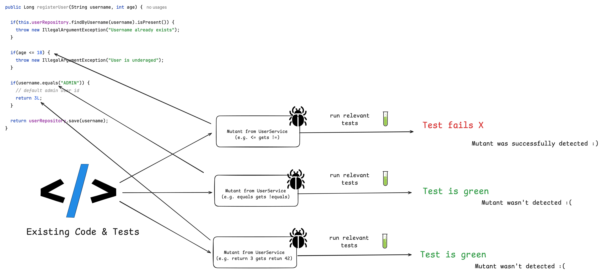

---

## Act 5: The Triumphant Exit


- Spring Boot applications come with batteries-included and excellent testing support
- We've completed three main quests: Unit testing, Sliced testing, and Integration testing
- Three core quest items help us to speed up and validate our tests:
  - Context Caching
  - Test Parallelization
  - Mutation Testing

---


## What's Next?

Testing is a team sport, make sure your whole team levels up together

- Spring Boot [testing workshops](https://pragmatech.digital/workshops/) (in-house/remote/hybrid)
- Further Spring Boot testing resources (courses, eBooks, articles) at [rieckpil.de](https://rieckpil.de/)
- [Consulting offerings](https://pragmatech.digital/consulting/), e.g. the Test Maturity Assessment for projects/teams

---

## Bring This Talk to Your Company!


I offer this and similar Spring Boot testing talks **for free** for companies as:

- **Lunch & Learn** sessions
- **Internal conferences** and developer days
- **Team training** events

Reach out via LinkedIn or email (philip@pragmatech.digital) to discuss the details and schedule a session for your team.

---

## My Entire Spring Boot Testing Knowledge Combined

... in one on-demand online course.

Learn how to test and verify a real-world self-contained system with the [Testing Spring Boot Applications Masterclass](https://rieckpil.de/testing-spring-boot-applications-masterclass/)

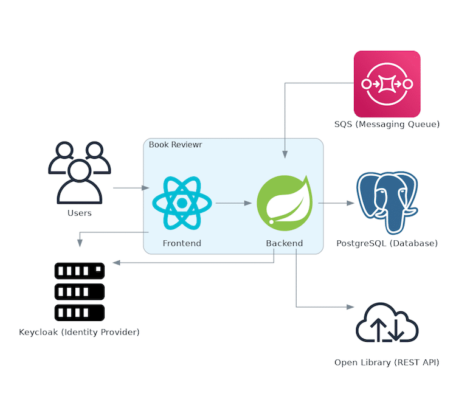


---

## Covering Unit, Sliced, Integration and E2E Tests

... with 130 course lessons and 12h+ of content

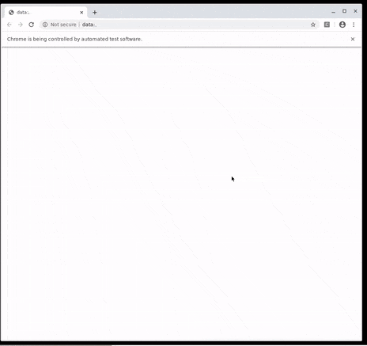

---


---


## Limited Webinar Offer for the Next 24 Hours


Enrolling for the Bundle Edition gives you three additional resources for free:


- TDD with Spring Boot Done Right **Online Course**
- Hands-On Mocking with Mockito **Online Course**
- 30 Testing Tools and Libraries Every Java Developer Must Know **eBook**


All webinar attendees get a **50% discount** on the course price with [this link](https://rieckpil.de/testing-spring-boot-applications-masterclass/?promo=WEBINAR-2026-03-19) (link will be shared in the chat).


The offer expires on the 20th of March 2026 6 PM CET.


[//]: # (## Don't Leave Empty-Handed)

[//]: # ()
[//]: # ()
[//]: # (![bg h:720 w:450 right:33%]&#40;assets/tsbad-cover.png&#41;)

[//]: # ()
[//]: # ()
[//]: # (- Get the complementary **Testing Spring Boot Applications Demystified** for free &#40;instead of $9&#41;)

[//]: # ()
[//]: # (- 120+ Pages with practical hands-on advice to ship code with confidence)

[//]: # ()
[//]: # (- Get the eBook by joining our [newsletter]&#40;https://rieckpil.de/free-spring-boot-testing-book/&#41;)

---


<!-- paginate: false -->


## Joyful Testing!

[//]: # (Get your Spring Boot testing eBook:)

[//]: # ()
[//]: # (![center h:200 w:200]&#40;assets/newsletter-signup-qr.png&#41;)

Now it's time for Q&A! If you have any questions feel free to ask via Zoom chat or within Menti (last question).


Reach out any time via:
- [LinkedIn](https://www.linkedin.com/in/rieckpil) (Philip Riecks)
- [X](https://x.com/rieckpil) (@rieckpil)
- [Mail](mailto:philip@pragmatech.digital) (philip@pragmatech.digital)
